# CaseBook

> The tamper-evident record for adverse events, incidents &amp; breaches.

A secure, on-prem web utility for the SOC to inventory and manage escalated security matters —
**Adverse Events, Incidents, and Breaches** (the three IRP classifications) — end to end:
timelines, evidence, analyst notes, after-action follow-ups, leadership dashboards, and
auto-generated Word reports, on a **tamper-evident, hash-chained audit trail**.

## Screenshots

### Leadership dashboard
Headline open-items tile with classification mix, attention stats, an open-items-by-phase pipeline,
response times against SLA targets, a **regulatory-notification** compliance block (detected→reported
mean, awaiting-report, and at-risk/overdue deadlines), and a **12-month case-activity bar chart** (opened
vs. closed) plus an open-items sparkline — all derived from case timestamps — with one-click metrics CSV
export (incl. monthly & quarterly rollups) for board / regulatory packs.

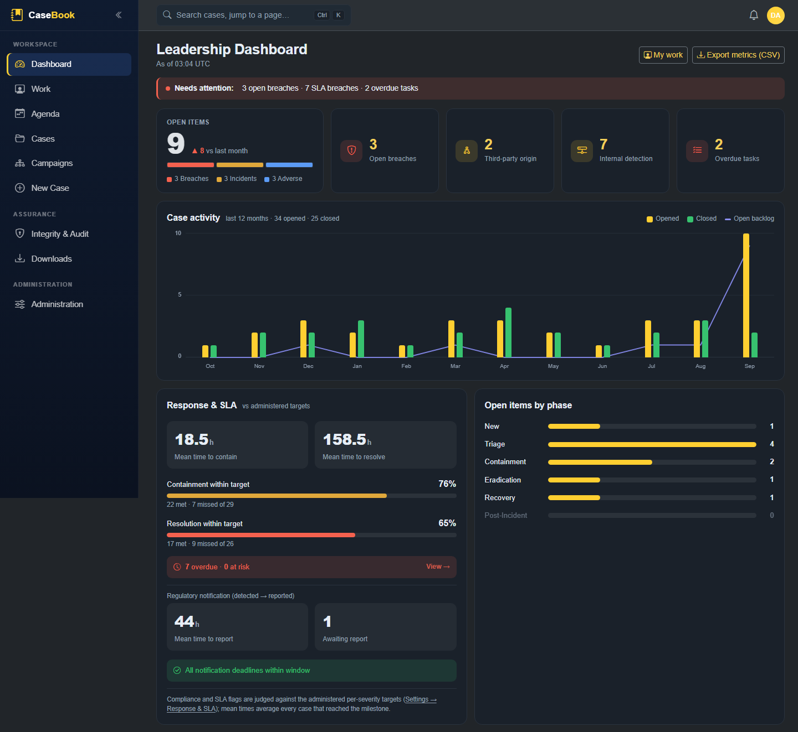

### Case workspace
The analyst's hub: a NIST SP 800-61 lifecycle bar, tabbed **Overview / Timeline / Entities /
Evidence / Notes / Discussion / Tasks / Lessons learned / Report / Audit**, true **detected / occurred** timestamps (with
dwell-before-detection and per-severity SLA targets), **links to related cases**, and a structured
impact assessment (affected individuals, data-element taxonomy, and jurisdictions). The header carries
at-a-glance status badges — SLA, **materiality** (material / not material, a Legal/committee decision the
tool records but does not make), and the **regulatory notification** countdown — alongside the classic
classification/severity/legal chips. A case can be **restricted to need-to-know** (its incident commander,
its team and cleared roles only), and the Overview says in plain words who can see it; view-only roles get a
note explaining what they can and can't do.

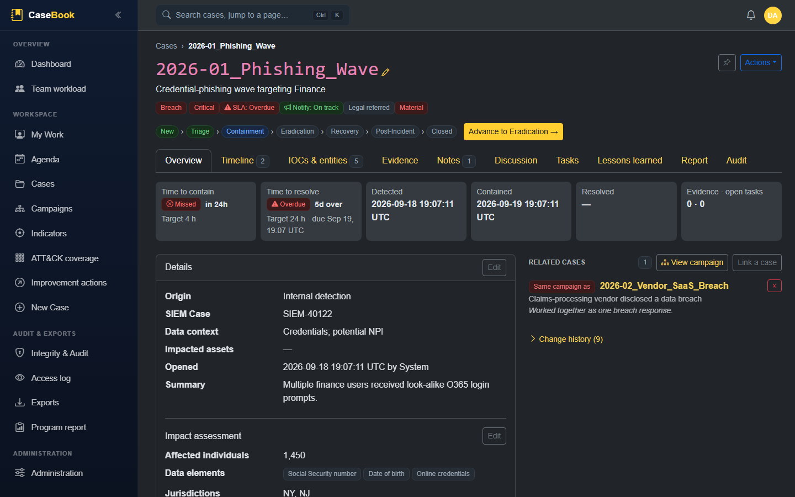

### Guided case creation
A wizard captures origin (internal vs. third-party/vendor), classification, severity, an optional
detection-source case reference (the source label is a configurable operational setting — defaults to
**SIEM**), and any known **indicators / IOCs** — with inline validation, so every case starts
consistent and auto-numbered (`YYYY-NN_DescriptiveName`). As indicators are entered they're checked
against open cases (defanged notation refanged first), so a **duplicate or an ongoing campaign is
surfaced and linked at creation** instead of fragmenting across cases.

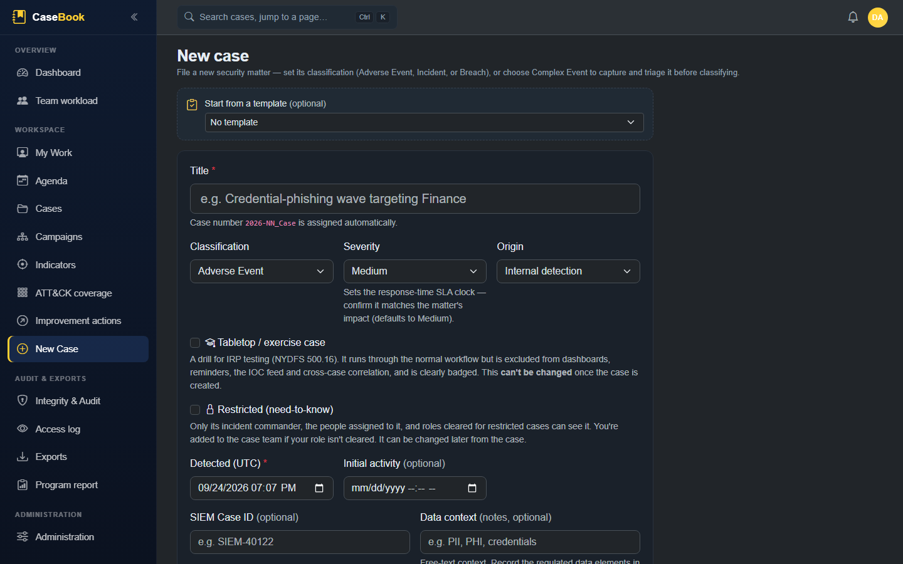

### Structured &amp; AI-assisted import
Bring a matter in as a structured document instead of retyping it: paste or upload a versioned JSON that
seeds a **new or existing** case with a summary, timeline, indicators and tasks. CaseBook never calls an AI —
**Step 1** generates a copy-paste prompt for your *own* tool (e.g. Copilot) that emits the exact schema, and
**Step 2** shows an editable, validated preview you confirm. Producers (XSIAM/SOAR playbooks, scripts) can
also submit over a **token-authenticated API**, landing in a review queue — a human always confirms before
anything is written to a case. See [docs/API.md](docs/API.md) for the API reference and
[docs/case-import.schema.json](docs/case-import.schema.json) for the document schema.

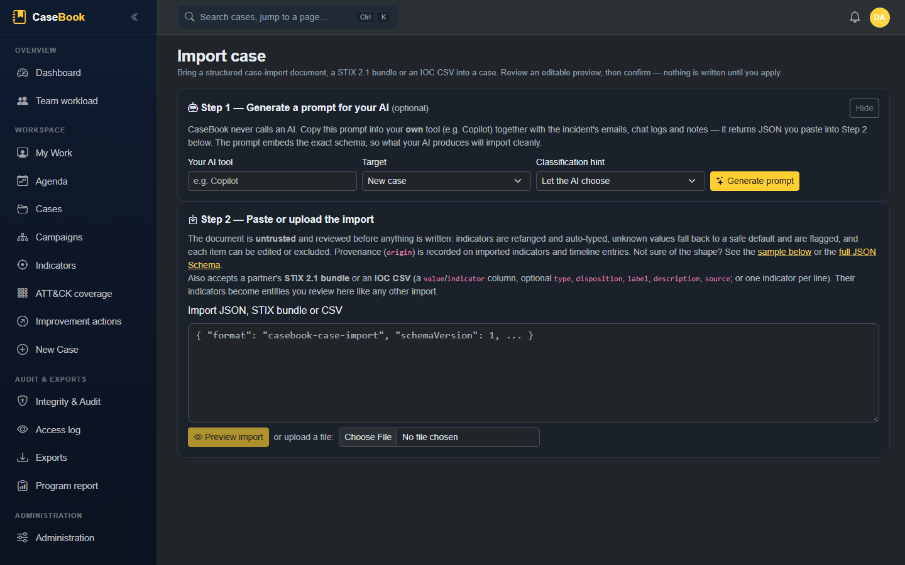

### Event &amp; investigation timelines
Two separate chronologies per case — the **event** timeline (facts and timing of what happened) and the
**investigation** timeline (analyst/team actions) — each typed, sourced, and audited.

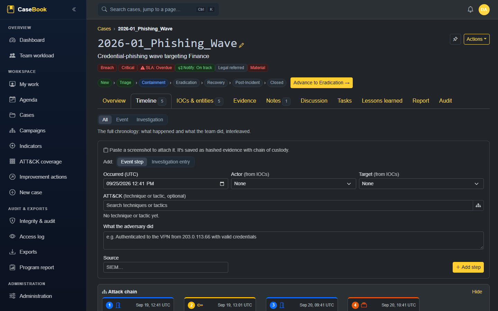

### Team discussion &amp; @mentions
A durable, **hash-chained** discussion thread per case (part of the audited record, unlike ephemeral
presence) for cross-role handoffs — Markdown, one-level replies, and **@mentions** that notify the
mentioned teammates through the notification pipeline (email and/or chat). Open to everyone who can see
the case, so an analyst, IC, and Legal work from one shared trail.

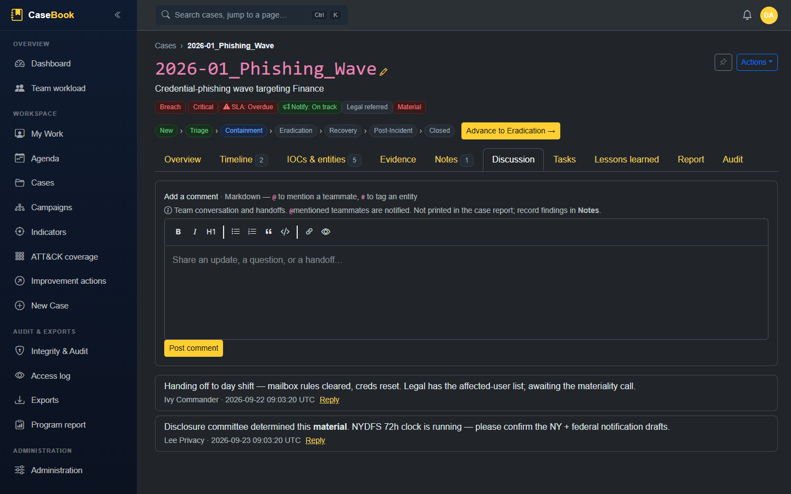

### Entities &amp; relationship graph
Every case's indicators and entities — accounts, hosts, IPs, domains, URLs, file hashes — captured with
a type, a **disposition** (malicious / suspicious / benign / unknown), and a source. An interactive
force-directed **relationship graph** renders each entity as a type-shaped node and **overlays the
attack chain** as tactic-coloured edges (e.g. the blue *Initial Access* step), so an analyst can see how
the phishing sender, patient-zero host, compromised Domain Admin account, and exfiltration destination
connect at a glance. Network/URL indicators can be shown **defanged** for safe copy-out. An **Across
cases** view redraws the graph around the case itself: the indicators it shares with other cases you can
see, those cases, and its case links (campaign links in gold).

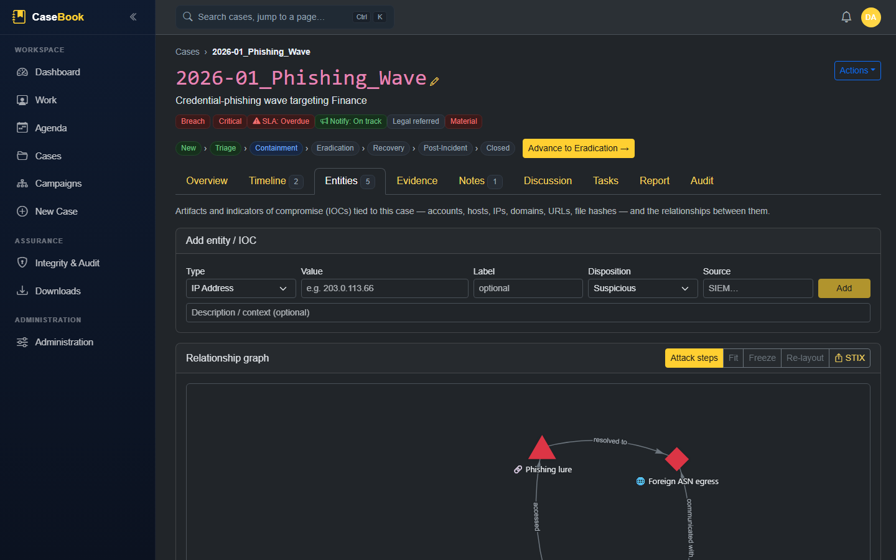

### Indicators — the cross-case pivot
Every indicator recorded on your cases, deduplicated by type and value, **most-shared first**: how many
cases each appears on (and how many are still open), the worst verdict any case gave it, and first / last
seen, with an expandable list of the cases behind it. A case's "also in" badge links straight here. Partner
**STIX 2.1 bundles** and **IOC CSV** files import into a case through the same reviewed import as everything
else, and the preview flags open cases already carrying the same indicators.

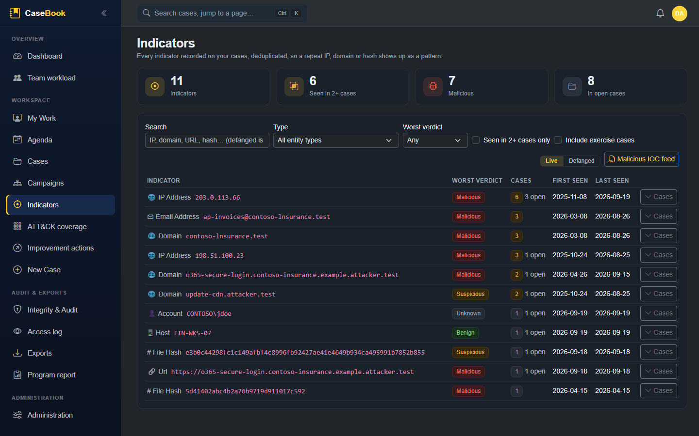

### ATT&amp;CK coverage
What the SOC has actually faced: the technique tags and attack steps across your cases rolled into the
MITRE ATT&amp;CK matrix, each technique shaded by how many cases saw it, unobserved tactics shown as gaps,
and a click-through to the cases behind any cell. Windowed by detection date; exercises excluded unless
asked for.

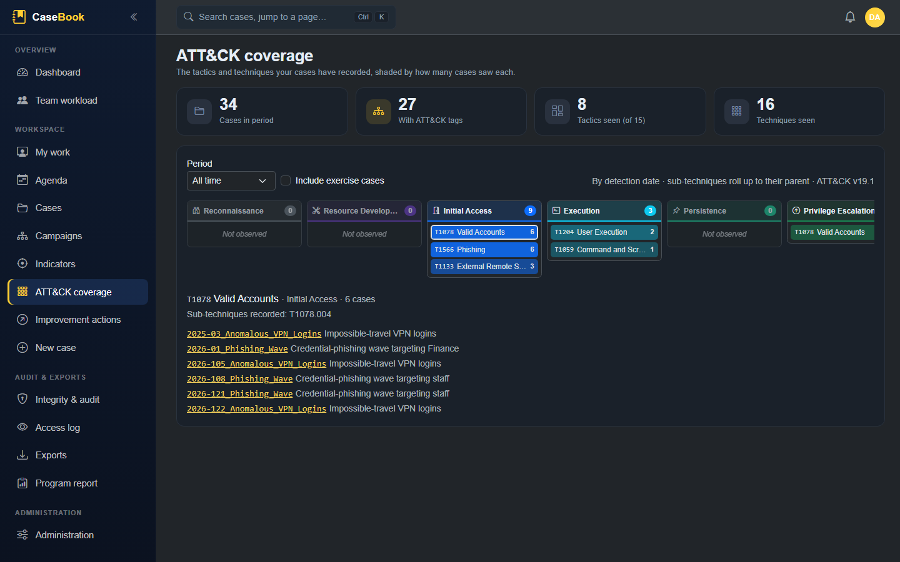

### Campaign rollup
When several cases are worked as one attack wave, linking them **"Same campaign as"** (E-14) makes them
roll up into a single cross-case view — reached from the **Campaigns** sidebar entry or the **View
campaign** shortcut on any linked case. One page shows the member cases, the **indicators shared across
more than one case** (the pivots that tie the wave together, strongest verdict wins), the combined
**MITRE ATT&amp;CK** coverage, a **merged event timeline**, and the aggregate posture (highest severity /
classification, span, open count, affected individuals &amp; jurisdictions). Exportable as JSON for a
partner or a TIP. A campaign is just the connected group of linked cases — no separate record to
maintain — and the whole view is need-to-know scoped, so a restricted case never appears in a rollup or
bridges two campaigns for someone who can't see it.

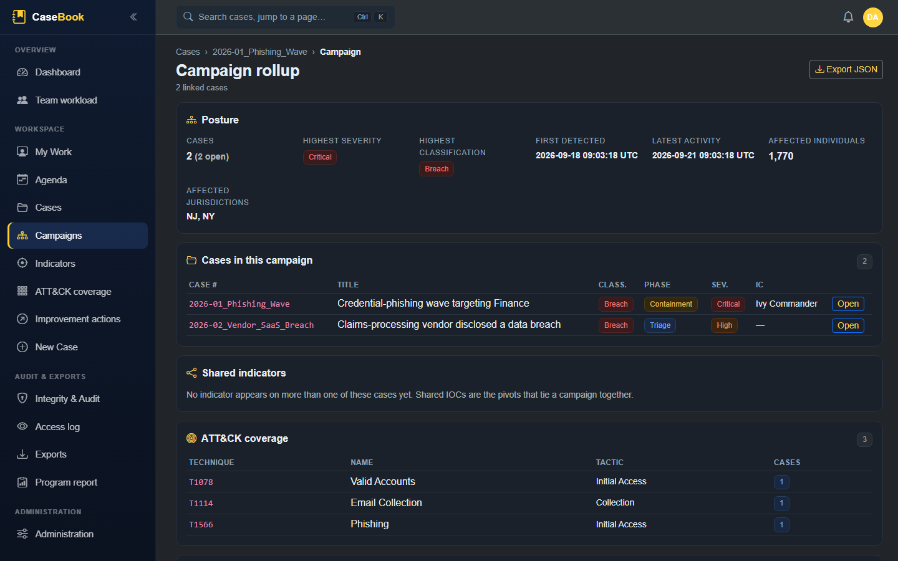

### Reporting — Word draft &amp; locked final
Generate a **Word** report as a working draft, then approve it as the **locked final**. Each report carries the
case's **SHA-256 content hash**, and the version, final flag, file hash, author and approver are recorded per
artifact. Reports are Word only, so they always match your own template; save the final as PDF in Word when
someone needs one. Reports
**draw the attack chain** across ATT&amp;CK tactic lanes and the **entity relationship graph**, list
**indicators of compromise** apart from everything examined, **defang** indicators so a forwarded report
can't be clicked through, and carry a **TLP 2.0** marking on every page. Admins keep a library of their own
**Word templates** with `{{…}}` fields and **preview** each one filled with a real case before anyone uses it
(nothing is stored). A report profile names a default template, and whoever generates a Word report can pick
another; each report records which template filled it. Uploads with macros, embedded objects or externally
loaded content are refused.

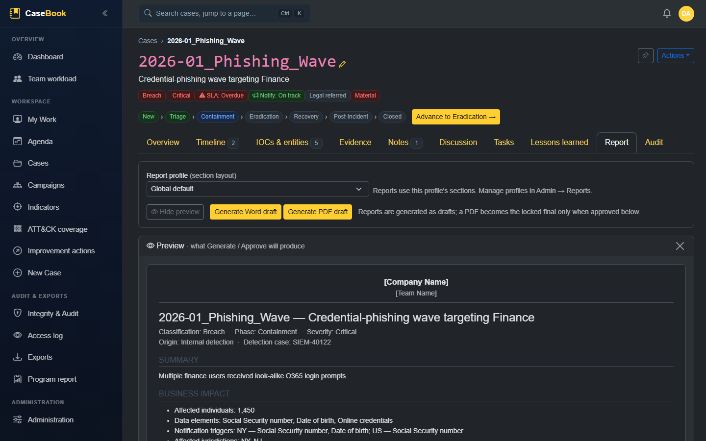

### Lessons learned &amp; improvement actions
A structured **post-incident review** per case (what happened, contributing factors, what worked well,
opportunities to improve — Markdown, like notes) and the **improvement actions** it identifies, each with
an owner and target date and tracked to closure (closing needs an outcome note). Actions stay editable after
the case closes and roll up into a cross-case **Improvement actions** register with CSV export. An optional
**Lessons captured** check can be required on the Close gate for Incidents and Breaches. The review prints in
its own stored, hashed **lessons-learned report**, never in the case report, with an optional admin-set
confidentiality legend on every page. Wording is deliberately neutral, since these records are discoverable.
**Draft from the case record** fills *What happened* with key times, the event sequence and every recorded
decision, for the analyst to edit (template-based; CaseBook never calls an AI).

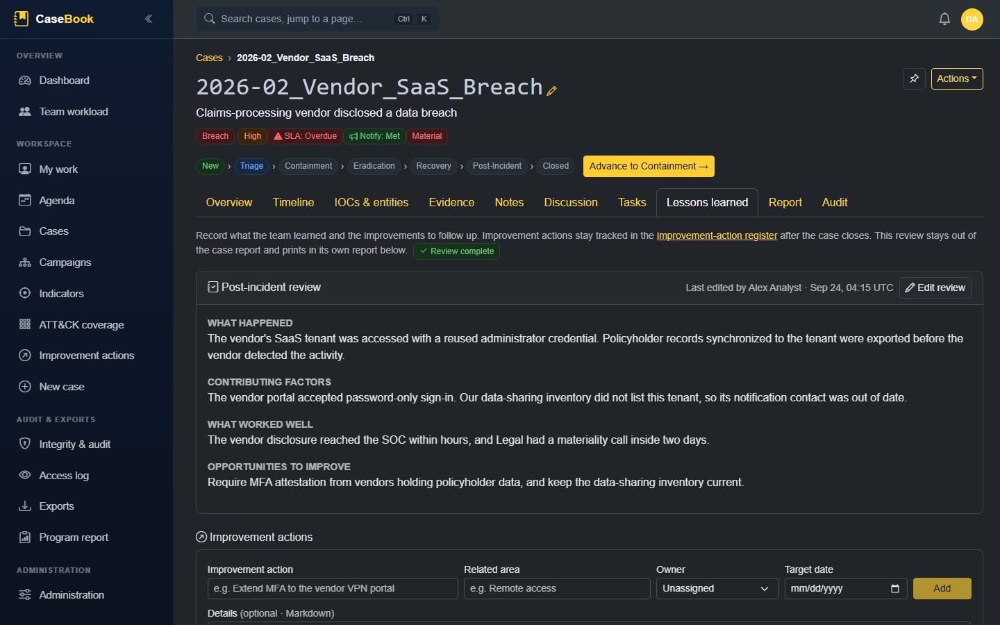

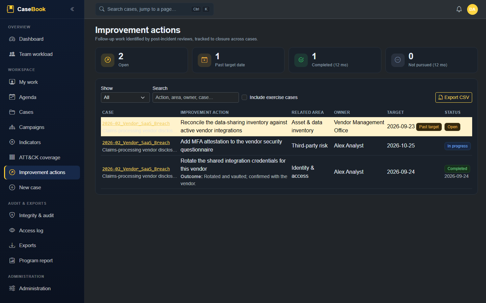

### Program report
A **quarterly** roll-up for leadership, board and exam packs: case volumes by classification and severity,
time to detect / contain / resolve, SLA attainment, regulatory reporting, post-incident follow-through and
the top ATT&amp;CK techniques, each against the previous quarter. Exports as CSV and prints cleanly to PDF;
an optional **quarterly email** sends the headline figures to managers. A **legal &amp; regulatory
obligations register** (referrals, holds, materiality, notification deadlines) exports alongside it for
Legal and Privacy.

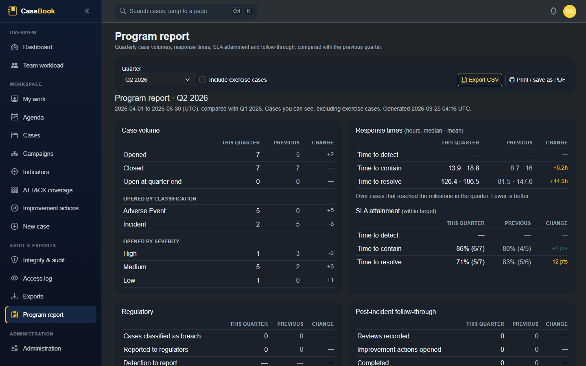

### Integrity &amp; audit
The tamper-evident spine: an append-only, SHA-256 hash-chained audit trail with one-click chain
verification and RSA-signed integrity seals exported out of band.

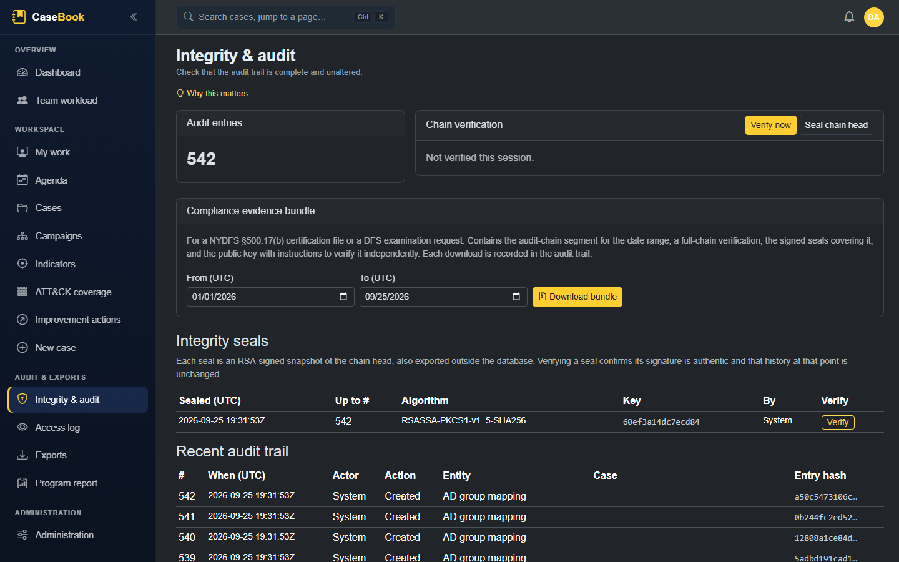

### Access log
Least-privilege access monitoring for a DFS exam: who **read** a case or pulled a sensitive artifact
(evidence, report, export), recorded as **out-of-chain** telemetry (so it never disturbs the
tamper-evident record) and **coalesced** into per-user view-sessions. Filterable by actor, case, type,
and date range, exportable as CSV, with a configurable scope (off / restricted-only / all). Case
workspaces also show a leadership-only **"Viewed by"** panel.

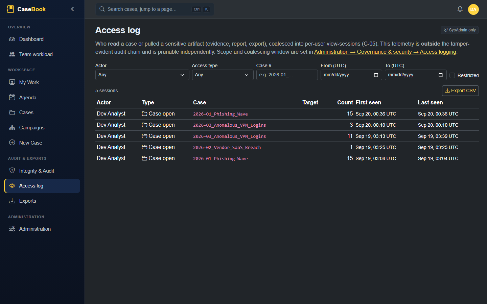

### Administration
SysAdmin-only admin hub. A single left rail groups every admin area — configuration, customization
(templates, stage gates, taxonomy labels, **data elements**, **notification rules**, report profiles), people & audit, and
a **configuration bundle** plus read-only system views. Operational settings are edited in-app and
stored as **audited, hash-chained** records; security- and infrastructure-sensitive settings stay in
server-side configuration and are shown read-only (secrets as status only). The main sidebar collapses
to icons when you want more room.

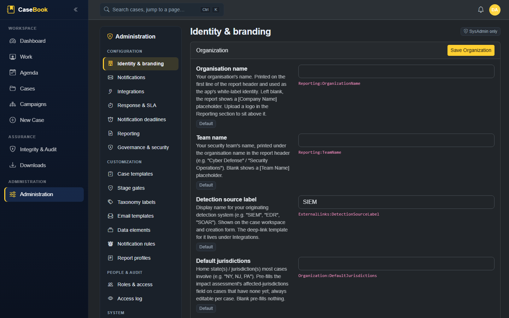

### Data elements
The categories of personal / non-public information an impact assessment can record are **admin-managed
reference data**, not a fixed code list — so an org can align them to its own IRP **without a release**:
add your own, rename, reorder, or **archive** ones it no longer uses. Each element carries its own
notification-trigger jurisdictions (e.g. `US, NY`), which drive the report's breach-notification summary.
Archiving (including a built-in) drops an element from new selection but **keeps its stable identity on
any case that already recorded it**, so historical records and their tamper-evident hashes stay intact;
an element no case uses can be deleted outright. Every change is audited.

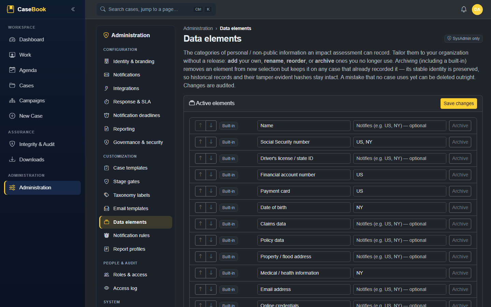

### Regulatory deadlines
Per-jurisdiction **regulatory notification deadlines** (e.g. New York / NYDFS Part 500 = 72h) as
admin-managed reference data — add, retime, or archive **without a release**. Each rule's code is matched
against the notification jurisdictions on the case's data elements, so a case's involved data determines
which deadlines apply; anything untuned falls back to a default window. The whole feature is a master
toggle (shipped **off**), and the clock starts from the **materiality determination** (or, optionally,
detection). The countdown surfaces on the case (a header badge and a per-jurisdiction table with a
one-click **"Mark reported"**) and aggregates on the leadership dashboard (detected→reported mean,
awaiting-report, and at-risk/overdue) — reminders only, never an automatic state change.

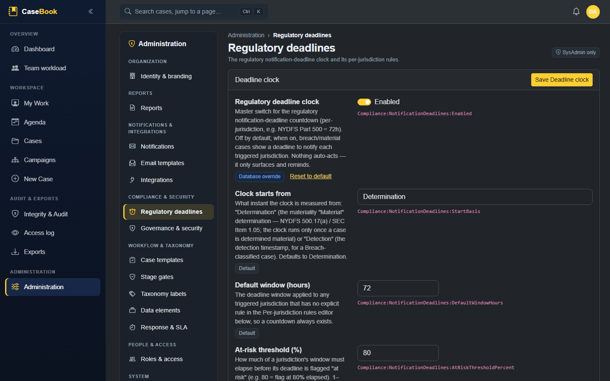

### Configuration bundle
Export an instance's **editable configuration** — operational & taxonomy settings, roles & AD mappings,
case templates, stage gates, report profiles with their Word templates, data elements, and notification-deadline rules — as a single **signed, versioned**
JSON "seed pack" to snapshot a setup, diff it against an IRP revision, promote config from a test
instance to production, or stand up a new **white-label** instance from a known baseline. Import is
**additive and previewed**: the signature is verified first, then a diff shows exactly what would change
before anything is written, and every change is audited. Cases, evidence, the audit trail, and
server-side security/infrastructure config are deliberately excluded — those never leave the server.

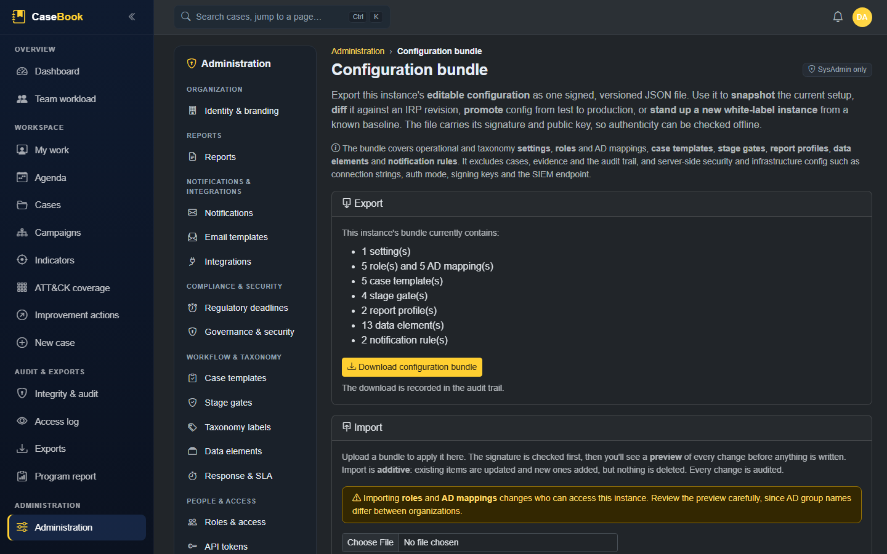

### Roles &amp; access
Permission-based RBAC: locked built-in **system roles** plus **custom roles** that compose the same
fixed, code-enforced permissions, each tied to AD security groups. Every change is audited,
hash-chained and streamed to the SIEM, with an anti-lockout guard on administrator access and a
confirmation that says what a removal will do. Changes reach signed-in users within a couple of minutes,
without them reconnecting.

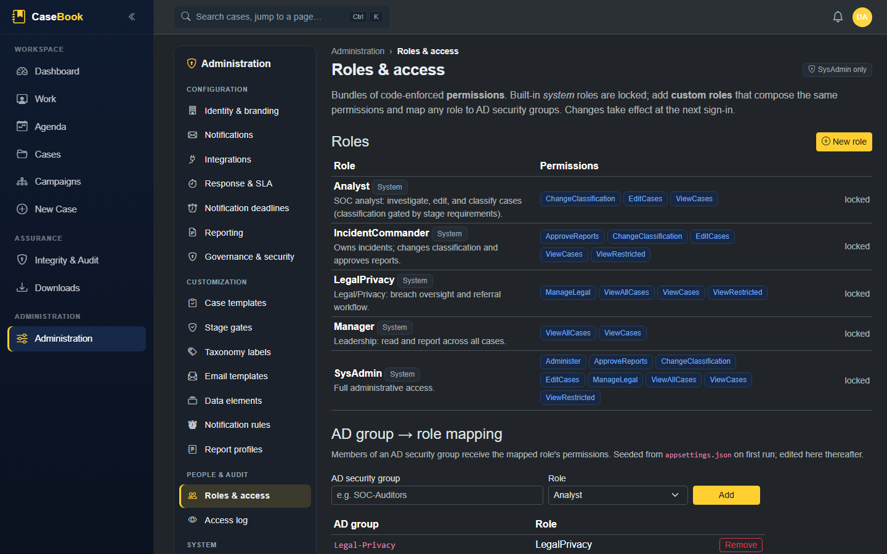

Everyone can see what their own roles allow under **Account → My access**, and the access-denied page names
the permission a refused page needs.

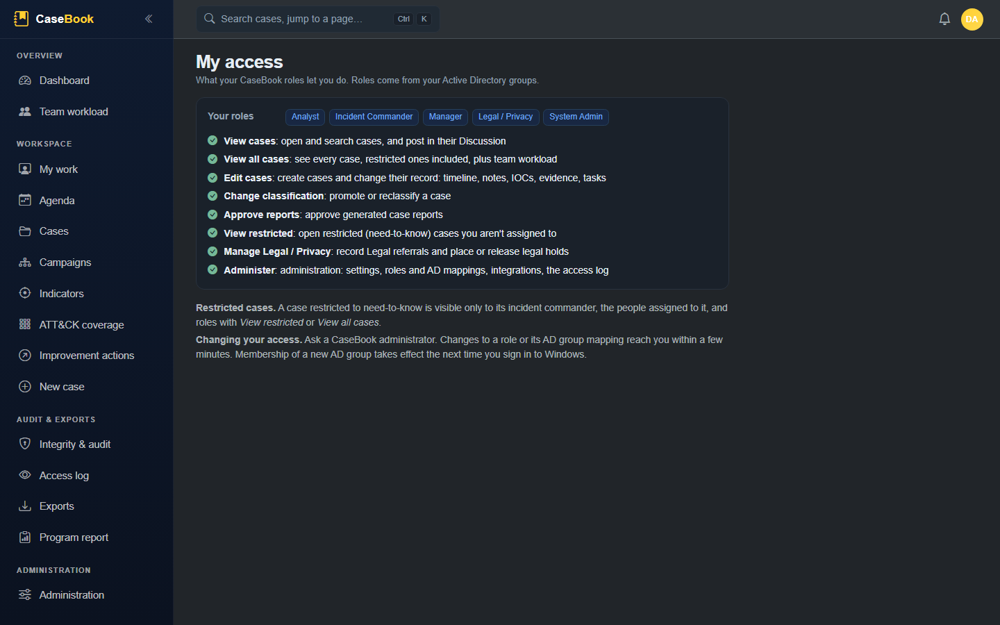

### Case inventory &amp; drill-in
Filterable across classification, phase, severity, origin, and full-text search over case numbers,
titles, notes, and IOCs. Filters live in the URL, so views are bookmarkable and the **dashboard tiles,
classification mix, phase pipeline, and activity bars deep-link straight into the pre-filtered list**
(need-to-know scoping preserved).

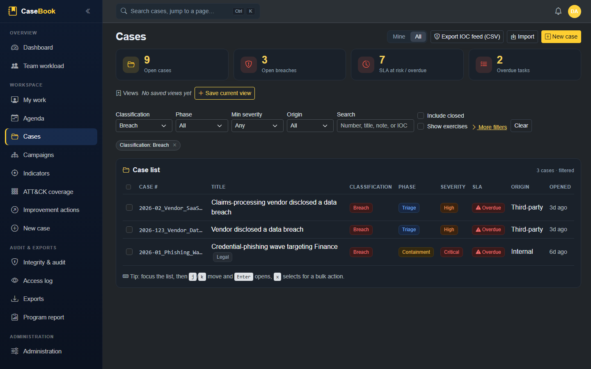

> Screenshots use local **dev-auth** (all roles) and seeded demo data; dark theme shown.

## Stack

- **.NET 10**, ASP.NET Core, **Blazor Server** (interactive)
- **EF Core** — SQLite for local dev (zero-install), SQL Server 2022 in production
- **Windows Integrated Authentication** (AD group → role mapping); a dev auth fallback for local use
- Reporting: **DocumentFormat.OpenXml** (Word, MIT-licensed); report text in Aptos with Aptos Display headings

## Architecture (Clean Architecture)

```
src/
  IncidentManager.Domain          Entities, enums, value objects, domain behaviour (no deps)
  IncidentManager.Application      Use-case services, DTOs, validation, authz policies, interfaces
  IncidentManager.Infrastructure   EF Core, audit-chain interceptor, stores, report generation, AD mapping
  IncidentManager.Migrations.SqlServer  Production SQL Server EF migrations (dev SQLite set lives in Infrastructure)
  IncidentManager.Web              Blazor Server UI, Windows/dev auth, security headers, download endpoints
tests/
  IncidentManager.UnitTests        Domain rules, hash-chain construction & tamper detection
  IncidentManager.IntegrationTests EF workflow, tamper detection via direct DB edit, report generation
```

Dependencies point inward. The **audit-chain interceptor** (`AuditChainInterceptor`) writes an
append-only, SHA-256 hash-chained `AuditLog` entry for every change on `SaveChanges`, and refreshes
per-row hashes on hashable entities — the spine of the integrity guarantees.

A full design reference — layered architecture, the integrity spine, access-control model, data model,
and diagrams — is in **[docs/ARCHITECTURE.md](docs/ARCHITECTURE.md)**; a runtime support/troubleshooting
runbook is in **[docs/SUPPORT.md](docs/SUPPORT.md)**. The complete documentation index is
**[docs/README.md](docs/README.md)**.

## Run locally

```bash
dotnet run --project src/IncidentManager.Web --launch-profile http
```

Then browse to <http://localhost:5103>. On first run the SQLite database is created, migrated, and
seeded with demo cases. Local dev uses a **dev auth** user granted all roles (see `DevAuth` in
`appsettings.json`) so every screen is reachable.

## Test

```bash
dotnet test
```

## Configuration (`appsettings.json`)

| Key | Purpose |
|---|---|
| `Auth:Mode` | `Dev` (local fallback) or `Windows` (production Integrated Auth) |
| `Database:Provider` | `Sqlite` (dev) or `SqlServer` (prod) |
| `ConnectionStrings:Default` | DB connection string |
| `RoleMapping:Groups` | AD security groups → application roles |
| `EvidenceStore:RootPath` / `ReportOutput:RootPath` | File stores (kept **outside** the web root) |

### Going to production

Full step-by-step for a fresh **Windows Server 2022 + SQL Server 2022** host — including a scripted
database + login provisioning and an IIS installer — is in **[docs/INSTALL.md](docs/INSTALL.md)**
(tooling in [`deploy/`](deploy/)); ongoing operations are in [docs/OPERATIONS.md](docs/OPERATIONS.md).
In brief:

1. Set `Auth:Mode = "Windows"`, host under IIS with Windows Authentication enabled.
2. Set `Database:Provider = "SqlServer"` and a SQL Server 2022 connection string using
   **integrated security** (no SQL credentials). The schema is applied by the **SQL Server EF Core
   migrations** (a dedicated `IncidentManager.Migrations.SqlServer` assembly — dev keeps its SQLite
   set); the app runs them on first start, or a DBA applies `deploy/sql/casebook-schema-sqlserver.sql`.
   Optionally enable **ledger tables** as engine-level tamper defence.
3. Populate `RoleMapping:Groups` with the real AD group names.
4. Provision the integrity signing key out of band; configure encrypted, tested backups of the database
   and the evidence/report stores.

`deploy/Install-Database.ps1` → `deploy/Install-CaseBook.ps1` → `deploy/Verify-Install.ps1` walks all of
this end to end.

## Roles

`Analyst`, `IncidentCommander`, `Manager` (leadership, read + reporting), `LegalPrivacy`, `SysAdmin` —
enforced via policies in `Application/Security/Policies.cs` and need-to-know case scoping.

## License

Copyright © 2026 James Ashley

CaseBook is free software, licensed under the **GNU Affero General Public License v3.0**
(AGPL-3.0). You may use, study, share, and modify it under those terms; there is **no
warranty**. Because the AGPL covers network use, anyone who runs a modified version as a
hosted service must make their modified source available to its users. See
[LICENSE](LICENSE) for the full text.

Third-party components are used under their own licenses, listed in
[THIRD-PARTY-NOTICES.md](THIRD-PARTY-NOTICES.md).
