# CaseBook

> The tamper-evident record for adverse events, incidents &amp; breaches.

A secure, on-prem web utility for the SOC to inventory and manage escalated security matters —
**Adverse Events, Incidents, and Breaches** (the three IRP classifications) — end to end:
timelines, evidence, analyst notes, after-action follow-ups, leadership dashboards, and
auto-generated Word reports, on a **tamper-evident, hash-chained audit trail**.

**Documentation:** start at **[docs/README.md](docs/README.md)**: product overview, a guided tour of the
screens, architecture, data model, workflows, developer guide, configuration, operations and troubleshooting.

## Screenshots

### Desk
Where an analyst starts: **what changed on your cases since you last looked**, then **what needs you** in order of
consequence (a running notification deadline, an overdue task, a mention, a case you were just added to, work due
soon), **your cases** with your part in each and the next thing for you, and **your tasks** by when they're due,
each with why it exists. The clocks on your cases and the quiet changes sit beside it.

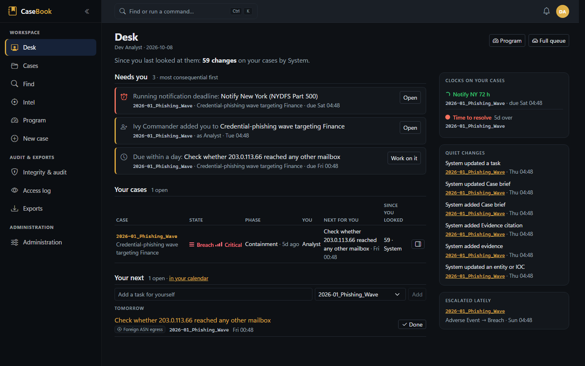

### Program
The cross-case views in one place for leadership: the **dashboard** (classification mix, attention items, an
open-items-by-phase pipeline, response times against SLA targets, a **regulatory-notification** compliance block
and a **12-month case-activity chart**, all derived from case timestamps, with a metrics CSV for board and
regulatory packs), the team's workload, due work across the team, improvement actions, the **legal register** and
the quarterly program report.

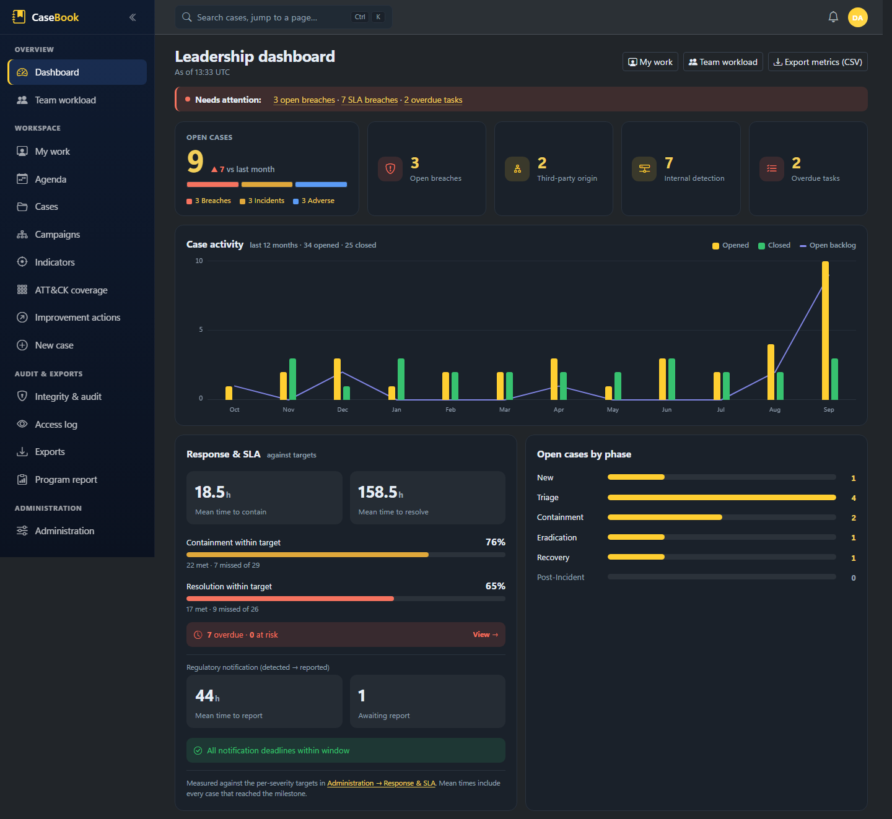

### Case workspace
One workspace per matter, whichever rung of the ladder it's on. A compact header carries the case number and
title, then one state line that reads as a sentence: the rung, severity as bars, the NIST SP 800-61 phase as a bar
with how long it's been there, the flags that matter (materiality, legal referral, restriction, legal hold), the
commander and the **most urgent clock**. The one act the state calls for (*Advance*, *Promote*, *Close*) sits
beside **Hand off** and the actions menu; a change of phase, rung or severity opens as a sheet under the header.

The case reads as five views: **Record** (the timeline), **Things** (IOCs & entities, evidence, ATT&CK,
connections, impact), **Tasks**, **Briefing** and **Paper** (report, lessons learned, audit trail). Beside every
view, **Now and Next**: Now is the brief (what the team believes, what's known, each open question and who is
answering it, and a prompt when the record has moved on since it was written); Next is what must happen, in order of
consequence: running obligations, then the open tasks with why each exists (and *Done…* to record a result), then
how ready the case is for its next gate. Any entity or evidence chip opens a panel in place: the verdict here and
on every other case, where it appears, the chain of custody. Opening a case you've seen before says **what changed
since you last looked**.

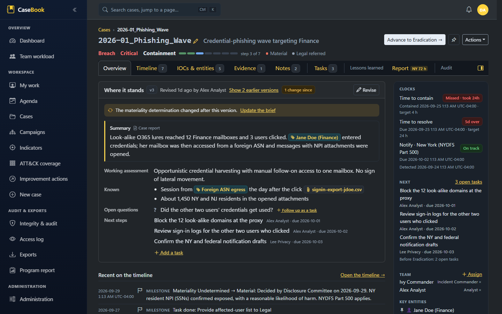

### Briefing
One page for a commander or a manager, assembled from the record and writing nothing: **what is happening, what we
know, what we are doing, what remains, and why**, beside the obligations, governance and team. It copies out as
plain text, and a closed case opens on it.

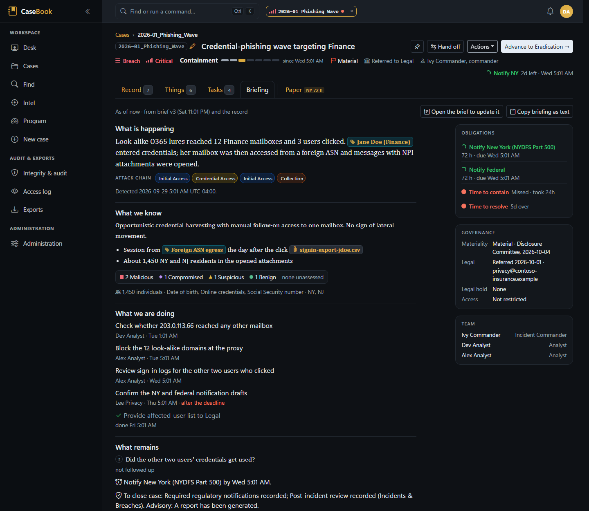

### Closing a case
Closing is a view of its own: the outcome (each with what it means), what happened and what the team concluded
(which become the brief's closing version and the report's summary), the open questions, and beside them the close
gate's readiness, when it closed, and what closing won't stop. Bring-your-own-AI help drafts the closing brief from
a copy-paste prompt; nothing is saved until a person closes the case.

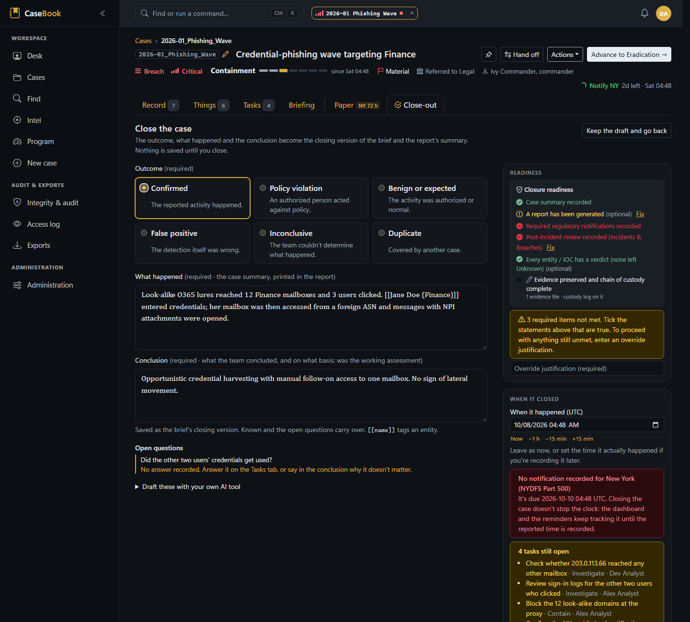

### Find
One search across every case you can see, with **typed results**: entities (with each one's verdict on every case),
cases (a closed one with how it ended), record entries including closing briefs, tasks, evidence names and, if you
ask, working notes. Find says how it read the query (a case number, an indicator, a person, words) and takes plain
filters you can see and edit (`type:decision reset after:2026-01-01`, `class:breach state:NY`). Matching is exact; a
restricted case you can't see never appears. The command bar (`Ctrl+K`) shows the same typed results as you type.

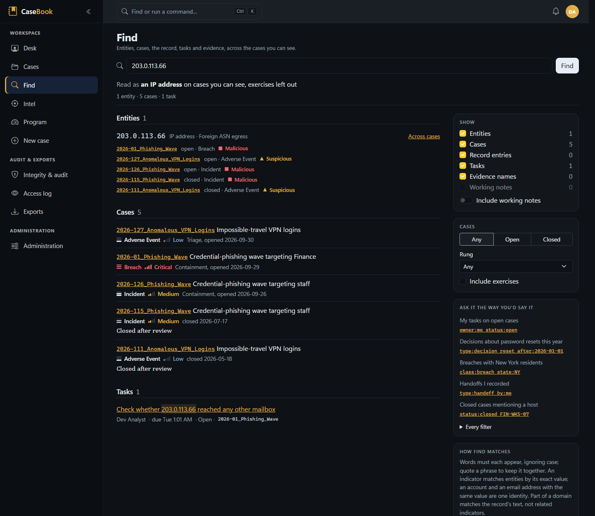

### Open-case tabs and Open beside
The cases you're on sit as tabs in the top bar, kept on your account and back when you sign in; pinned cases stay.
**Open beside** puts another case's Briefing next to the page you're on, to read two matters side by side.

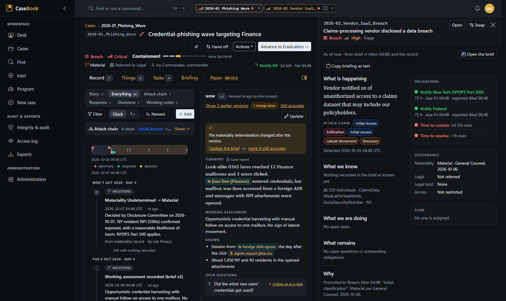

### On a phone
A case opens on **Now**, with Now · Record · Next · Things along the bottom: read the brief, log what you found,
answer a question, finish a task with its result. Phase changes, gates, closing and reports say they're done at a
desk.

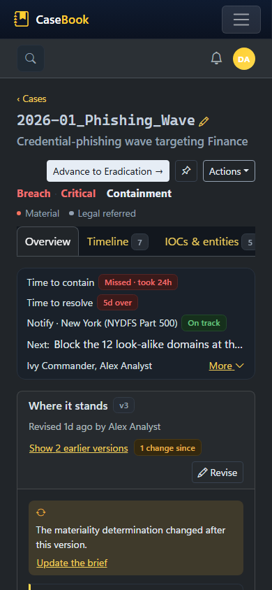 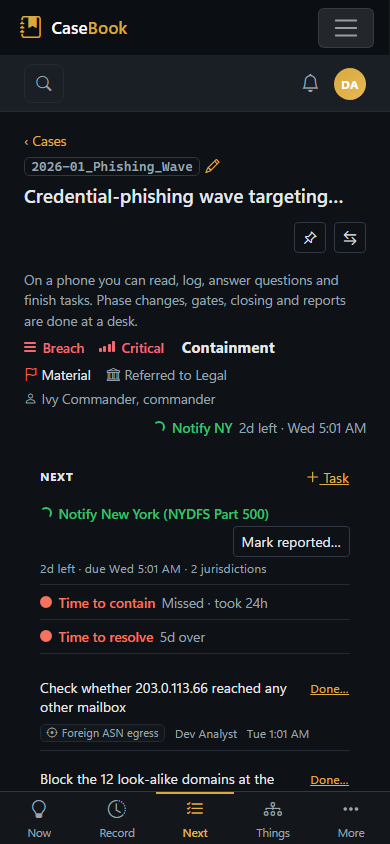

### Case creation
A single form captures origin (internal vs. third-party/vendor), classification, severity, an optional
detection-source case reference (the source label is a configurable operational setting — defaults to
**SIEM**), and any known **indicators / IOCs** — with inline validation, so every case starts
consistent and auto-numbered (`YYYY-NN_DescriptiveName`). As indicators are entered they're checked
against open cases (defanged notation refanged first), so a **duplicate or an ongoing campaign is
surfaced and linked at creation** instead of fragmenting across cases.

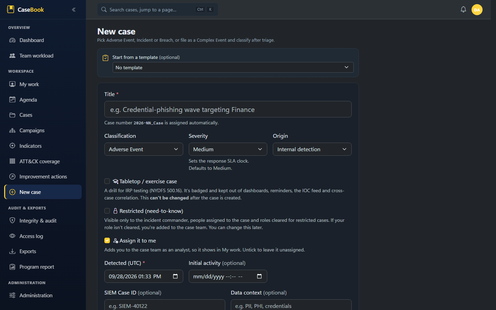

### Structured &amp; AI-assisted import
Bring a matter in as a structured document instead of retyping it: paste or upload a versioned JSON that
seeds a **new or existing** case with a summary, timeline, indicators and tasks. CaseBook never calls an AI —
**Step 1** generates a copy-paste prompt for your *own* tool (e.g. Copilot) that emits the exact schema, and
**Step 2** shows an editable, validated preview you confirm. Producers (XSIAM/SOAR playbooks, scripts) can
also submit over a **token-authenticated API**, landing in a review queue — a human always confirms before
anything is written to a case. See [docs/API.md](docs/API.md) for the API reference and
[docs/case-import.schema.json](docs/case-import.schema.json) for the document schema.

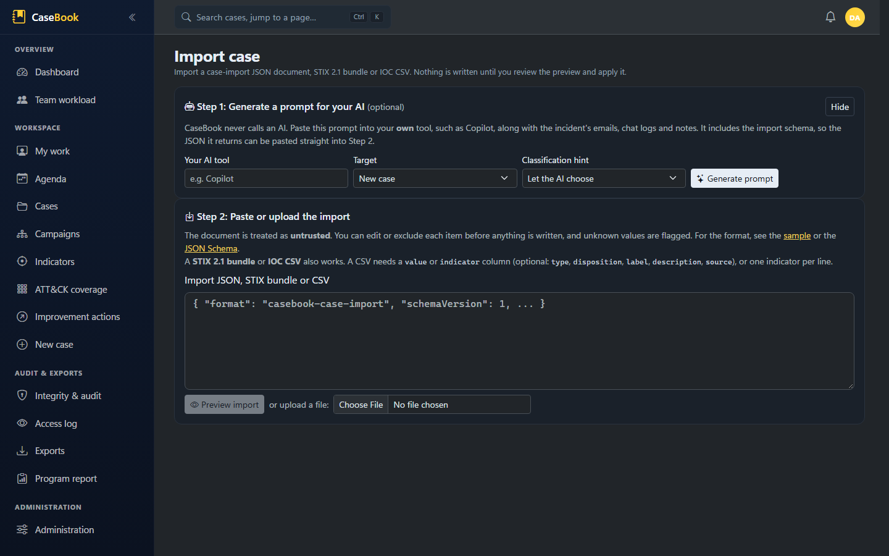

### The timeline: the record the report is built from
One chronology per case, read by day and counted from detection (switch to **T+** time to see it as the
responders do): the **event** timeline (what the adversary or vendor did, with the attack chain), the
**investigation** timeline (what the team did), **decisions** recorded with their why, and the **response
milestones** (classification, severity and phase changes, stage gates, materiality, reporting, completed tasks,
and who took command, joined or left)
drawn straight from the case record, so nothing is written twice. Work recorded after the fact is dated when
it happened: phase and classification changes take a "when it happened" time and can be corrected later, with a
reason, while the time it was entered is kept and shown. A task's result, a note or a task comment goes
onto the timeline in one step, entries (and the brief's "Known") cite the evidence behind them, and the report's investigation timeline
is this same record. A task can be started from a timeline entry, an entity or an evidence file, and remembers
what it's about; playbook steps set the kind of work their tasks are. The lenses (**Story**, Everything, Attack chain, Response, **Decisions**, Working notes) sit in one row
with the reading controls and **Add**. Story and Everything read in **two lanes**, the adversary left of the time
spine and the response right of it, with the phase as a band on the spine and long quiet stretches marked, under a
minimap of the whole case. One composer logs a finding, a decision, an adversary step, a question or a working note,
and adds its follow-ups (tasks, a question, a line for Known, a case link) in the same save.

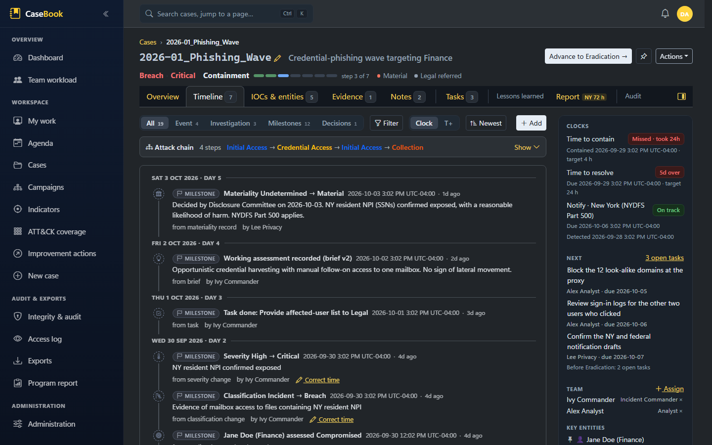

On a **vendor** case the lens is *Attack & disclosure*: each attack step says whether it happened in the vendor's
environment or in ours, and the chain marks where the attacker pivoted into our network. The vendor's notices and
containment are disclosure milestones, kept out of the chain.

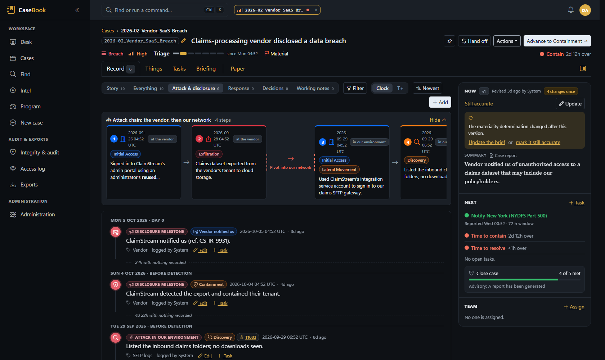

### Notes &amp; @mentions
Working notes per case (the Record's *Working notes* lens), in Markdown and versioned on every edit, that can be put on the timeline once they
become a finding. A note can **@mention** teammates to point them at it: they're emailed a link straight to
the note, and an edit only notifies people it newly mentions. Only people who can see the case can be
mentioned. There's no chat thread in the record: the team talks in its own chat, and the case keeps the
conclusions (decisions with their why, the brief, handoffs). A **handoff** can email the person taking over.

### Entities &amp; relationship graph
Every case's indicators and entities — accounts, hosts, IPs, domains, URLs, file hashes — captured with
a type, a **disposition** (malicious / suspicious / benign / unknown), and a source. An interactive
force-directed **relationship graph** renders each entity as a type-shaped node and **overlays the
attack chain** as tactic-coloured edges (e.g. the blue *Initial Access* step), so an analyst can see how
the phishing sender, patient-zero host, compromised Domain Admin account, and exfiltration destination
connect at a glance. Network/URL indicators can be shown **defanged** for safe copy-out. An **Across
cases** view redraws the graph around the case itself: the indicators it shares with other cases you can
see, those cases, and its case links (campaign links in gold).

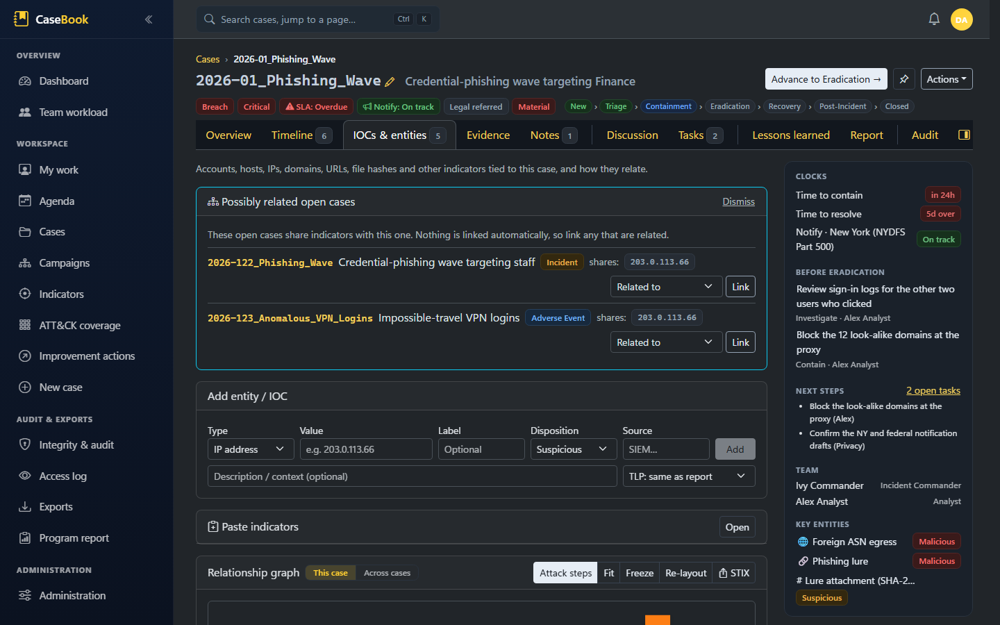

### Indicators — the cross-case pivot
Every indicator recorded on your cases, deduplicated by type and value, **most-shared first**: how many
cases each appears on (and how many are still open), the worst verdict any case gave it, and first / last
seen, with an expandable list of the cases behind it. A case's "also in" badge links straight here. Partner
**STIX 2.1 bundles** and **IOC CSV** files import into a case through the same reviewed import as everything
else, and the preview flags open cases already carrying the same indicators.

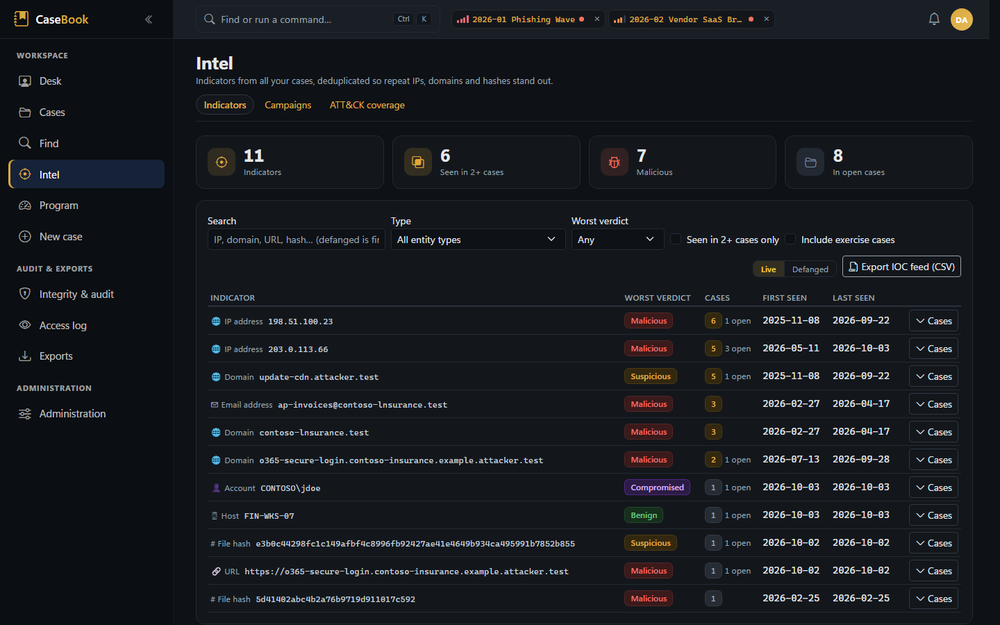

### ATT&amp;CK coverage
What the SOC has actually faced: the technique tags and attack steps across your cases rolled into the
MITRE ATT&amp;CK matrix, each technique shaded by how many cases saw it, unobserved tactics shown as gaps,
and a click-through to the cases behind any cell. Windowed by detection date; exercises excluded unless
asked for.

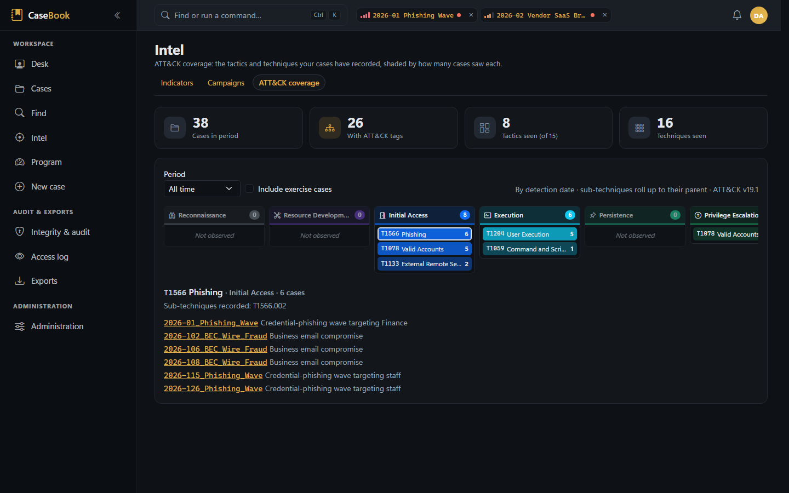

### Campaign rollup
When several cases are worked as one attack wave, linking them **"Same campaign as"** (E-14) makes them
roll up into a single cross-case view — reached from **Intel › Campaigns** or the **View
campaign** shortcut on any linked case. One page shows the member cases, the **indicators shared across
more than one case** (the pivots that tie the wave together, strongest verdict wins), the combined
**MITRE ATT&amp;CK** coverage, a **merged event timeline**, and the aggregate posture (highest severity /
classification, span, open count, affected individuals &amp; jurisdictions). Exportable as JSON for a
partner or a TIP. A campaign is just the connected group of linked cases — no separate record to
maintain — and the whole view is need-to-know scoped, so a restricted case never appears in a rollup or
bridges two campaigns for someone who can't see it.

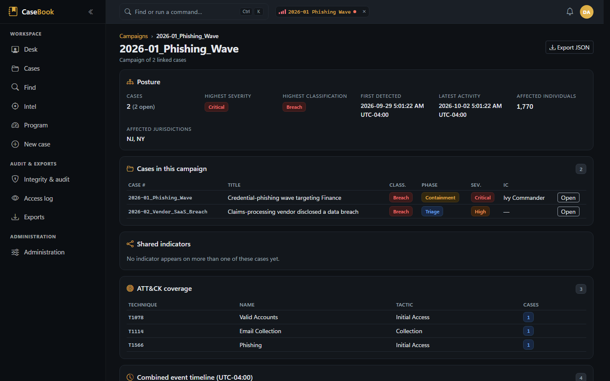

### Reporting — Word draft &amp; locked final
Generate a **Word** report as a working draft, then approve it as the **locked final**. Each report carries the
case's **SHA-256 content hash**, and the version, final flag, file hash, author and approver are recorded per
artifact. Reports are Word only, so they always match your own template; save the final as PDF in Word when
someone needs one. Reports
**draw the attack chain** across ATT&amp;CK tactic lanes and the **entity relationship graph**, list
**indicators of compromise** apart from everything examined, **defang** indicators so a forwarded report
can't be clicked through, and carry a **TLP 2.0** marking on every page. Admins keep a library of their own
**Word templates** with `{{…}}` fields and **preview** each one filled with a real case before anyone uses it
(nothing is stored). A report profile names a default template, one template can be the lessons-learned
reports' default, and whoever generates a report can pick another; each report records which template filled it.
Any template can fill either report and use any field, so one house template can serve both. Uploads with macros,
embedded objects or externally loaded content are refused.

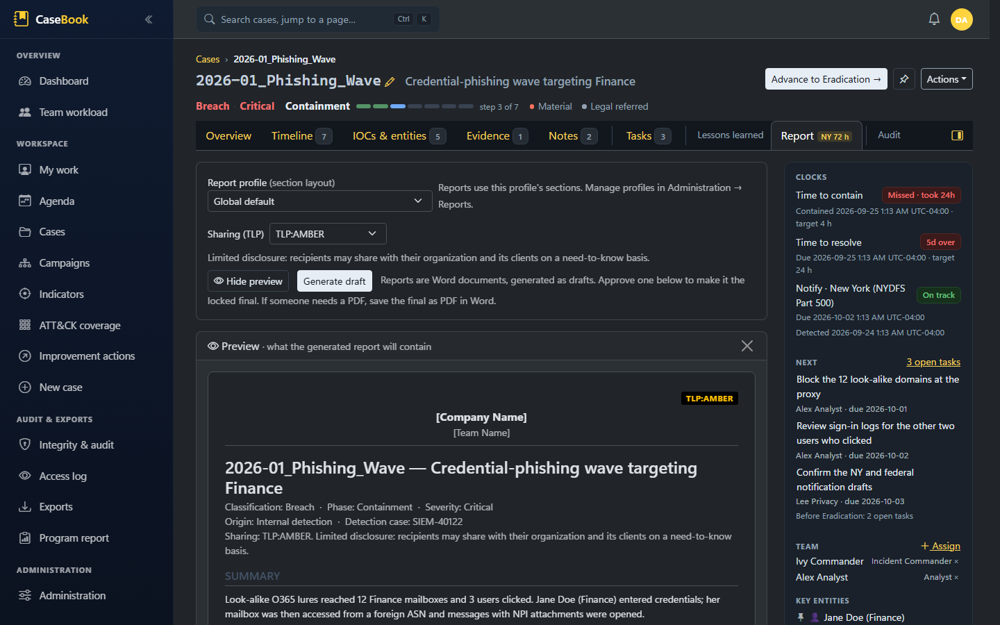

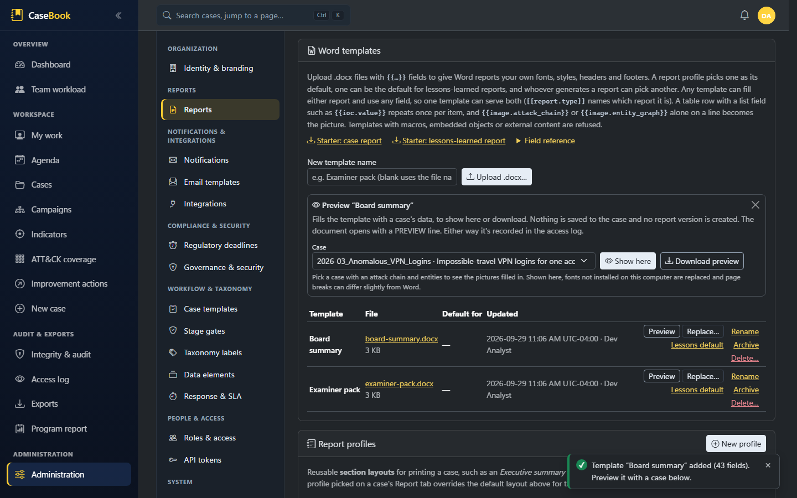

### Lessons learned &amp; improvement actions
A structured **post-incident review** per case (what happened, contributing factors, what worked well,
opportunities to improve — Markdown, like notes) and the **improvement actions** it identifies, each with
an owner and target date and tracked to closure (closing needs an outcome note). Actions stay editable after
the case closes and roll up into a cross-case **Improvement actions** register with CSV export. An optional
**Lessons captured** check can be required on the Close gate for Incidents and Breaches. The review prints in
its own stored, hashed **lessons-learned report** (the built-in case report never includes it), with an optional
admin-set confidentiality legend on every page, in the built-in layout or a Word template. Wording is deliberately neutral, since these records are discoverable.
**Draft from the case record** fills *What happened* with key times, the event sequence and every recorded
decision, for the analyst to edit (template-based; CaseBook never calls an AI).

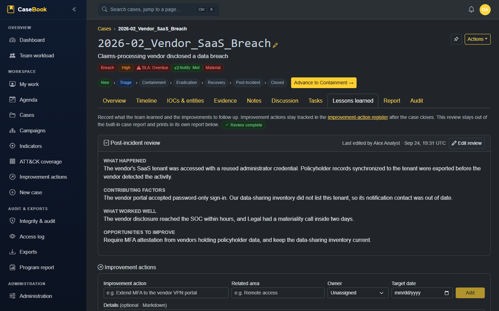

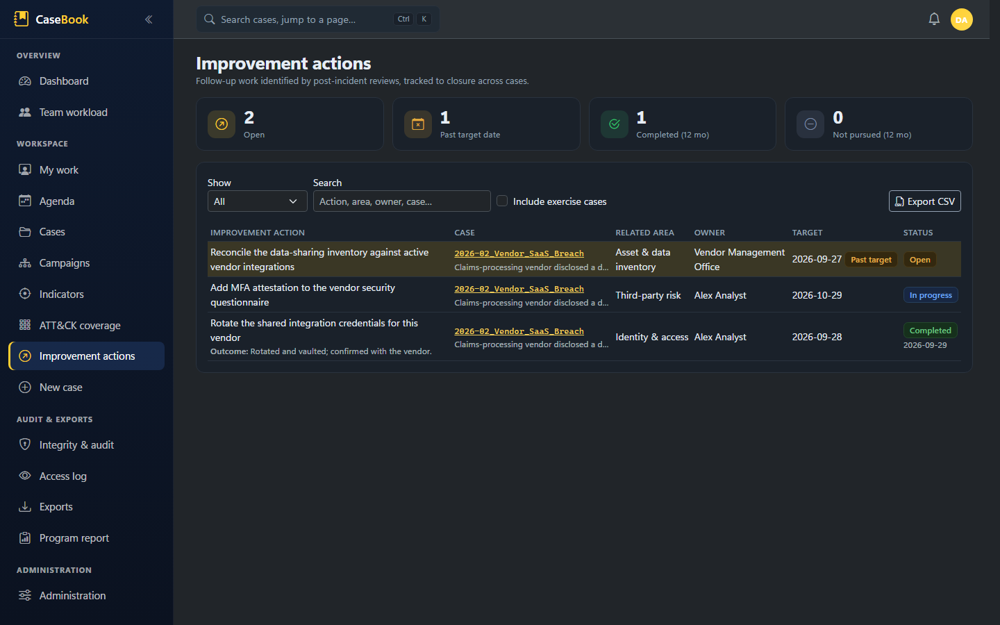

### Program report
A **quarterly** roll-up for leadership, board and exam packs: case volumes by classification and severity,
time to detect / contain / resolve, SLA attainment, regulatory reporting, post-incident follow-through and
the top ATT&amp;CK techniques, each against the previous quarter. Exports as CSV and prints cleanly to PDF;
an optional **quarterly email** sends the headline figures to managers. A **legal &amp; regulatory
obligations register** (referrals, holds, materiality, notification deadlines) exports alongside it for
Legal and Privacy.

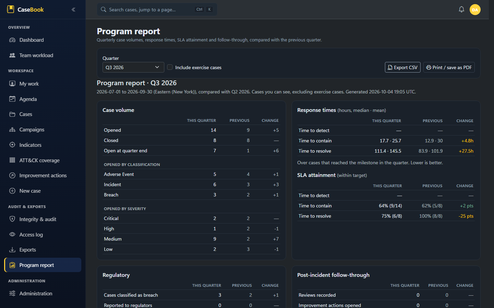

### Integrity &amp; audit
The tamper-evident spine: an append-only, SHA-256 hash-chained audit trail with one-click chain
verification and RSA-signed integrity seals exported out of band.

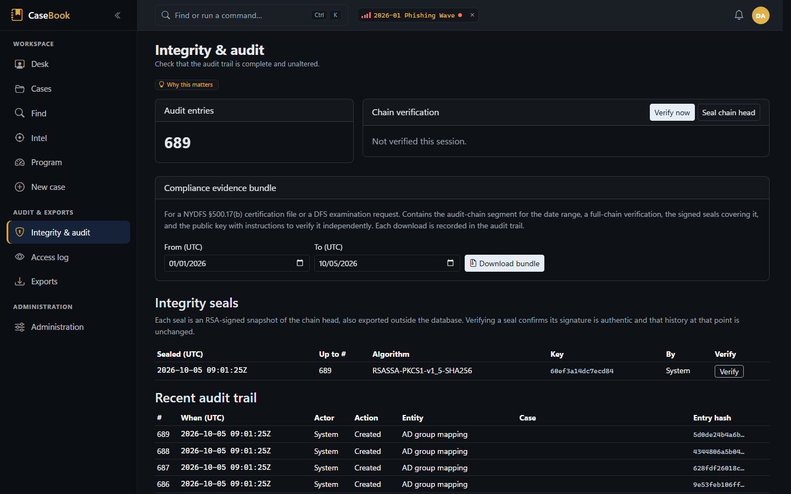

### Access log
Least-privilege access monitoring for a DFS exam: who **read** a case or pulled a sensitive artifact
(evidence, report, export), recorded as **out-of-chain** telemetry (so it never disturbs the
tamper-evident record) and **coalesced** into per-user view-sessions. Filterable by actor, case, type,
and date range, exportable as CSV, with a configurable scope (off / restricted-only / all). Case
workspaces also show a leadership-only **"Viewed by"** panel.

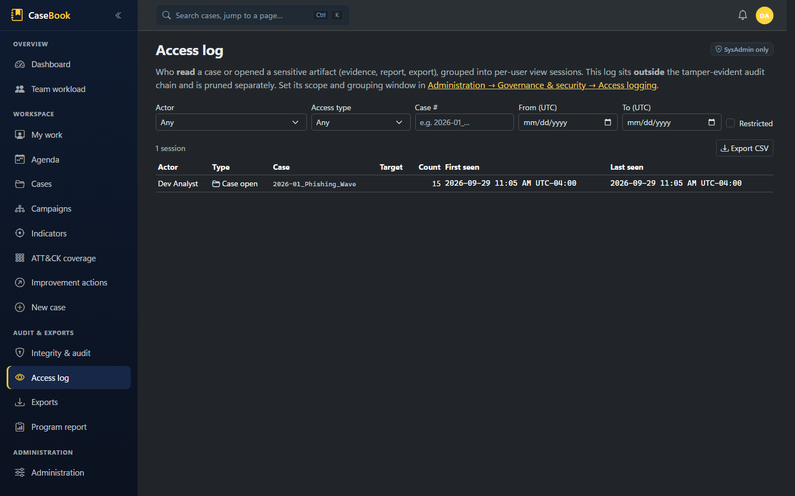

### Administration
SysAdmin-only admin hub. A single left rail groups every admin area — configuration, customization
(templates, stage gates, taxonomy labels, **data elements**, **notification rules**, report profiles), people & audit, and
a **configuration bundle** plus read-only system views. Operational settings are edited in-app and
stored as **audited, hash-chained** records; security- and infrastructure-sensitive settings stay in
server-side configuration and are shown read-only (secrets as status only). The main sidebar collapses
to icons when you want more room.

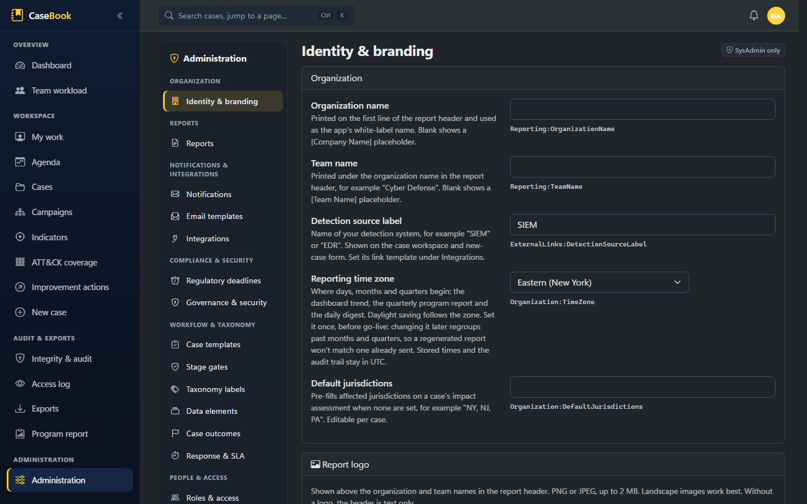

### Data elements
The categories of personal / non-public information an impact assessment can record are **admin-managed
reference data**, not a fixed code list — so an org can align them to its own IRP **without a release**:
add your own, rename, reorder, or **archive** ones it no longer uses. Each element carries its own
notification-trigger jurisdictions (e.g. `US, NY`), which drive the report's breach-notification summary.
Archiving (including a built-in) drops an element from new selection but **keeps its stable identity on
any case that already recorded it**, so historical records and their tamper-evident hashes stay intact;
an element no case uses can be deleted outright. Every change is audited.

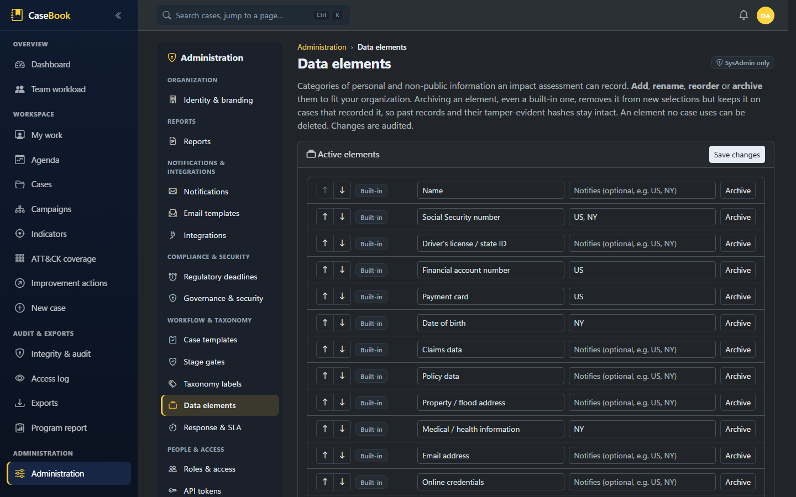

### Regulatory deadlines
Per-jurisdiction **regulatory notification deadlines** (e.g. New York / NYDFS Part 500 = 72h) as
admin-managed reference data — add, retime, or archive **without a release**. Each rule's code is matched
against the notification jurisdictions on the case's data elements, so a case's involved data determines
which deadlines apply; anything untuned falls back to a default window. The whole feature is a master
toggle (shipped **off**), and the clock starts from the **materiality determination** (or, optionally,
detection). The countdown surfaces on the case (a header badge and a per-jurisdiction table with a
one-click **"Mark reported"**) and aggregates on the leadership dashboard (detected→reported mean,
awaiting-report, and at-risk/overdue) — reminders only, never an automatic state change.

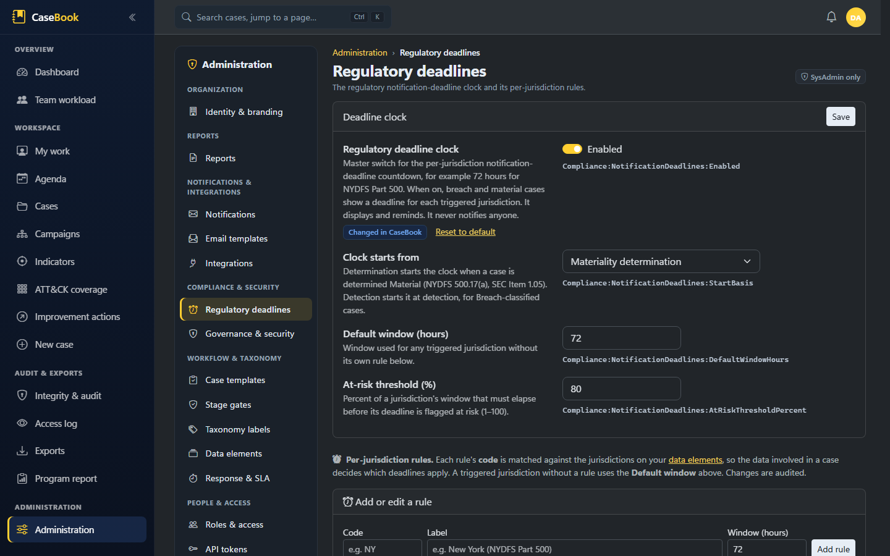

### Configuration bundle
Export an instance's **editable configuration** — operational & taxonomy settings, roles & AD mappings,
case templates, stage gates, report profiles with their Word templates, data elements, and notification-deadline rules — as a single **signed, versioned**
JSON "seed pack" to snapshot a setup, diff it against an IRP revision, promote config from a test
instance to production, or stand up a new **white-label** instance from a known baseline. Import is
**additive and previewed**: the signature is verified first, then a diff shows exactly what would change
before anything is written, and every change is audited. Cases, evidence, the audit trail, and
server-side security/infrastructure config are deliberately excluded — those never leave the server.

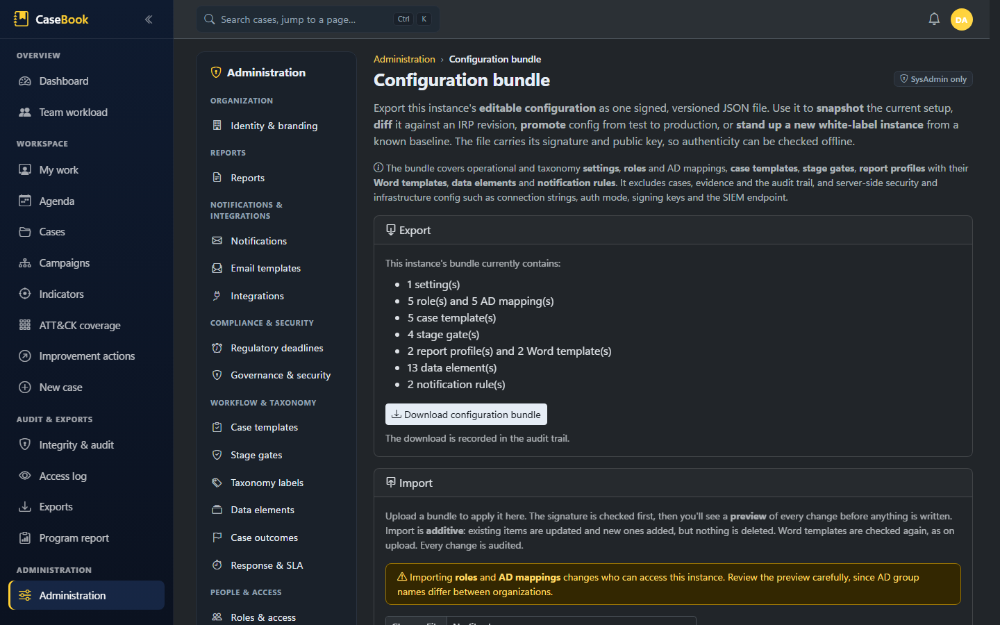

### Roles &amp; access
Permission-based RBAC: locked built-in **system roles** plus **custom roles** that compose the same
fixed, code-enforced permissions, each tied to AD security groups. Every change is audited,
hash-chained and streamed to the SIEM, with an anti-lockout guard on administrator access and a
confirmation that says what a removal will do. Changes reach signed-in users within a couple of minutes,
without them reconnecting.

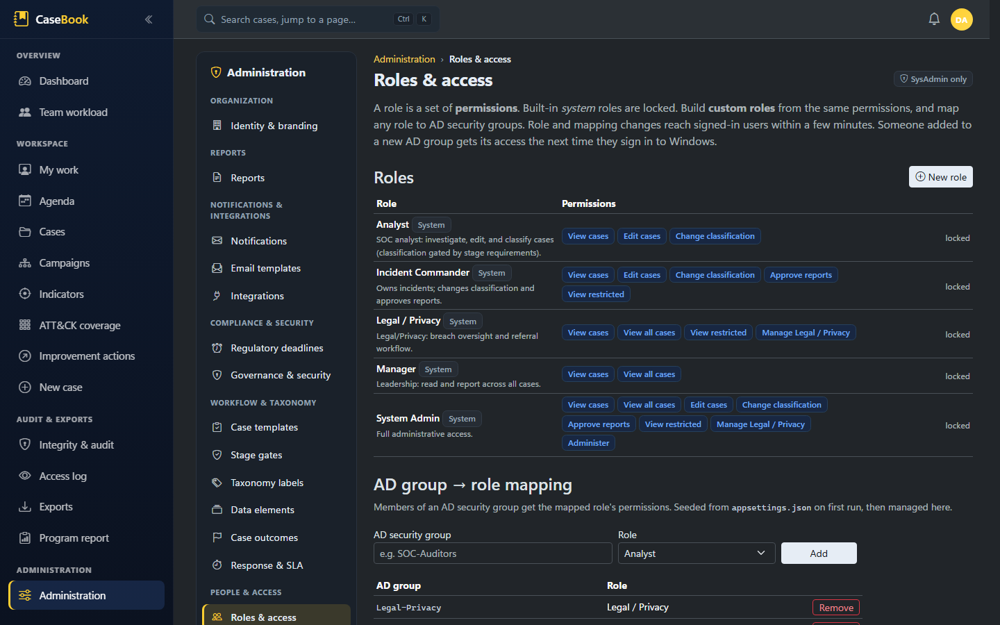

Everyone can see what their own roles allow under **Account → My access**, and the access-denied page names
the permission a refused page needs.

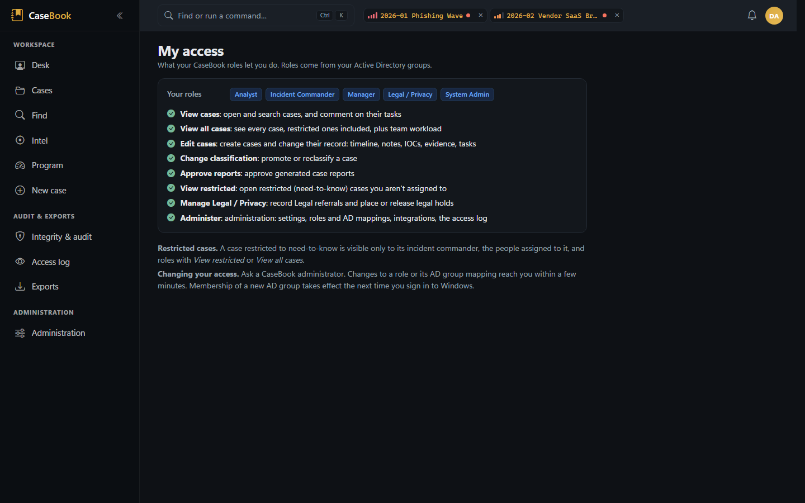

### Case inventory &amp; drill-in
Filterable across classification, phase, severity, origin, and full-text search over case numbers,
titles, notes, and IOCs. Filters live in the URL, so views are bookmarkable and the **dashboard tiles,
classification mix, phase pipeline, and activity bars deep-link straight into the pre-filtered list**
(need-to-know scoping preserved).

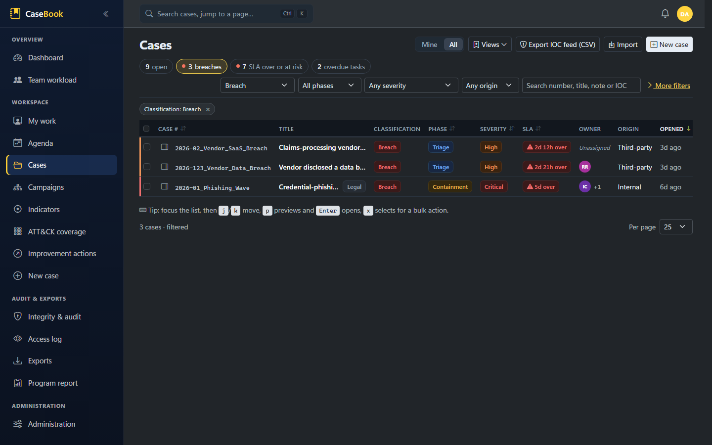

> Screenshots use local **dev-auth** (all roles) and seeded demo data; dark theme shown.

## Stack

- **.NET 10**, ASP.NET Core, **Blazor Server** (interactive)
- **EF Core** — SQLite for local dev (zero-install), SQL Server 2022 in production
- **Windows Integrated Authentication** (AD group → role mapping); a dev auth fallback for local use
- Reporting: **DocumentFormat.OpenXml** (Word, MIT-licensed); report text in Aptos with Aptos Display headings

## Architecture (Clean Architecture)

```
src/
  IncidentManager.Domain          Entities, enums, value objects, domain behaviour (no deps)
  IncidentManager.Application      Use-case services, DTOs, validation, authz policies, interfaces
  IncidentManager.Infrastructure   EF Core, audit-chain interceptor, stores, report generation, AD mapping
  IncidentManager.Migrations.SqlServer  Production SQL Server EF migrations (dev SQLite set lives in Infrastructure)
  IncidentManager.Web              Blazor Server UI, Windows/dev auth, security headers, download endpoints
tests/
  IncidentManager.UnitTests        Domain rules, hash-chain construction & tamper detection
  IncidentManager.IntegrationTests EF workflow, tamper detection via direct DB edit, report generation
```

Dependencies point inward. The **audit-chain interceptor** (`AuditChainInterceptor`) writes an
append-only, SHA-256 hash-chained `AuditLog` entry for every change on `SaveChanges`, and refreshes
per-row hashes on hashable entities — the spine of the integrity guarantees.

The architecture is described in **[docs/architecture/overview.md](docs/architecture/overview.md)** (with the
[integrity spine](docs/architecture/integrity.md), [security model](docs/architecture/security.md) and
[data model](docs/architecture/data-model.md)); troubleshooting is in
**[docs/operations/troubleshooting.md](docs/operations/troubleshooting.md)**. The complete documentation index
is **[docs/README.md](docs/README.md)**.

## Run locally

```bash
dotnet run --project src/IncidentManager.Web --launch-profile http
```

Then browse to <http://localhost:5103>. On first run the SQLite database is created, migrated, and
seeded with demo cases. Local dev uses a **dev auth** user granted all roles (see `DevAuth` in
`appsettings.json`) so every screen is reachable. See
[docs/development/getting-started.md](docs/development/getting-started.md).

## Test

```bash
dotnet test
```

## Configuration (`appsettings.json`)

| Key | Purpose |
|---|---|
| `Auth:Mode` | `Dev` (local fallback) or `Windows` (production Integrated Auth) |
| `Database:Provider` | `Sqlite` (dev) or `SqlServer` (prod) |
| `ConnectionStrings:Default` | DB connection string |
| `RoleMapping:Groups` | AD security groups → application roles |
| `EvidenceStore:RootPath` / `ReportOutput:RootPath` | File stores (kept **outside** the web root) |

Every setting is listed in [docs/operations/configuration.md](docs/operations/configuration.md).

### Going to production

Full step-by-step for a fresh **Windows Server 2022 + SQL Server 2022** host — including a scripted
database + login provisioning and an IIS installer — is in **[docs/INSTALL.md](docs/INSTALL.md)**
(tooling in [`deploy/`](deploy/)); ongoing operations are in [docs/OPERATIONS.md](docs/OPERATIONS.md).
In brief:

1. Set `Auth:Mode = "Windows"`, host under IIS with Windows Authentication enabled.
2. Set `Database:Provider = "SqlServer"` and a SQL Server 2022 connection string using
   **integrated security** (no SQL credentials). The schema is applied by the **SQL Server EF Core
   migrations** (a dedicated `IncidentManager.Migrations.SqlServer` assembly — dev keeps its SQLite
   set); the app runs them on first start, or a DBA applies `deploy/sql/casebook-schema-sqlserver.sql`.
   Optionally enable **ledger tables** as engine-level tamper defence.
3. Populate `RoleMapping:Groups` with the real AD group names.
4. Provision the integrity signing key out of band; configure encrypted, tested backups of the database
   and the evidence/report stores.

`deploy/Install-Database.ps1` → `deploy/Install-CaseBook.ps1` → `deploy/Verify-Install.ps1` walks all of
this end to end.

## Roles

`Analyst`, `IncidentCommander`, `Manager` (leadership, read + reporting), `LegalPrivacy`, `SysAdmin`, plus any
custom roles, built from eight code-defined permissions and enforced at the page, the service layer and the
need-to-know query filter. The permission matrix is in [docs/architecture/security.md](docs/architecture/security.md).

## License

Copyright © 2026 James Ashley

CaseBook is free software, licensed under the **GNU Affero General Public License v3.0**
(AGPL-3.0). You may use, study, share, and modify it under those terms; there is **no
warranty**. Because the AGPL covers network use, anyone who runs a modified version as a
hosted service must make their modified source available to its users. See
[LICENSE](LICENSE) for the full text.

Third-party components are used under their own licenses, listed in
[THIRD-PARTY-NOTICES.md](THIRD-PARTY-NOTICES.md).
