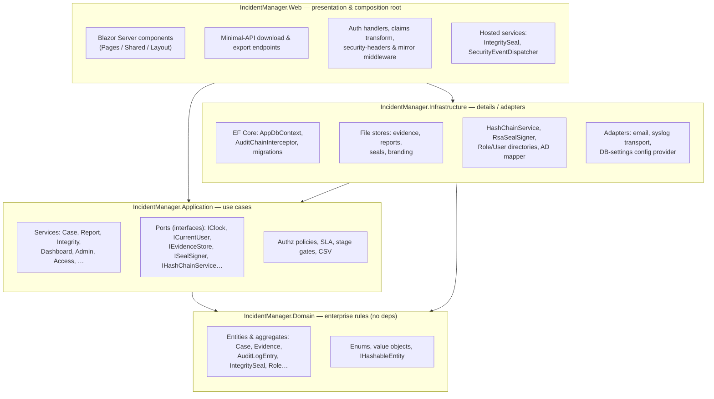
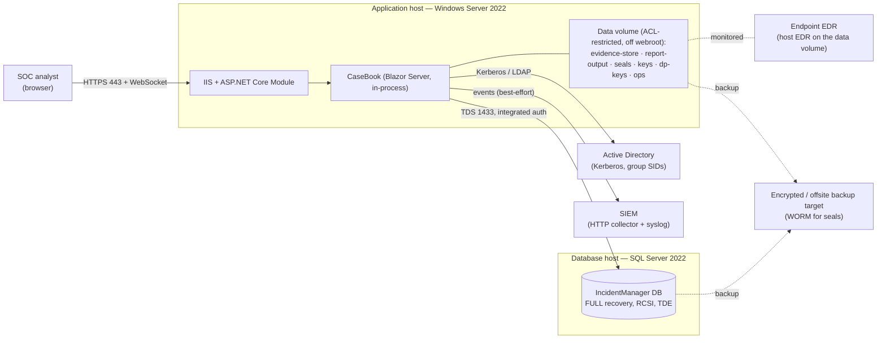
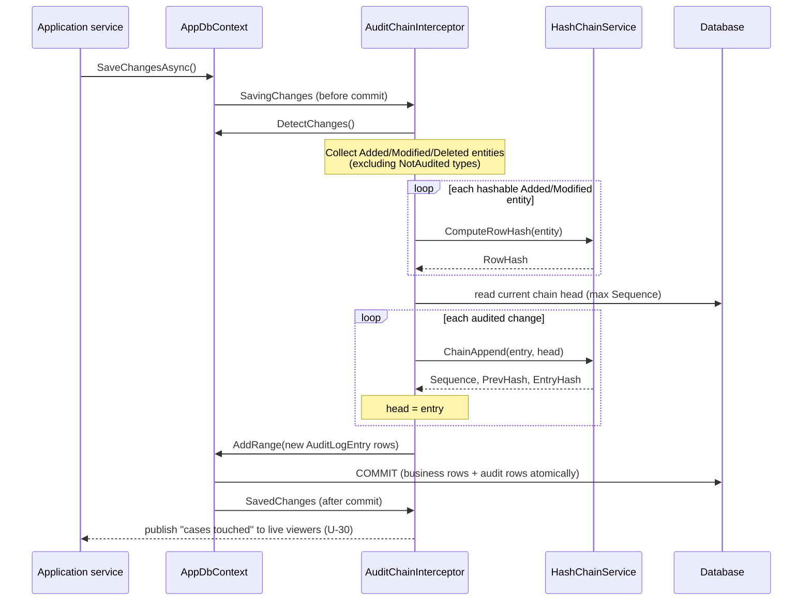
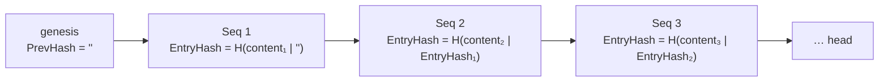
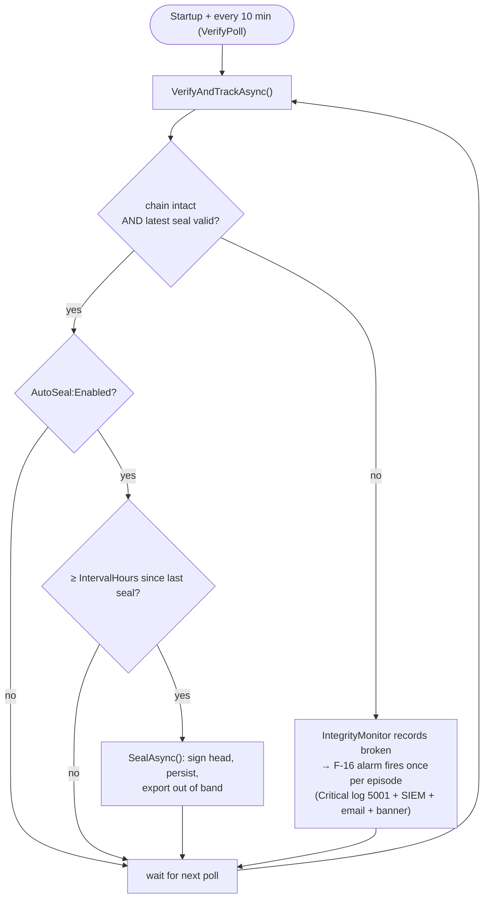
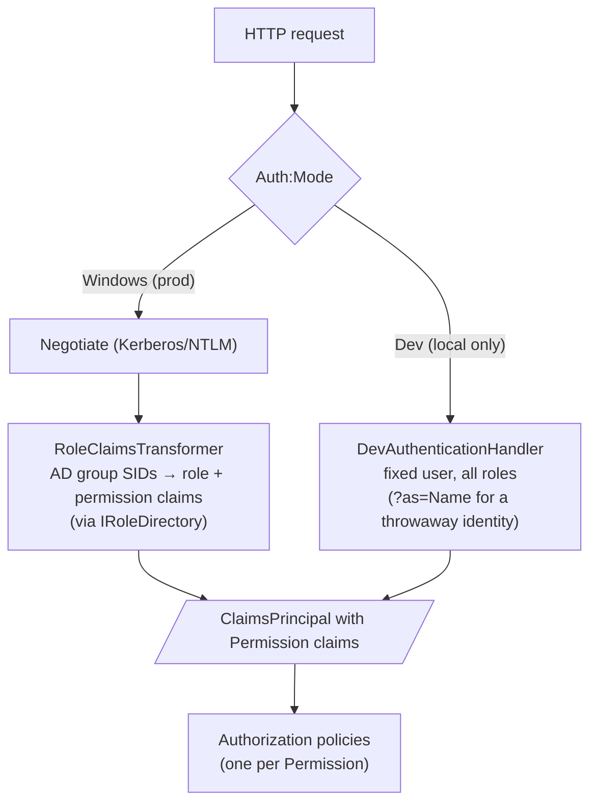
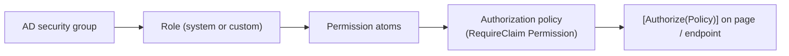
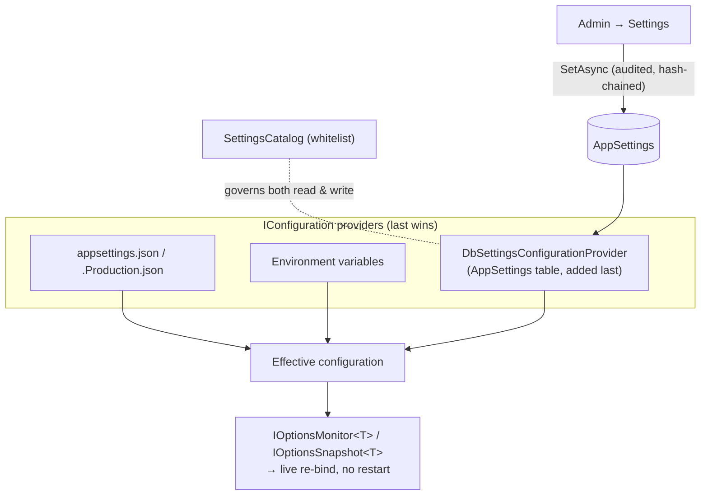
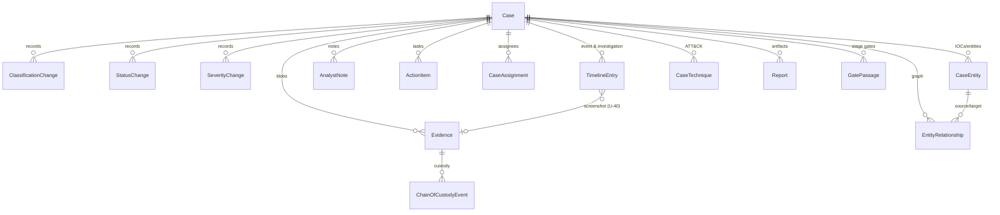
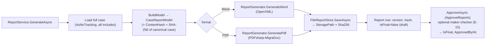

# CaseBook — Architecture & Design Reference

The engineering companion to the operational docs. Where **[INSTALL.md](INSTALL.md)** tells you how to
stand the app up and **[OPERATIONS.md](OPERATIONS.md)** tells you how to run it, this document explains
**how the app is built and why**, so a team that did not write it can support, extend, and reason about
it safely.

> **Audience:** developers and senior support/SRE engineers who need to change the code, diagnose a
> non-trivial fault, or evaluate the integrity guarantees. For a runtime troubleshooting runbook aimed at
> support desks, see **[SUPPORT.md](SUPPORT.md)**.

Backlog tags in this document (`F-16`, `C-05`, `S-02`, `A-08`, …) cross-reference the project's
internal planning backlog, where each item's rationale lives.

---

## 1. What CaseBook is

CaseBook is an **on-prem, single-tenant web application** for a Security Operations Center to manage
escalated security matters — **Adverse Events, Incidents, and Breaches** (the three IRP classifications),
plus a pre-triage **Complex Event** holding state — end to end. Its distinguishing property is a
**tamper-evident, hash-chained audit trail** with **RSA-signed integrity seals**: the record of what was
known, when, and who changed it is designed to survive scrutiny by a regulator or examiner.

Design priorities, in order:

1. **Integrity of the record** — every mutation is chained and independently sealable; alteration is
   detectable, not merely discouraged.
2. **Need-to-know access** — a restricted case is invisible to those not on it, with no existence leak.
3. **Auditability & defensibility** — reads are logged (out of band), reports carry content hashes, and
   a compliance bundle can be exported for an exam.
4. **Operability on a small on-prem footprint** — Windows Server + IIS + SQL Server, AD-integrated, no
   cloud dependency.

---

## 2. Architectural style — Clean Architecture

The solution follows **Clean Architecture**: dependencies point **inward**, toward the domain. Nothing in
the domain knows about EF Core, ASP.NET, or the file system; those are details supplied at the edges.



**The dependency rule in practice:** `Application` defines *ports* (interfaces in
`Application/Abstractions`), and `Infrastructure` supplies the *adapters*. For example `IEvidenceStore`
(port) is implemented by `FileEvidenceStore` (adapter); `ISealSigner` by `RsaSealSigner`;
`IHashChainService` by `HashChainService`. Swapping an HSM-backed signer for the file signer is a
one-line DI change with no impact on the services that call it.

### 2.1 Project layout

| Project | Responsibility | Depends on |
|---|---|---|
| **IncidentManager.Domain** | Entities, enums, value objects, aggregate behavior, the `IHashableEntity` contract. **No external dependencies.** | — |
| **IncidentManager.Application** | Use-case services, DTOs, FluentValidation validators, authorization policy definitions, port interfaces, SLA/stage-gate/CSV logic. | Domain |
| **IncidentManager.Infrastructure** | EF Core (`AppDbContext`, the audit-chain interceptor, dev/SQLite migrations), file stores, crypto, AD role mapping, email, syslog, the DB-settings config provider. | Application, Domain |
| **IncidentManager.Migrations.SqlServer** | The **production** SQL Server EF Core migration set (dev keeps its SQLite set inside Infrastructure). | Infrastructure |
| **IncidentManager.Web** | Blazor Server UI, composition root (`Program.cs`), Windows/dev auth, security middleware, download/export endpoints, hosted background jobs. | Application, Infrastructure |
| **tests/IncidentManager.UnitTests** | Domain rules, hash-chain construction & tamper detection, CSV escaping, image sniffing, SLA. | — |
| **tests/IncidentManager.IntegrationTests** | EF workflows, tamper detection via direct DB edit, seal verify, report generation, settings & access-log behavior. | — |

---

## 3. Runtime topology



Key facts a supporter must internalize:

- **Blazor Server** holds one **live circuit (WebSocket) per active user** in server memory. Sizing and
  app-pool recycles are memory- and circuit-sensitive (see INSTALL §1.1, and §4 below).
- **Blobs live on the file system, not in SQL.** Only hashes/metadata are in the database. The **data
  volume is the growth driver**; the SQL data file stays small and steady.
- **No SQL passwords.** The app authenticates to SQL with the app-pool's Windows identity (gMSA
  preferred).
- **Three data sets must be backed up in lockstep** — DB, evidence/report blobs, and out-of-band seal
  exports — or references dangle and tamper-evidence is lost. (OPERATIONS §1.)

---

## 4. The Blazor Server request & data-access model

Understanding two mechanics prevents most "works on my machine / breaks under load" confusion.

### 4.1 Circuit lifetime and the DbContext-factory rule (H-08)

Blazor Server shares **one DI scope for the entire circuit** (the whole time a user's tab is connected).
`DbContext` is **not thread-safe** and multiple components can render in the same pass, so a single shared
context throws *"A second operation was started on this context."* CaseBook therefore does **not** inject
`AppDbContext` into services. Services depend on **`IAppDbContextFactory`** and create a **short-lived
context per operation**:

```csharp
public async Task<ChainVerificationResult> VerifyAsync(CancellationToken ct = default)
{
    using var db = _factory.CreateDbContext();     // one context, this operation only
    var chain = await db.AuditLog.AsNoTracking().OrderBy(a => a.Sequence).ToListAsync(ct);
    return _hasher.VerifyChain(chain);
}
```

The factory is registered **scoped** so the context it builds carries the **scoped audit-chain
interceptor**, which in turn reads the **scoped `ICurrentUser`** — that is how a save knows which analyst
to attribute. A handful of infrastructure consumers (`RoleDirectory`, `UserDirectory`,
`CaseNumberGenerator`, `AuditWriter`) manage their own short scopes and are exempt.

> **Support/dev implication:** never cache a `DbContext` in a field, and never `await` two operations on
> the same context concurrently. Always `using var db = _factory.CreateDbContext();` per unit of work.

### 4.2 Rendering and authorization boundary

Every Razor endpoint is authorized by the ASP.NET **fallback policy** (`RequireAuthenticatedUser`) plus a
per-page `[Authorize(Policy = …)]`. A signed-in user who is **authenticated but unprovisioned** (in no
mapped AD group) is denied at the *endpoint* — before any component renders — so the in-component
`<NotAuthorized>` never runs. `Program.cs` catches that specific **page-GET 403** via `UseStatusCodePages`
and redirects to `/access-denied` (a friendly "who you're signed in as / what to do" page), while emitting
the SIEM `AuthorizationDenied` event (5201). Circuit endpoints (`/_blazor`) and non-GETs are deliberately
left alone so the redirect can't loop or disrupt the WebSocket.

---

## 5. The integrity spine — the system's reason to exist

This is the most important subsystem to understand. It has **three layers**, each defending a different
attack:

| Layer | Mechanism | Defends against | Lives in |
|---|---|---|---|
| **Per-row hash** | SHA-256 over each hashable entity's canonical fields (`RowHash`) | Silent field edits on a business record | `IHashableEntity` + `HashChainService.ComputeRowHash` |
| **Append-only hash chain** | Each `AuditLogEntry` hashes its content **+ the previous entry's hash** | Insert / delete / reorder / edit of history | `AuditChainInterceptor` + `HashChainService` |
| **Signed integrity seals** | RSA signature (RSASSA-PKCS1-v1_5-SHA256) over the chain-head snapshot, exported out of band | A *competent* rewrite that recomputes every hash, or a lost/tampered DB | `IntegrityService` + `RsaSealSigner` + `FileSealStore` |

### 5.1 How a save becomes audited (the interceptor)

`AuditChainInterceptor` is an EF Core `SaveChangesInterceptor` registered on every context. On each save,
**inside the same transaction**:



Details worth knowing:

- **What is not audited:** `AuditLogEntry`, `IntegritySeal`, `AppUser`, `ChainOfCustodyEvent`,
  `EntityLayout` (cosmetic graph positions), and `CaseAccessEvent` (high-volume read telemetry) are in the
  `NotAudited` set. The access log and custody log are separate records by design.
- **Before/after capture:** an `Update` records only the **changed** properties' before→after JSON; a
  `Create` records the new values; a `SoftDelete` records the prior values. Shadow properties are skipped.
- **Reason-for-change:** a service can set `AppDbContext.PendingChangeReason` for a unit of work (e.g. "why
  this IOC was re-dispositioned"); the interceptor folds it into the audit entry for `Update`s and clears
  it so a later save can't inherit it. It extends the entry's canonical content **only when present**, so
  the vast majority of reason-less historical entries hash exactly as before.
- **Actor:** `ICurrentUser.UserId`, or `"system"` for background/unauthenticated saves.

### 5.2 The hash chain



`VerifyChain` walks the ordered entries and fails on the **first** of: a sequence gap (insert/delete), a
`PrevHash` that doesn't match the prior `EntryHash` (reorder/break), or an `EntryHash` that doesn't match
recomputed content (edit). The result names the first broken sequence.

> **Known property (by design):** the chain is **unkeyed** SHA-256. A sophisticated attacker with write
> access who recomputes *every* downstream hash could produce an internally-consistent forged chain that
> `VerifyChain` alone would accept. That is precisely what the **signed seals** exist to catch — and, since
> security hardening **S-05**, the automatic monitor verifies the latest seal too, so such a rewrite
> trips the alarm on the monitor's cadence, not only on a manual check. Keying the chain off the DB (an
> HMAC) and anchoring seals off-box (WORM / RFC 3161) are the remaining S-05 ③/④ hardening steps, deferred
> to sequence with the F-05b key-custody decision.

### 5.3 Signed seals & continuous verification

A **seal** is a signed snapshot of the chain head: `{ SealedAtUtc, UpToSequence, ChainHeadHash, SealedBy,
Algorithm, KeyId, Signature }`. Because the chain is linear, if the sealed head hash still matches the live
audit entry at `UpToSequence`, **all history up to that point is provably unchanged since sealing**. Seals
are written to the DB **and** exported out of band by `FileSealStore` so they survive a DB compromise.

The **`IntegritySealHostedService`** (a singleton `BackgroundService`) drives this:



- **Detection latency is decoupled from seal cadence.** Verification + alarm run every **10 minutes**
  regardless; `IntervalHours` (default **6**) only bounds how much *recent* history is not yet sealed.
- **Never seal over a broken chain** — a break stops new seals until it verifies intact again.
- The alarm is **deduplicated per broken episode** by `IntegrityMonitor` (a singleton shared by the job and
  every circuit's banner), so a persistent break alarms once, not every 10 minutes.
- Both alarm channels are **out-of-band of the database the chain protects**, so a tamper that deletes rows
  cannot also suppress the alarm. The notifier **never throws**.

Manual **"Verify now"** on the Integrity page calls the same `VerifyAndTrackAsync`, so any detection path
raises the same alert exactly once.

---

## 6. Security & access control

### 6.1 Authentication



- **Production requires `Auth:Mode=Windows`.** `Program.cs` **throws at startup** if the environment is
  Production and the mode is anything else — the dev handler can never authenticate everyone as admin in
  prod (F-02).
- **`RoleClaimsTransformer`** (Windows mode) resolves Windows group claims — whose values are **SIDs** — to
  the configured group **names** (with a process-lifetime SID→name cache), asks `IRoleDirectory` which
  roles those groups map to, and adds **role** and **`Permission`** claims. A group rename is picked up on
  the next restart.
- **`DevAuthenticationHandler`** signs every request in as a fixed user with all roles. `?as=<name>` pins a
  throwaway identity via an `HttpOnly` cookie so multi-user features (presence, assignment, need-to-know)
  can be exercised on one box. It expands roles→permissions through the same directory as prod.

### 6.2 Authorization — permissions, not roles

Authorization is **permission-based**. The stable security atoms are the **`Permission`** enum values;
they only mean anything because code checks for them, so they are **defined in the domain and never
administered**. Roles (system or custom) are *bundles* of permissions.



| Permission | Grants |
|---|---|
| `ViewCases` | See cases **within need-to-know scope** |
| `ViewAllCases` | See every case regardless of restriction (leadership/oversight) |
| `EditCases` | Create and edit case content |
| `ChangeClassification` | Move a case on the ladder (Adverse Event → Incident → Breach) |
| `ApproveReports` | Approve/finalize reports |
| `ViewRestricted` | Open the content of restricted cases |
| `ManageLegal` | Manage the Legal/Privacy referral workflow |
| `Administer` | Settings, roles, integrity operations, access log, bundles |

**System roles** (seeded, undeletable) and their permission sets are defined in code
(`RoleDefinitions.SystemRoles`): `Analyst` (view+edit), `IncidentCommander` (+classification, +approve,
+restricted), `Manager` (view + view-all, read/reporting oversight), `LegalPrivacy` (view-all, restricted,
legal), `SysAdmin` (**every** permission, including future enum additions). Custom roles compose the same
atoms and are stored in the DB. `Policies.Required` maps each policy name to its required permission;
`Program.cs` registers one policy per entry.

### 6.3 Need-to-know case scoping

The single choke point is **`CaseQueryExtensions.ForUser(user)`**, applied to every case query:

```csharp
public static IQueryable<Case> ForUser(this IQueryable<Case> query, ICurrentUser user)
{
    if (user.Has(Permission.ViewAllCases)) return query;   // leadership/legal see everything
    var uid = user.UserId;
    return query.Where(c =>
        !c.IsRestricted                          // unrestricted cases are visible to all viewers
        || c.IncidentCommander == uid            // the IC always sees their case
        || c.Assignments.Any(a => a.UserId == uid)); // as does anyone assigned
}
```

- Scoping keys on the **capability** (`ViewAllCases`), not a specific role, so a *custom* role that grants
  it behaves correctly with no change here.
- **No existence leak:** direct-GUID access paths (`OpenAsync` for evidence/reports, report approve) apply
  the same filter and return the **same "not found"** message for both a missing and a not-permitted case.

### 6.4 File download / export endpoints

Minimal-API endpoints in `Program.cs` stream files; each is `RequireAuthorization`-gated and records the
sensitive-artifact access to the **out-of-chain** access log (C-05):

| Route | Gate | Notes |
|---|---|---|
| `GET /evidence/{id}` | `ViewCases` | Streams evidence; records a **chain-of-custody "Downloaded" event** (`recordDownload: true`) + a C-05 row. |
| `GET /evidence/{id}/inline` | `ViewCases` | Timeline thumbnail. **Sniffs magic bytes** (S-04) and serves **only a genuine raster image with the sniffed type** — an SVG or mislabeled file is refused. Passive views are deliberately **not** logged and record **no** custody event (S-03). |
| `GET /reports/{id}` | `ViewCases` | Streams the Word/PDF; C-05 row. |
| `GET /export/metrics.csv` | `ViewCases` | Dashboard metrics, scoped to the caller's visible cases. |
| `GET /export/iocs.csv` | `ViewCases` | Malicious-IOC blocklist feed, need-to-know scoped. |
| `GET /export/case-audit.csv` | `ViewCases` + `CanViewAsync(case)` | One case's filtered audit trail. |
| `GET /export/access-log.csv` | `Administer` | The C-05 access telemetry, filtered. |
| `GET /export/compliance-bundle.zip` | `Administer` | Audit segment + covering seals + verification, zipped (C-01). |

All CSV exports go through the shared **`Csv.Escape`** guard (S-01) that neutralizes formula/DDE injection
(`= + - @`, tab/CR leads) and RFC-4180-quotes as needed, so a malicious IOC value can't execute in a
spreadsheet.

---

## 7. Configuration model

CaseBook layers configuration so that **operational** settings are editable in-app (audited) while
**security/infrastructure** settings stay in server-side files.



- **`SettingsCatalog`** is the **whitelist** of ~25 operational settings (Email, SLA, retention, access
  logging, idle timeout, reporting, integrity interval, external links). It defines each setting's key,
  label, group, kind, default, and validation.
- **Writes** go through `AdminSettingsService.SetAsync`, which enforces the whitelist and writes an
  **audited, hash-chained** `AppSetting` row, then triggers `IConfigurationRoot.Reload()`.
- **Reads** (`DbSettingsConfigurationProvider.Load`) enforce the **same whitelist** (S-02): a row whose key
  is *not* editable is **dropped** and recorded in `RejectedKeys`. Such a row could only have been inserted
  out-of-band (DB tamper / restored backup), so on startup `Program.cs` logs a **Critical** line and emits
  SIEM event **5002** per rejected key. This is why a tampered `AppSettings` row can **never** override a
  connection string, auth mode, signing key, or the SIEM endpoint/token.
- **Anything not in the catalog** — connection strings, `Auth:Mode`, signing key paths, `RoleMapping`,
  data-protection, `Siem:*` endpoints/secrets, backup-status path — is **server-side only** and shown
  **read-only** in Admin (secrets as presence, never value).

### 7.1 The extensibility boundary — data-driven, labels-only, or code-defined (X-05)

CaseBook is built to be **re-aligned to a revised IRP, or stood up for a different organization, without a
code release** — but not *every* dimension is safe to make administrable. Each configurable dimension sits
in exactly one of **three tiers**, and the tier is a deliberate design decision, not an accident of what
happened to get built first.

| Tier | What an admin can change in-app | Examples | Why |
|---|---|---|---|
| **Data-driven reference data** | Add / relabel / reorder / archive the **members themselves** | Data elements (X-03), case templates, stage-gate definitions, report profiles, custom roles, AD-group→role mappings, taxonomy override entries | Nothing in code branches on a *specific* member; the code treats the set generically, so an org can shape it freely. |
| **Labels-only (X-02 display layer)** | Rename, hide, or reorder for **display**; the underlying member is untouched | The **classification ladder** (`AdverseEvent → Incident → Breach`), the **`CasePhase` set**, severity levels | Compliance and workflow logic **keys on the specific member**; only the shown name is safe to vary. |
| **Code-defined (fixed)** | Nothing — changing it is a code change, by design | `Permission` atoms (§6.2), the enum members behind the labels-only tier | These are the stable atoms other code is written against; administering them would let configuration silently break a security or compliance guarantee. |

**Why the classification ladder and the phase set are labels-only, not data-driven.** Making
`AdverseEvent → Incident → Breach` or the NIST-style `CasePhase` set fully data-driven (admin adds/removes/
reorders the *members*) is **high-risk and low-benefit**, because live behaviour is wired to specific
members, not to "whatever the top of the ladder is":

- **Breach-notification and bundle paths key on `Classification.Breach` by name.** Reclassifying *to* Breach
  is what fires the notification/escalation side-effects (`CaseNotifications` at
  `Infrastructure/Notifications/CaseNotifications.cs:28`, the escalation branch in `CaseService.ReclassifyAsync`
  at `Application/Cases/CaseService.cs:361`). An admin who renamed the member to a new identity, reordered the
  ladder, or deleted "Breach" would **silently stop breach notifications from firing** — a compliance failure
  with no error and no audit signal that anything broke.
- **SLA milestones key on specific phases.** Entering `CasePhase.Containment` stamps `ContainedAtUtc` and
  entering `CasePhase.Recovery` stamps `ResolvedAtUtc` (`Domain/Entities/Case.cs:246`), which are the two
  clocks the SLA subsystem (E-16) measures against. Rewiring the phase set would detach those milestones from
  the timeline they measure.
- **Stage-gate triggers are keyed to ladder/phase transitions.** `StageGateTrigger`
  (`PromoteToAdverseEvent` / `EscalateToIncident` / `EscalateToBreach` / `CloseCase`) maps one-to-one onto
  specific classification and phase moves (`Application/StageGates/GateNotSatisfiedException.cs:34`). A
  data-driven ladder would leave gates pointing at members that no longer exist.

The **benefit** an org actually wants from this dimension — "call it *Data Incident* instead of *Breach*",
"we don't use the *Eradication* phase", "show *Containment* before *Triage*" — is fully served by the
**X-02 labels-only display layer** (rename / hide / reorder, stored as a display override, canonical enum
value unchanged, no hash-canonical impact, no restart). The members themselves stay in code precisely so
that the notification, SLA, and gate logic above can keep keying on them safely.

**The rule for a future "make everything data-driven" ask.** Before promoting a dimension from labels-only
to data-driven, check whether **any code branches on a specific member of it** (a `switch`/`==` on the enum
value, a milestone stamp, a trigger mapping, a notification path). If it does, the members are load-bearing
and must stay code-defined; expose adjustability through the X-02 display layer instead. Only dimensions the
code treats **generically** (iterated, counted, matched by stable id — never by a named member) belong in the
data-driven tier. This is the same principle that keeps `Permission` atoms out of administration (§6.2):
*things other code is written against are not configuration.*

---

## 8. Data model

### 8.1 The Case aggregate

`Case` is the **aggregate root**. It owns its history and child collections and enforces invariants through
**behavior methods** (`Open`, `Reclassify`, `ChangePhase`, `Assign`, `AddEntity`, `AddEventStep`,
`EditNote`, `PlaceLegalHold`, `Archive`, …) rather than open setters — so, e.g., a reclassification always
records a `ClassificationChange`, and archival is refused under legal hold.



Notable modeling choices:

- **Human key** `YYYY-NN_DescriptiveName` for IRP cases; **Complex Events** (pre-triage, null
  classification) are numbered `CE-YYYY-MM-DD_Name` so they never mix with ladder cases and there is no
  sequence to reuse. Promotion renumbers into the IRP scheme (unless a custom number was set).
- **Append-only history** for notes and investigation-timeline entries: an edit **supersedes** the current
  version (`IsCurrent`, `Version`, `SupersedesId`) rather than overwriting, so "what was known and when"
  survives. Event steps and entities are corrected in place (the audit chain preserves the prior value).
- **IOC normalization:** entities refang defanged notation on entry (`1.1.1[.]1` → `1.1.1.1`) so
  correlation, links, and the pushed feed all match canonically, and dedup by `(type, value)`.
- **`BuildCanonicalContent()`** on `Case` (and every `IHashableEntity`) is the **order-stable projection**
  that feeds the row hash. Preferences deliberately excluded from it (e.g. `ReportProfileId`,
  `HasCustomNumber`) are still audited by the interceptor but never re-baseline the row hash.

### 8.2 The full entity set

| Cluster | Entities |
|---|---|
| **Case aggregate** | `Case`, `ClassificationChange`, `StatusChange`, `SeverityChange`, `TimelineEntry`, `AnalystNote`, `Evidence`, `ChainOfCustodyEvent`, `ActionItem`, `CaseAssignment`, `CaseEntity`, `EntityRelationship`, `EntityLayout`, `CaseTechnique`, `Report` |
| **Cross-case linking** | `CaseLink` |
| **Templates & gates** | `CaseTemplate`, `CaseTemplateStep`, `StageGate`, `StageGateRequirement`, `GatePassage`, `ReportProfile` |
| **Integrity & audit** | `AuditLogEntry`, `IntegritySeal` |
| **Access telemetry** | `CaseAccessEvent` (C-05, out of chain) |
| **Identity & config** | `AppUser`, `Role`, `AdGroupRoleMapping`, `AppSetting` |

### 8.3 Persistence specifics

- **Client-generated GUID keys**, assigned in the entity constructor. `OnModelCreating` sets
  `ValueGenerated.Never` for GUID keys so a new child on a tracked aggregate is `INSERT`ed, not mistaken
  for an existing row and `UPDATE`d.
- **Dev vs prod dates:** SQLite (dev) cannot order/compare `DateTimeOffset`, so a value converter stores it
  as **UTC ticks**; SQL Server (prod) keeps native `datetimeoffset`. **All stored times are UTC**; the
  UTC/local toggle (U-29) is display-only and per-circuit.
- **Two migration sets:** the **SQLite** dev set lives in `Infrastructure/Persistence/Migrations`; the
  **SQL Server** prod set is a separate assembly (`IncidentManager.Migrations.SqlServer`) selected via
  `MigrationsAssembly` when the provider is SQL Server. Keep them in step when the model changes.

---

## 9. Cross-cutting subsystems

### 9.1 Access / read logging (C-05)

Mutations are covered by the audit chain; **reads** are covered by a separate, **out-of-chain**,
**prunable** `CaseAccessEvent` log so that high-volume read telemetry never disturbs the tamper-evident
record. `AccessLogService` records case opens and sensitive-artifact/exports; the `IAccessLogPolicy` reads
live config for **scope** (`Off` / `RestrictedOnly` / `All`) and a **coalesce window** that folds repeated
accesses of the same case/artifact by the same user into one view-session with a count. The workspace shows
a leadership-only "Viewed by" panel; Admin → Access log is filterable and CSV-exportable.

### 9.2 Outbound security-event stream to SIEM (F-18)

A single structured event stream lets a SIEM build detection rules over app activity. `ISecurityEventSink`
is the **synchronous, non-blocking** port that call sites use (`SecurityEventQueue.Emit` does a bounded
`Channel.TryWrite`); the Web-hosted **`SecurityEventDispatcher`** drains the channel and **fans each event
out to every enabled transport** (webhook JSON via `IHttpClientFactory`, syslog CEF). Delivery is
**best-effort and non-blocking** — a slow/dead collector never adds latency to or fails a user action, and
one failing transport never stops the others; the audit chain remains the system of record. The stable
event-ID catalog (5001, 51xx…55xx) is documented in OPERATIONS §5; endpoints/secrets are server-side only.

### 9.3 Reporting pipeline



Generation always produces a **working draft**; finalization is a **separate, permission-gated** approval
step that can enforce **separation of duties** (approver ≠ generator) when `Reporting:RequireSeparateApprover`
is on. Each file's **SHA-256 is persisted** on the `Report` row; `VerifyFileAsync` re-hashes the stored
file to prove it hasn't changed. Section layout is resolved per-case (a `ReportProfile` overrides the
global `Reporting:SectionLayout`); Markdown notes are flattened to plain text; owner ids resolve to display
names so an examiner report never shows a raw id.

### 9.4 Real-time presence & notifications

`CaseChangeNotifier` (singleton) broadcasts "case touched, by whom" after each committed save; the
`PresenceCircuitTracker` (a scoped `CircuitHandler`) tracks who's viewing a case and cleans up on a
closed/crashed tab. `EmailSender` decides log-vs-send **per message** from live options, so toggling
`Email:Enabled` takes effect without a restart; when disabled or unconfigured, notifications are written to
the log instead of delivered.

### 9.5 Retention & legal hold

`Retention:CaseYears` (default 7) sets how long closed cases are retained before becoming **eligible** for
archival; a **legal hold always overrides** it. Archival is a guarded aggregate action —
`Case.Archive` **throws** while a hold is in force, and the workspace surfaces that message. There is no
automated destructive purge job; disposition is deliberate and audited.

---

## 10. Extending the system — common changes

| You want to… | Do this |
|---|---|
| **Add an operational (in-app editable) setting** | Add a `SettingDefinition` to `SettingsCatalog.Editable` (key, kind, default, validation). Bind it via `Configure<T>` in the relevant DI. It becomes admin-editable, audited, live-reloading, and whitelist-protected automatically. |
| **Add a security/infra setting** | Put it in `appsettings*.json` only and bind with `Configure<T>`. Do **not** add it to the catalog — that keeps it out of the in-app editor and out of the DB override path. |
| **Make a new entity tamper-evident** | Implement `IHashableEntity` (declare `BuildCanonicalContent()` over its stable business fields; never include the hash or volatile metadata). It's row-hashed and audit-chained by the interceptor automatically — unless you add it to `NotAudited`. |
| **Add an audited use case** | Put the behavior on the aggregate (a method that records history), call it from an `Application` service using `IAppDbContextFactory`, and save. The interceptor audits it. Attribute via `ICurrentUser`. |
| **Add a SIEM event** | Add a stable id to `SecurityEventIds`, a factory to `SecurityEvents`, and `Emit(...)` at the choke point. Never include case content/PII — ids, labels, actions, outcomes only. Update the OPERATIONS §5 catalog. |
| **Add a SIEM transport** | Implement `ISecurityEventTransport` (Infrastructure or Web) and register it; the dispatcher fans out to it with no other change. |
| **Add a report section** | Extend `ReportSection` / `ReportLayout` and the generator; expose it in the section-layout designer. |
| **Swap the seal signer for an HSM** | Implement `ISealSigner` (cert-store/HSM-backed) and register it in place of `RsaSealSigner`. Nothing else changes. |
| **Change the model** | Add an EF migration to **both** the SQLite dev set and the SQL Server prod set, bump the model snapshot, and (if a UI asset changed) bump its `?v=` in `App.razor`. |

---

## 11. Testing strategy

- **Unit tests** (`IncidentManager.UnitTests`) cover domain rules and the security-critical primitives:
  hash-chain construction and **tamper detection**, CSV/formula-injection escaping, image magic-number
  sniffing, SLA math, SIEM URL validation.
- **Integration tests** (`IncidentManager.IntegrationTests`) run against a real SQLite context and exercise
  end-to-end EF workflows, **tamper detection via direct DB edit**, seal signing/verification (including a
  *competent rewrite* that recomputes hashes so `VerifyChain` passes but the **seal** catches it), the
  DB-settings whitelist, access-log behavior, and report generation.
- **How to run:** `dotnet test` (full suite). Integrity behavior is proven with a **controlled clock**
  (`FixedClock`) rather than wall-clock timing, so cadence/gating assertions are deterministic.

> When touching the integrity spine, the security choke points (`ForUser`, the download endpoints, the
> settings whitelist), or CSV export, **add or extend a test that would fail if the guarantee regressed** —
> these are the parts an examiner relies on.

---

## 12. Key design decisions & trade-offs

| Decision | Why | Trade-off / residual |
|---|---|---|
| **Blazor Server** (not WASM/SPA) | On-prem, AD-integrated, no public API surface; server holds the trusted state and never ships business logic to the client. | Per-user server memory + a live WebSocket; needs sticky sessions and a persisted data-protection keyring behind a farm. |
| **Unkeyed SHA-256 chain + signed seals** | Simple, verifiable by anyone with the public key; seals provide the independent anchor. | The chain alone is forgeable by a competent DB writer — mitigated by seal verification in the monitor (S-05 ①/②); HMAC-keying + off-box anchoring remain (S-05 ③/④). |
| **Blobs on disk, hashes in DB** | Keeps SQL small/fast; evidence is content-hashed & immutable; EDR watches the path. | Backups must include the file stores **in lockstep** with the DB or references dangle. |
| **Permissions as the security atoms; roles as bundles** | Custom roles compose without touching authorization code; need-to-know keys on a capability. | Adding a *capability* is a code change (by design — permissions are never administered). |
| **DB-settings override, whitelisted both ways** | Operators change operational settings without a deploy, fully audited; live reload. | Any setting that must never be DB-overridable has to be kept **out** of the catalog (enforced on read by S-02). |
| **Two migration sets (SQLite dev / SQL Server prod)** | Zero-install local dev; production fidelity on SQL Server. | Model changes must be migrated **twice**; keep them in step. |
| **Best-effort, non-blocking side effects** (SIEM, seal export, email, presence) | A user action must never be slowed or failed by a downstream system. | At-most-once delivery; a dropped SIEM event or export is acceptable because the **audit chain is the system of record**. |
| **Classification ladder & phase set are labels-only, not data-driven** (X-05, §7.1) | Breach-notification, SLA-milestone, and stage-gate logic all key on **specific** members; letting an admin add/remove/reorder them would silently break compliance behaviour. | Renaming/hiding/reordering those levels for an org is served by the X-02 display layer; adding a genuinely new ladder rung or phase remains a code change. |

---

## 13. Glossary

| Term | Meaning |
|---|---|
| **IRP ladder** | The three formal classifications in ascending consequence: **Adverse Event → Incident → Breach**. |
| **Complex Event** | A pre-triage holding state (null classification) for a matter still being worked; enters the ladder via **promotion**. |
| **Audit chain** | The append-only, hash-linked `AuditLog` — the tamper-evident record of every mutation. |
| **Row hash** | Per-entity SHA-256 of an `IHashableEntity`'s canonical fields; point-in-time silent-edit detection. |
| **Seal** | An RSA-signed snapshot of the chain head, exported out of band, for independent later verification. |
| **Need-to-know** | Restricted-case scoping (`ForUser`): visible only to assignees, the IC, and holders of `ViewAllCases`/`ViewRestricted`. |
| **Access log (C-05)** | The out-of-chain, prunable record of **reads** (case opens, downloads, exports). |
| **Stage gate** | A configurable checkpoint a case must satisfy (or be justified through) to advance a phase. |
| **F-xx / C-xx / E-xx / S-xx / A-xx / H-xx / U-xx** | Backlog item tags — references into the project's internal planning backlog. |

---

*Keep this document in step with the code. When you change the integrity spine, the access-control choke
points, the configuration model, or the data model, update the relevant section and diagram here in the
same change.*
