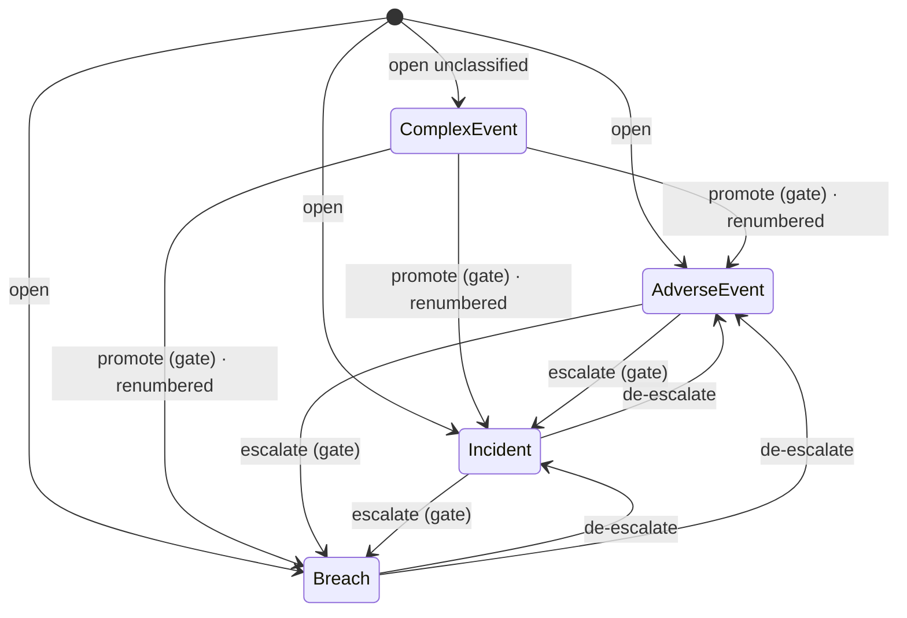
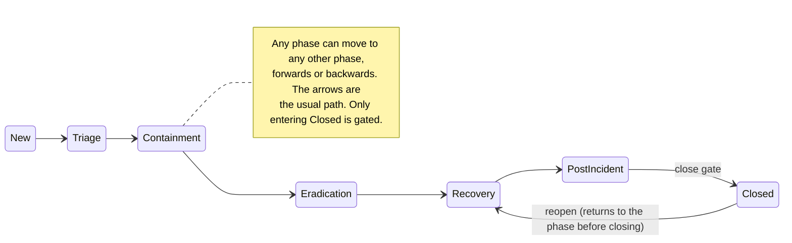

# Data model

What CaseBook stores, what each table means, and the rules that keep it consistent. Types are the SQL Server
production types; SQLite (development) uses `TEXT`/`INTEGER` and stores every date as UTC ticks.

Sources of truth: entity classes in `src/IncidentManager.Domain/Entities`, EF mappings in
`src/IncidentManager.Infrastructure/Persistence/Configurations`, and the model snapshot in
`src/IncidentManager.Migrations.SqlServer/Migrations/AppDbContextModelSnapshot.cs`.

## Conventions that apply everywhere

| Convention | Detail |
|---|---|
| **Keys** | Every table has a `uniqueidentifier Id`, generated in C# (`Guid.NewGuid()`), never by the database. The context forces `ValueGenerated.Never` so a child added to a loaded case is inserted, not updated. |
| **Users are strings** | Everything that names a person (`CreatedBy`, `Owner`, `UserId`, `IncidentCommander`, `Actor`) holds the user's stable id: their Windows SID in production, `dev:<name>` or the configured id in development, `apitoken:<slug>` for a system API token. There are **no foreign keys to `Users`**; that table is a display-name mirror. |
| **Enums are integers** | No value conversions anywhere: enums are stored as `int`, folded into row hashes as numbers, and serialized as numbers in audit JSON. **Append new members; never renumber or remove one.** Exception: `Permission` is stored by *name* inside `Roles.PermissionsCsv`, so never rename a `Permission` member. |
| **Times are UTC** | `datetimeoffset` on SQL Server; UTC ticks on SQLite (offset lost). Domain code always writes UTC. The UTC/local toggle in the UI is display only. |
| **Audit columns** | `CreatedAtUtc`/`CreatedBy` (required), `ModifiedAtUtc`/`ModifiedBy` (nullable) on `AuditableEntity` types. **Code sets them**; the interceptor doesn't. |
| **Row hash** | Types implementing `IHashableEntity` have `RowHash nvarchar(64)`, a SHA-256 of `BuildCanonicalContent()` recomputed on every save. See [integrity.md](integrity.md). |
| **Audit chain** | Every insert, update and delete of every type *not* in the interceptor's `NotAudited` list writes a chained `AuditLog` row in the same transaction. |
| **No soft-delete column** | Nothing has `IsDeleted`. Records are either append-only (never removed), archived (`IsArchived`, `IsActive=false`), or hard-deleted (audited, oddly, with action `SoftDelete`). **Cases, timeline entries, notes, evidence, tasks and comments are never deleted.** |
| **No query filters, no rowversion** | Need-to-know is applied explicitly by services (`ForUser`). Concurrency uses field "stamps" computed by the domain, compared before saving. |
| **Long text** | A configured max length over 4000 becomes `nvarchar(max)` on SQL Server, so code enforces it (case summary 8000, notes and timeline text 16000, brief parts 8000). |

## Entity-relationship diagram

Solid lines are foreign keys; dotted lines are references by id or name with **no** foreign key. Owned value
objects are columns of `Cases`.

```mermaid
erDiagram
    CASES ||--o{ CLASSIFICATION_CHANGES : history
    CASES ||--o{ STATUS_CHANGES : "phase history"
    CASES ||--o{ SEVERITY_CHANGES : history
    CASES ||--o{ MATERIALITY_CHANGES : history
    CASES ||--o{ ASSIGNMENT_CHANGES : "team history"
    CASES ||--o{ GATE_PASSAGES : "stage gates"
    CASES ||--o{ TRANSITION_TIME_CORRECTIONS : corrections
    CASES ||--o{ TIMELINE_ENTRIES : timeline
    TIMELINE_ENTRIES ||--o{ EVENT_STEP_TACTICS : tactics
    CASE_ENTITIES |o--o{ TIMELINE_ENTRIES : "actor / target (restrict)"
    CASES ||--o{ ANALYST_NOTES : notes
    CASES ||--o{ EVIDENCE : files
    EVIDENCE ||--o{ CHAIN_OF_CUSTODY_EVENTS : custody
    CASES ||--o{ EVIDENCE_CITATIONS : citations
    TIMELINE_ENTRIES ||..o{ EVIDENCE_CITATIONS : cites
    EVIDENCE ||..o{ EVIDENCE_CITATIONS : "cited by"
    CASES ||--o{ ACTION_ITEMS : tasks
    ACTION_ITEMS ||..o{ ACTION_ITEM_COMMENTS : comments
    CASE_BRIEFS |o..o{ ACTION_ITEMS : "raised from"
    CASES ||--o{ CASE_ASSIGNMENTS : team
    CASES ||--o{ CASE_ENTITIES : "IOCs / entities"
    CASES ||--o{ ENTITY_RELATIONSHIPS : edges
    CASE_ENTITIES ||..o{ ENTITY_RELATIONSHIPS : "source / target"
    CASES ||--o{ ENTITY_LAYOUTS : "graph positions"
    CASES ||--o{ CASE_TECHNIQUES : "ATT&CK"
    CASES ||--o{ CASE_DATA_ELEMENTS : "data involved"
    DATA_ELEMENTS ||..o{ CASE_DATA_ELEMENTS : "by Key"
    CASES ||--o{ CASE_BRIEFS : "brief versions"
    CASES ||--o{ REPORTS : reports
    CASES ||--o| POST_INCIDENT_REVIEWS : review
    CASES ||--o{ IMPROVEMENT_ACTIONS : "improvement actions"
    CASES ||..o{ CASE_LINKS : "links (both ends)"
    REPORT_PROFILES |o..o{ CASES : "report profile"
    REPORT_TEMPLATES |o--o{ REPORT_PROFILES : "default template"
    CASE_TEMPLATES ||--o{ CASE_TEMPLATE_STEPS : steps
    STAGE_GATES ||--o{ STAGE_GATE_REQUIREMENTS : requirements
    ROLES ||..o{ AD_GROUP_ROLE_MAPPINGS : "by role name"
    CASES ||..o{ PINNED_CASES : pins
    CASES ||..o{ CASE_ACCESS_EVENTS : "read log"
    CASES |o..o{ PENDING_IMPORTS : "target / result"
    AUDIT_LOG ||..o{ INTEGRITY_SEALS : "seal covers up to Sequence"
```

Tables with no relationships: `Users`, `AppSettings`, `ApiTokens`, `NotificationRules` (matched to
`DataElements.NotificationJurisdictions` by code), `SavedViews`, `UserDisplayPreferences`,
`UserNotificationPreferences`.

Legend for the tables below: **H** = row-hashed, **A** = audit-chained. "Never deleted" means no code path
removes the row.

---

## The case

### `Cases` (H, A)

The aggregate root. Every state change on a case goes through a method on `Domain/Entities/Case.cs`.

| Column | Type | Null | Meaning |
|---|---|---|---|
| `CaseNumber` | nvarchar(200) | no | Human key, **unique**. `YYYY-NN_Slug`, `CE-YYYY-MM-DD_Slug[-N]` for a Complex Event, or a custom number. |
| `Year`, `Sequence` | int | no | Numbering parts. `Sequence` is 0 for Complex Events and custom numbers. |
| `DescriptiveName` | nvarchar(200) | no | The slug source. |
| `HasCustomNumber` | bit | no | Set by renumbering. Kept through promotion; excluded from the sequence counter. |
| `Title` | nvarchar(300) | no | |
| `Classification` | int | **yes** | 1 Adverse Event, 2 Incident, 3 Breach. **NULL = Complex Event.** |
| `Phase` | int | no | 0 New … 6 Closed (see below). |
| `Severity` | int | no | 0 Informational … 4 Critical. |
| `Origin` | int | no | 0 internal detection, 1 third-party. |
| `Summary` | nvarchar(max) | yes | Always equal to the current brief's summary (8000 max). |
| `ImpactedAssets`, `DataTypesInvolved` | nvarchar(4000) | yes | Free-text scope. |
| `DetectionCaseId` | nvarchar(100) | yes | The SIEM or detection platform's id (a reference; no sync). |
| `AffectedIndividualsCount` | int | yes | Impact assessment. |
| `AffectedStates` | nvarchar(max) | yes | Normalized jurisdiction list, `"NY, NJ"`. |
| `OccurredAtUtc` | datetimeoffset | yes | When activity began (dwell time). |
| `DetectedAtUtc` | datetimeoffset | yes | When it was detected; the start of SLA clocks. Defaults to creation. |
| `ContainedAtUtc`, `ResolvedAtUtc`, `ClosedAtUtc` | datetimeoffset | yes | Set the first time the case enters Containment, Recovery or Closed (effective time). Closed is cleared on reopen. |
| `ReportedAtUtc` | datetimeoffset | yes | When regulators were notified. Stops **every** jurisdiction's notification clock. |
| `IncidentCommander` | nvarchar(200) | yes | User id of the current IC (mirrors the IC assignment). |
| `IsRestricted` | bit | no | Need-to-know. |
| `LegalHold` | bit | no | Blocks archiving. |
| `LegalHoldRelease*` (reason, requested at, by) | | yes | Pending two-person release request. Not hashed. |
| `IsArchived` | bit | no | Hidden from active queues. |
| `IsExercise` | bit | no | Tabletop case. Set at creation only; no method changes it. |
| `ReportProfileId` | uniqueidentifier | yes | Preferred report profile. No foreign key; a deleted profile falls back to the default. Not hashed. |
| `Legal_*` | | | Owned `LegalReferral`: referred flag, when, by whom, contact, regulatory-relevance note. |
| `Materiality_*` | | | Owned `MaterialityDetermination`: status (0 Undetermined, 1 Under review, 2 Material, 3 Not material), decision maker, decided on, rationale, recorded at and by. |
| `ThirdParty_*` | | | Owned `ThirdPartyDetails` for vendor cases: vendor name, contact, reference. |
| `CreatedAtUtc`, `CreatedBy`, `ModifiedAtUtc`, `ModifiedBy`, `RowHash` | | | |

Indexes: unique `CaseNumber`; unique `(Year, Sequence)` **filtered** to classified, non-custom cases; plus
`Classification`, `Phase`, `IsArchived`.

Everything else about a case lives in child tables that cascade from `Cases` (in practice cases are never
deleted, so cascades never fire).

**Lifecycle**: created by `Case.Open`; changed only through its methods. Who can do what is in
[workflows/case-lifecycle.md](../workflows/case-lifecycle.md) and [security.md](security.md).

### History tables (A)

Append-only records of each transition. Rows are never updated except `EffectiveAtUtc`, and only through a
recorded correction.

| Table | Columns | Notes |
|---|---|---|
| `ClassificationChanges` | `From` (int, null), `To` (int), `Reason` (required, 2000), `ChangedBy`, `ChangedAtUtc`, `EffectiveAtUtc` (null) | `From = NULL` is either the opening classification or a promotion from Complex Event; code tells them apart by `ChangedAtUtc > Case.CreatedAtUtc`. |
| `StatusChanges` (phase) | `From` (null), `To`, `Reason` (optional), `ChangedBy`, `ChangedAtUtc`, `EffectiveAtUtc` | The first row is `null → New`. |
| `SeverityChanges` | `From` (null), `To`, `Reason`, `ChangedBy`, `ChangedAtUtc`, `EffectiveAtUtc` | First row "Initial severity". |
| `MaterialityChanges` | `From`, `To`, `DecisionMaker`, `DecidedOnUtc`, `Rationale`, `ChangedBy`, `ChangedAtUtc` | Written only when the status changes. No effective time. |
| `AssignmentChanges` | `UserId`, `UserDisplayName`, `From` (role, null = joined), `To` (role, null = left), `ChangedBy`, `ChangedAtUtc` | Written only when a role actually changes. No effective time. |
| `GatePassages` (H) | `Trigger`, `PassedAtUtc`, `PassedBy`, `WasOverridden`, `OverrideJustification`, `Commentary` (the transition reason), `Detail` (each requirement as `[MET]`, `[UNMET(OVERRIDDEN)]`, `[UNMET(advisory)]`) | Stores only the trigger, not a link to the gate, so later gate edits don't rewrite history. Written only when an active gate exists. |
| `TransitionTimeCorrections` (H) | `Kind` (classification, phase or severity), `ChangeId` (no foreign key), `FromEffectiveUtc`, `ToEffectiveUtc`, `Reason` (required, 2000), `CreatedBy/At` | One row per re-dating. |

**Effective time.** `ChangedAtUtc` is when the change was entered and never moves. `EffectiveAtUtc` is when it
actually happened, and is **NULL when the two are equal**. Always read the computed `EffectiveAt`
(`EffectiveAtUtc ?? ChangedAtUtc`).

## The investigation record

### `TimelineEntries` (H, A)

Stored timeline content. Milestones are not stored; see [timeline.md](timeline.md).

| Column | Type | Null | Meaning |
|---|---|---|---|
| `Kind` | int | no | 0 **Event** (what the adversary or vendor did), 1 **Investigation** (what the team did). |
| `Type` | int | no | 0 Detection, 1 Analysis, 2 Containment, 3 Eradication, 4 Recovery, 5 Communication, 6 Evidence, 7 Escalation, 8 Note, 9 Other, 10 Notified, 11 ScopeConfirmed, 12 DataConfirmed, 13 Remediation, 14 RegulatoryNotification, 15 **Decision**, 16 **Handoff**. First-party event steps use Other; third-party ones use the disclosure types 10–14. |
| `OccurredAtUtc` | datetimeoffset | no | When it happened (analyst-supplied). |
| `CreatedAtUtc`, `CreatedBy` | | no | When and by whom it was recorded. |
| `Description` | nvarchar(max) | no | Markdown for investigation entries (16000 max). |
| `Source` | nvarchar(200) | yes | Provenance: a tool, "Handoff", "Task: …", or the import's origin. |
| `TechniqueId` | nvarchar(20) | yes | Event steps: `T1566` or `T1566.001`. |
| `ActorEntityId`, `TargetEntityId` | uniqueidentifier | yes | Event steps: entities on this case. **Foreign keys with Restrict.** |
| `Rationale` (4000), `OptionsConsidered` (2000), `DecidedBy` (300) | | yes | Decision entries. **Rationale is required for a Decision.** |
| `EvidenceId` | uniqueidentifier | yes | A screenshot pasted into the entry (no foreign key). |
| `ActionItemId` | uniqueidentifier | yes | The task whose result this entry logs (no foreign key). |
| `PromotedFrom` | nvarchar(64) | yes | `note:<id>`, `taskcomment:<id>` or `import`. |
| `Version`, `IsCurrent`, `SupersedesEntryId` | | | Investigation entries are versioned (see below). |

`EventStepTactics` (A): `TimelineEntryId`, `Tactic` (MITRE tactic as int). One row per tactic on an event
step; part of the parent's hash.

Two edit models:

- **Event steps** are corrected **in place**. The previous values are in the audit trail.
- **Investigation entries** are edited by **supersede**: the old row gets `IsCurrent = false`, a new row with
  `Version + 1` points back at it, and citations move to the new row.

### `AnalystNotes` (H, A)

`Body` (Markdown, 16000), `MentionsCsv` (user ids), `Version`, `IsCurrent`, `SupersedesNoteId`, audit columns.
Edits supersede. Never deleted.

### `CaseBriefs` (H, A)

The "Where it stands" brief. `Summary`, `WorkingAssessment`, `Known`, `OpenQuestions`, `NextSteps` (each up to
8000), `Version`, `IsCurrent`, `SupersedesBriefId`. `NextSteps` is a snapshot of the open tasks when the
version was saved. Saving any version also sets `Cases.Summary`.

### `Evidence` (H, A)

| Column | Type | Meaning |
|---|---|---|
| `OriginalFileName` | nvarchar(500) | As uploaded. |
| `ContentType` | nvarchar(200) | As claimed by the browser (inline display sniffs the real type). |
| `SizeBytes` | bigint | |
| `Sha256` | nvarchar(64) | Hash computed while storing. Indexed, not unique. |
| `StoragePath` | nvarchar(500) | Where the file is in the evidence store. Not hashed. |
| `Description` | nvarchar(2000) | Not hashed. |

Created only by `EvidenceService.UploadAsync`. **No update or delete path exists.**

### `ChainOfCustodyEvents` (not hashed, not audited; ledger table)

`EvidenceId` (foreign key), `Action` ("Uploaded", "Viewed", "Downloaded", "Transferred"), `Actor`, `AtUtc`,
`Details`. "Viewed" is recorded once per person per 10 minutes. A transfer is also written to the audit chain.

### `EvidenceCitations` (A)

`CaseId` (foreign key), `TimelineEntryId`, `EvidenceId` (no foreign keys). Unique per entry and evidence pair.

### `ActionItems` — tasks (H, A)

| Column | Type | Meaning |
|---|---|---|
| `Title` | nvarchar(400) | Required. |
| `Description` | nvarchar(4000) | |
| `Owner` | nvarchar(200) | A user id **or free text** (an external name). |
| `DueAtUtc` | datetimeoffset | |
| `Status` | int | 0 Open, 1 In progress, 2 Blocked, 3 Done, 4 Cancelled. "Open" in logic means not Done and not Cancelled. |
| `Kind` | int | 0 General, 1 Investigate, 2 Contain, 3 Eradicate, 4 Recover, 5 Notify (linked to phases Triage, Containment, Eradication, Recovery). |
| `CompletedAtUtc` | datetimeoffset | Set on Done. |
| `CompletedBy` | nvarchar(200) | Who did the work: a user id or a typed name. Set on Done (defaults to whoever marks it done), cleared when it leaves Done. Hashed only when set. |
| `RaisedFromBriefId` | uniqueidentifier | The brief version whose open question raised it. |
| `AboutRef` | nvarchar(64) | `entity:<id>`, `evidence:<id>` or `entry:<first-version id>`. |

Status can move from any value to any value; the service sets it directly. Never deleted.

### `ActionItemComments` (H, A)

`ActionItemId`, `CaseId` (no foreign keys), `Body` (8000). Append-only; never edited or deleted. A completed
task's result is stored as a comment starting "Result:"; the latest one is the task's result (`TaskResults`), so earlier answers stay on record after a reopen.

### `CaseAssignments` (A)

`UserId`, `UserDisplayName`, `Role` (0 Incident commander, 1 Analyst, 2 Observer), `AssignedBy`,
`AssignedAtUtc`. Unique per case and user. Assigning a new incident commander demotes the previous one to
Analyst (one IC per case is enforced in code, not the database). Unassigning deletes the row (history is in
`AssignmentChanges`).

### `CaseEntities` — entities and IOCs (H, A)

| Column | Type | Meaning |
|---|---|---|
| `Type` | int | 0 Account, 1 Host, 2 IP address, 3 Domain, 4 URL, 5 File hash, 6 File name, 7 Email address, 8 Process, 9 Registry key, 10 Other. |
| `Value` | nvarchar(2000) | Normalized: network types are refanged; hashes, file names and accounts are kept exactly. |
| `Label` | nvarchar(400) | Friendly name ("Jane Doe (Finance)"). |
| `Disposition` | int | 0 Unknown, 1 Benign, 2 Suspicious, 3 Malicious, 4 Compromised (a legitimate asset taken over). |
| `Description`, `Source` | | |
| `Tlp` | int | Per-indicator TLP. Not hashed. |
| `IsPinned` | bit | Shown first in the context rail. Not hashed. |

`(Type, Value)` is unique per case, case-insensitively, **in code only**. Adding an existing one never duplicates it
and never overwrites what's recorded: its disposition changes only while it's Unknown, and label, description and
source are filled only where blank. Changing a recorded value is an edit (`Case.EditEntity`). Removing an entity removes its relationships and layout, but **fails at the database if
an event step uses it as actor or target** ([known issue](../reference/known-issues.md)).

### `EntityRelationships` (H, A)

`SourceEntityId`, `TargetEntityId` (no foreign keys), `Type` (0 Related to, 1 Communicated with, 2 Connected
to, 3 Resolved to, 4 Logged in to, 5 Executed, 6 Downloaded, 7 Dropped, 8 Contacted, 9 Contains, 10 Redirected,
11 Child of, 12 Accessed, 13 Impersonated), `Description`. Directed. Unique `(source, target, type)` in code. Can
be edited in place (type, description, direction).

### `EntityLayouts` (not hashed, not audited)

`EntityId` (unique), `X`, `Y`. Shared graph node positions, last write wins.

### `CaseTechniques` (H, A)

`TechniqueId` (validated `T####[.###]`), `Name`, `Tactic`. Unique per case and technique.

### `CaseDataElements` (A)

`ElementKey` (matches `DataElements.Key`, no foreign key). Unique per case. The sorted key set is part of the
case's hash.

### `CaseLinks` (H, A)

`CaseId`, `RelatedCaseId` (no foreign keys), `Type` (0 Related to, 1 Duplicate of (directional), 2 Part of
campaign), `Description`. **One link per pair of cases in either direction** (enforced in code). Can be
removed. A campaign is the connected group of `Part of campaign` links.

## Reporting and review

### `Reports` (A; not row-hashed)

| Column | Meaning |
|---|---|
| `Kind` | 0 Case report, 1 Lessons-learned report. |
| `Format` | 0 Word, 1 PDF (only older releases produced PDFs). |
| `Version` | Count of existing reports of the same kind and format + 1. Not unique in the database. |
| `FileName`, `StoragePath` | `{CaseNumber}_v{n}.docx` in the report store. |
| `ContentSha256` | Hash of the stored file; re-checked on demand. |
| `Tlp` | Marking printed on every page. |
| `TemplateName`, `TemplateSha256` | The Word template used, by value. |
| `IsFinal`, `ApprovedBy`, `ApprovedAtUtc` | Draft until approved; approval is one-way. |

Each generation adds a row. Reports are never regenerated in place or deleted.

### `PostIncidentReviews` (H, A)

One per case (unique `CaseId`): `WhatHappened`, `ContributingFactors`, `WhatWorkedWell`,
`OpportunitiesToImprove` (4000 each), `NoActionsIdentified`. Saved in place (not versioned; the audit trail
keeps revisions).

### `ImprovementActions` (H, A)

`Title` (400), `RelatedArea`, `Details`, `Owner`, `TargetDateUtc`, `Status` (0 Open, 1 In progress, 2 Completed,
3 Not pursued), `ClosedAtUtc`, `OutcomeNote` (required to close). Editable after the case closes. Never deleted.

## Administration (reference data)

All are row-hashed and audited, and are edited in Administration by the `Administer` permission.

| Table | Columns (main) | Rules |
|---|---|---|
| `CaseTemplates` | `Name` (unique), `Description`, `IsActive`, `SortOrder`, `DefaultClassification`, `DefaultSeverity`, `DefaultDataTypes`, `SummaryBoilerplate` | Inactive templates are hidden from pickers; can be deleted. |
| `CaseTemplateSteps` | `TemplateId` (FK), `Order`, `Title`, `Description`, `OwnerHint`, `DueOffsetHours`, `Kind` | Saving a template replaces its steps. Created tasks keep no link to the step. |
| `StageGates` | `Trigger` (0 promote to AE, 1 escalate to Incident, 2 escalate to Breach, 3 close), `Name`, `Description`, `IsActive`, `CommentaryMinLength` | One active gate per trigger (in code). |
| `StageGateRequirements` | `GateId` (FK), `Order`, `Kind` (0 machine check, 1 attestation), `CheckKey`, `CheckParam`, `Label`, `IsBlocking` | Unknown check keys are rejected on save and never satisfied at runtime. |
| `ReportProfiles` | `Name` (unique), `Description`, `IsActive`, `SortOrder`, `SectionLayout`, `TemplateId` (FK, restrict) | Can be deleted; cases pointing at it fall back to the default layout. |
| `ReportTemplates` | `Name`, `FileName`, `Sha256`, `SizeBytes`, `IsActive`, `IsLessonsDefault` | File stored as `{id}.docx`. Can't be deleted while a profile or the lessons default uses it. |
| `DataElements` | `Key` (unique, stable), `Label`, `SortOrder`, `IsActive`, `IsSystem`, `NotificationJurisdictions` (`"US, NY"`) | 13 system elements are seeded. `Key` must never change. System elements can be archived but not deleted; custom ones only when unused. |
| `NotificationRules` | `Code` (unique, upper-case, matches jurisdiction codes), `Label`, `WindowHours`, `IsActive`, `IsSystem` | NY and US (72 h) are seeded. |
| `AppSettings` | `Key` (unique), `Value`, `UpdatedAtUtc`, `UpdatedBy` | Whitelisted operational settings, plus `Taxonomy:*` and `EmailTemplate:*` keys. Deleting a row resets the setting. |

## Identity and security

| Table | H/A | Columns (main) | Rules |
|---|---|---|---|
| `Users` | — | `Sid` (unique: the user id), `DisplayName`, `UserPrincipalName`, `Email`, `RolesCsv`, `LastSeenUtc`, `FeedLinkIssuedAtUtc` | A mirror updated on sign-in (at most every 30 minutes per user). Used for names, pickers, notifications and checking what other people can see. |
| `Roles` | H, A | `Name` (unique), `Description`, `IsSystem`, `PermissionsCsv` (permission **names**) | System roles are re-synced to code on every start and can't be edited. The last role with `Administer` can't lose it. |
| `AdGroupRoleMappings` | H, A | `AdGroup`, `RoleName` (no FK) | Unique pair. Seeded from configuration only when empty. |
| `ApiTokens` | — (create and revoke are written to the audit chain explicitly) | `Name`, `Kind` (0 personal, 1 system), `OwnerUserId`, `OwnerDisplayName`, `RolesCsv`, `Prefix`, `TokenHash` (SHA-256, unique), `ExpiresAtUtc`, `RevokedAtUtc`, `RevokedBy`, `LastUsedAtUtc` | The token itself is never stored. Revocation is one-way. |

## Integrity and telemetry

| Table | Columns | Rules |
|---|---|---|
| `AuditLog` (ledger) | `Sequence` (unique, gapless), `AtUtc`, `Actor`, `Action` (0 Create, 1 Update, 2 delete (named `SoftDelete`), 15 Export, 16 Evidence transferred, …), `EntityType` (the C# class name), `EntityId`, `CaseNumber`, `EntityLabel`, `Summary`, `BeforeJson`, `AfterJson`, `Reason`, `PrevHash`, `EntryHash` | Append-only. See [integrity.md](integrity.md). |
| `IntegritySeals` (ledger) | `SealedAtUtc`, `UpToSequence`, `ChainHeadHash`, `SealedBy`, `Algorithm`, `KeyId`, `Signature` | Not audited. Also exported as files. |
| `CaseAccessEvents` | `ActorUserId`, `CaseId`, `CaseNumber`, `AccessType` (0 case open, 1 evidence download, 2 report download, 3 export), `TargetId`, `TargetLabel`, `WasRestricted`, `FirstSeenUtc`, `LastSeenUtc`, `Count` | The read log. Outside the audit chain; repeated access within the coalesce window increments `Count`. Can be pruned. |

## Per-user state and staging (not hashed, not audited)

| Table | Columns | Notes |
|---|---|---|
| `SavedViews` | `OwnerUserId`, `Name` (unique per owner), `Query` (a `/cases` query string), `IsShared`, `IsDefault` | One default per user (in code). |
| `PinnedCases` | `UserId`, `CaseId` (unique pair) | Re-filtered by need-to-know when read. |
| `UserDisplayPreferences` | `UserId` (unique), `DarkTheme`, `NavCollapsed`, `CompactRows`, `LocalTime`, `TwelveHourClock`, `AttackChainOpen` | Rendered onto the page so the theme applies before first paint. |
| `UserNotificationPreferences` | `UserId` (unique), `DigestCadence` (off, daily, weekly), `SuppressAssignment`, `SuppressOverdue`, `SuppressDueSoon` | Opt-outs never suppress the breach notice to Legal or alarm mail. |
| `PendingImports` | `Status` (0 pending, 1 applied, 2 rejected), `RawJson`, `Origin`, `Summary`, `SubmittedBy/At`, `TargetCaseId`, `DecidedBy/At`, `DecisionNote`, `ResolvedCaseId`, `ResolvedCaseNumber` | API submissions waiting for review. The case writes made when it's applied are audited normally. |

## State machines

### Classification

Every move needs `ChangeClassification` and a reason, and writes a `ClassificationChange`. Only upward moves run
a gate. The gate is chosen by the **target**: promoting straight to Breach runs only the Breach gate. **There is
no way back to Complex Event.** Promotion renumbers `CE-…` to `YYYY-NN_…` (using the original year) unless the
case has a custom number.

### Phase

Entering Containment, Recovery and Closed for the first time sets `ContainedAtUtc`, `ResolvedAtUtc` and
`ClosedAtUtc` (at the effective time). Leaving Closed clears `ClosedAtUtc`. Closed and archived cases **can still
be edited**; nothing locks them.

### Other lifecycles

| Thing | States |
|---|---|
| Legal hold | none → held → (release requested → approved by a second person, or cancelled) → none. A direct release is refused when two-person release is on. Archiving is refused while held. |
| Archive | toggles; refused under legal hold; independent of phase. |
| Restriction | toggles; anyone with `EditCases` can restrict; only the IC or a cleared role can lift. |
| Task | any status to any status. |
| Report | draft → final (once, irreversible). |
| Improvement action | any status to any status; closing needs an outcome note. |
| Pending import | pending → applied or rejected (both final). |
| API token | active → revoked or expired. |
| Versioned records (notes, investigation entries, briefs) | exactly one current version per lineage. |

## Rules a developer could break

1. **Enums**: append only. Their numbers are in stored rows, row hashes and audit JSON.
2. **`Permission` names**: never rename; roles store them by name and drop unknown names silently.
3. **Entity class names**: `AuditLog.EntityType` stores the C# class name. Renaming a class changes the audit
   vocabulary.
4. **Canonical hashes**: a new field on a hashed entity may only be appended to `BuildCanonicalContent()`
   **when it has a non-default value**. Otherwise every existing row fails verification. Fields that are
   preferences or workflow state stay out of the hash.
5. **Ledger tables** (`AuditLog`, `IntegritySeals`, `ChainOfCustodyEvents`): any column change also needs
   `deploy/sql/02-Enable-Ledger.sql`, and new columns must be nullable. `LedgerScriptModelTests` enforces both.
6. **Never delete evidence**; on a ledger database it fails anyway.
7. **Child tables that should carry the case number** in the audit trail and trigger live refresh need a
   property literally named `CaseId`.
8. **Set `CreatedBy`/`CreatedAtUtc` yourself**; the interceptor doesn't, and empty values get hashed.
9. **Never assign `Case.Summary` directly**; go through the brief so a version is recorded.
10. **Read `EffectiveAt`, not `EffectiveAtUtc`**.
11. **Uniqueness enforced only in code**: entity (type, value); relationship (source, target, type); one link
    per case pair; one active gate per trigger; one lessons-default template; template names; one default
    saved view; one IC per case; report version numbers. Keep the checks when you touch these paths.
12. **References without foreign keys** leave dangling ids if you delete the target. Check the table notes
    above before adding a delete.
13. **Migrations that insert into hashed tables** leave `RowHash` NULL until the row is next saved.
14. **An update that touches only `ModifiedBy`/`ModifiedAtUtc` isn't audited.**
15. **Adding a type to `NotAudited`** removes it from tamper evidence. Don't do it for anything that's part of
    the record.
