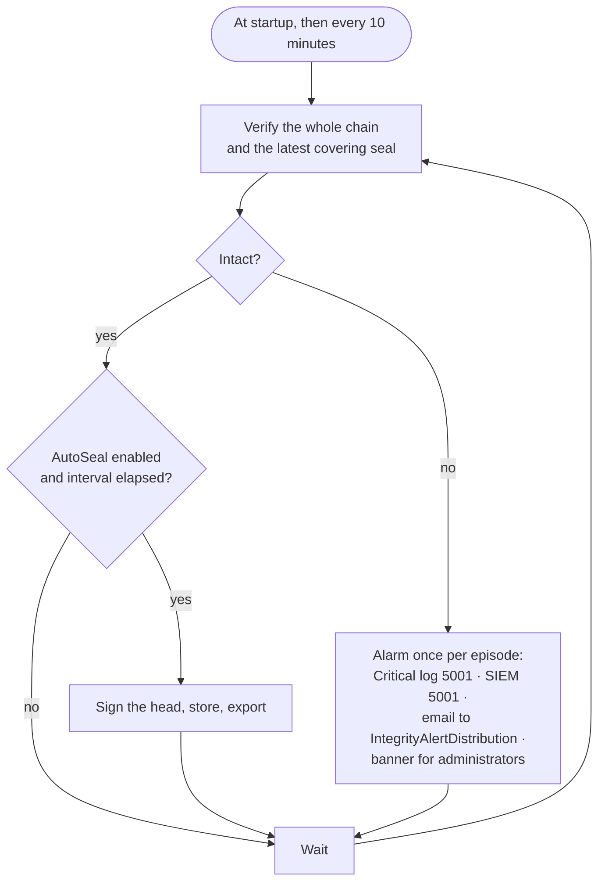

# Tamper evidence (the integrity spine)

CaseBook's record is meant to be evidence. This page explains how a change becomes provably part of the record,
how tampering is detected, and what is deliberately outside that protection. Why it's built this way:
[decision 0002](../decisions/0002-integrity-spine.md).

| Layer | Mechanism | Detects | Code |
|---|---|---|---|
| Row hash | SHA-256 of each record's canonical fields, stored in `RowHash` | A field edited without going through the app | `IHashableEntity.BuildCanonicalContent`, `HashChainService.ComputeRowHash` |
| Hash chain | Every change appends an `AuditLog` row whose hash covers the previous row's hash | Inserted, deleted, reordered or edited history | `AuditChainInterceptor`, `HashChainService` |
| Signed seals | Periodic RSA signature over the chain head, stored in the database and as files out of band | A competent rewrite that recomputes every hash | `IntegrityService`, `RsaSealSigner`, `FileSealStore` |
| Ledger (optional) | SQL Server append-only ledger tables plus external digests | Any UPDATE or DELETE, even by `sysadmin`; page-level tampering | `deploy/sql/02-Enable-Ledger.sql` |
| Evidence re-hash (optional) | Re-hashes stored evidence files against their recorded SHA-256 | Bit-rot, a swapped or deleted file | `EvidenceIntegrityVerifier` |
| Report hash | SHA-256 of each generated report, re-checkable | A stored report altered after generation | `ReportService.VerifyFileAsync` |

## How a save becomes audited

`AuditChainInterceptor` is an EF Core `SaveChangesInterceptor` attached to every context.

```mermaid
sequenceDiagram
    participant Svc as Service
    participant Ctx as AppDbContext
    participant Int as AuditChainInterceptor
    participant Hash as HashChainService
    participant DB as Database

    Svc->>Ctx: SaveChangesAsync()
    Ctx->>Int: SavingChanges
    Int->>Ctx: DetectChanges; collect added / modified / deleted entities (except NotAudited)
    Int->>Int: take PendingChangeReason (if any) and clear it
    loop each hashable entity
        Int->>Hash: ComputeRowHash → RowHash
    end
    Int->>Int: acquire the process-wide chain gate
    Int->>DB: read the chain head (max Sequence)
    loop each change
        Int->>Hash: ChainAppend → Sequence, PrevHash, EntryHash
    end
    Int->>Ctx: add the AuditLog rows
    Ctx->>DB: COMMIT business rows + audit rows together
    Ctx->>Int: SavedChanges → release the gate; tell live viewers which cases changed
```

Each audit row records:

- the sequence number, time and actor (the signed-in user, or `system` for background work);
- the action: Create, Update, or Delete (recorded under the historical name `SoftDelete`);
- the entity type (the C# class name), id, case number and a readable label;
- for an update, only the changed fields' before and after values;
- a reason, when the service supplied one (re-dating, editing an entry, a legal hold, a restriction).

An update that changes only `ModifiedBy`/`ModifiedAtUtc` is skipped. Some acts that don't change a business row
are written explicitly through `IAuditWriter`: evidence transfer, compliance-bundle and configuration-bundle
export and import, API token create and revoke.

**Hash:** `EntryHash = SHA-256(canonical content | PrevHash)`. The first row has `PrevHash = ""`. Verification
walks the chain in order and stops at the first sequence gap, broken link, or mismatched hash, and reports that
sequence number.

**Concurrency:** a process-wide semaphore serializes "read the head, append, commit", and the unique index on
`Sequence` is the backstop. This assumes one app instance.

## What is outside the chain, and why

| Not chained | Why |
|---|---|
| `AuditLog`, `IntegritySeals` | They are the integrity records. |
| `ChainOfCustodyEvents` | Has its own record; transfers are additionally chained. |
| `CaseAccessEvents` (the read log) | High volume and prunable; must not disturb the record. |
| `Users` (mirror), `EntityLayout` (graph positions), `SavedViews`, `PinnedCases`, display and notification preferences | Cosmetic or per-user state. |
| `PendingImports` | Staging; applying an import goes through normal audited writes. |
| `ApiTokens` | `LastUsedAtUtc` changes on every call; create and revoke are chained explicitly. |

Some fields are also deliberately left out of row hashes: a case's custom-number flag, report profile and
legal-hold release request; an entity's TLP and pin; evidence description and storage path; a report profile's
template. These are preferences or workflow state, not findings.

## Seals and continuous verification

A seal is `{ SealedAtUtc, UpToSequence, ChainHeadHash, SealedBy, Algorithm, KeyId, Signature }`, signed with
RSA-3072 (PKCS#1 v1.5, SHA-256). If the sealed head hash still matches the live entry at `UpToSequence`, all
history up to that point is unchanged since sealing. Seals are written to the database and as JSON files to
`Integrity:ExportPath`, so they survive a database compromise if that folder is backed up separately (ideally
to WORM storage).



- Detection latency is about 10 minutes, regardless of the seal interval.
- **No seal is made over a broken chain.**
- The alarm fires once per broken episode (`IntegrityMonitor` is shared by the job and every session's banner)
  and goes out of band, so deleting rows can't also suppress it.
- *Verify now* on the Integrity page runs the same check (at most once a minute, shared between users).
- **If the signing key file is missing, the app generates one.** In production, provision it first
  ([OPERATIONS.md §2](../OPERATIONS.md#2-integrity-signing-key-management-f-05b)).
- Seal-export failures are swallowed without being logged ([known issues](../reference/known-issues.md)).

### Known limitation

The chain is unkeyed. Someone with database write access who recomputes every later hash produces a chain that
verifies on its own. The latest seal catches that, because they can't re-sign without the private key. Keying
the chain (HMAC) and anchoring seals off the server (WORM, RFC 3161) are not implemented.

## Evidence at rest

When `Integrity:EvidenceVerify:Enabled` is on, a job re-hashes every stored evidence file on its interval (and
once at startup). A mismatched, missing or unreadable file raises event 5003: a Critical log entry and a SIEM
event (counts only), plus an email to the alert distribution listing the case, evidence id and file name. A
banner appears for administrators. The status is shown under Administration → Diagnostics. The job only reads.

## The compliance evidence bundle

`GET /export/compliance-bundle.zip?from=&to=` (administrators; also on the Integrity page) produces, for a date
range:

| File | Contents |
|---|---|
| `manifest.txt` | Coverage, entry span, whole-chain verdict, covering-seal verdict |
| `audit-chain.csv` | The audit rows in range, with their hashes |
| `seals.csv` | Covering and in-range seals, with signatures and verdicts |
| `signing-public-key.pem` | To verify the seals independently |
| `VERIFY.txt` | How to re-verify offline |

Generating it is itself recorded in the audit chain. It loads the whole chain into memory to verify it, so it
gets slower as the chain grows.

## Rules for developers

1. **Never write to the database outside EF tracking** for audited tables. Raw SQL updates bypass the chain and
   look like tampering. Data migrations that insert rows leave `RowHash` NULL until the next save.
2. **Changing a canonical** re-baselines every existing row's hash. Only append new fields, and only when they
   have a value.
3. **Don't add a type to `NotAudited`** unless it is genuinely not part of the record.
4. **Background work is attributed to `system`.** If a job ever needs to write, decide how it should be
   attributed. None does today.
5. **When touching this area, add a test that would fail if tampering went undetected.** The integration tests
   include direct-database tampering and a "competent rewrite" that only the seal catches.
