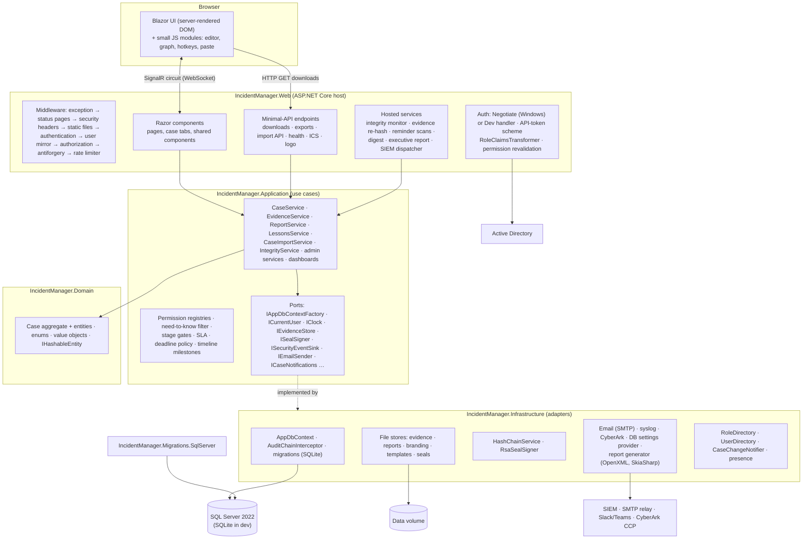
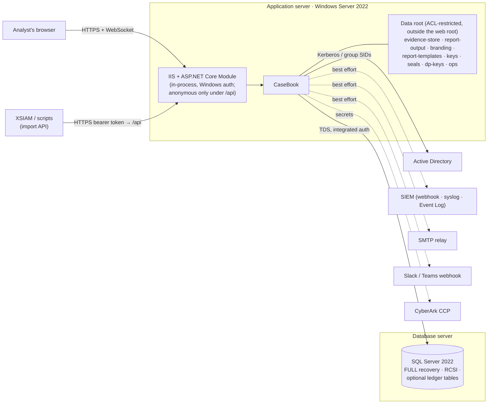

# Architecture overview

How CaseBook is put together, at the level you need before touching any part of it. Deeper pages:
[codebase map](codebase-map.md), [data model](data-model.md), [timeline](timeline.md),
[security](security.md), [integrity](integrity.md), [frontend](frontend.md), [backend](backend.md).

## In one paragraph

CaseBook is a single ASP.NET Core 10 process that renders its UI with **Blazor Server**: the browser holds a
SignalR connection (a *circuit*), and every click runs C# on the server. There is no client-side business
logic and no general JSON API. Business rules live in a `Case` aggregate in the Domain project and in
use-case services in the Application project. Data goes through EF Core to **SQL Server 2022** in production
(SQLite in development). An EF interceptor writes a **hash-chained audit entry for every change** in the same
transaction. Files (evidence, reports, templates, the logo) live on disk outside the web root, with their
hashes in the database. Users sign in with **Windows Integrated Authentication**; AD groups map to roles,
roles to permissions. Background services verify and seal the audit chain and send reminders, but never change
a case.

## Components



Dependencies point inward: Web → Application and Infrastructure; Infrastructure → Application → Domain. The
Domain project references nothing. Application declares interfaces (*ports*, in `Application/Abstractions`)
and Infrastructure implements them; `Web/Program.cs` and `Infrastructure/DependencyInjection.cs` wire them up.

| Project | Holds | Depends on |
|---|---|---|
| `IncidentManager.Domain` | Entities, the `Case` aggregate and its rules, enums, value objects, IOC parsing (`Observables`) | nothing |
| `IncidentManager.Application` | Use-case services, permission registries, validation, stage gates, SLA and deadline policies, reporting model, import, ports | Domain; EF Core abstractions, FluentValidation, Markdig |
| `IncidentManager.Infrastructure` | EF Core context and SQLite migrations, the audit interceptor, file stores, crypto, email, SIEM syslog, CyberArk, config providers, report rendering | Application, Domain; EF Core (SQLite + SQL Server), OpenXML, SkiaSharp |
| `IncidentManager.Migrations.SqlServer` | Production migrations, chosen at runtime when `Database:Provider=SqlServer` | Infrastructure |
| `IncidentManager.Web` | Host and composition root, Razor UI, auth handlers, middleware, HTTP endpoints, hosted services, SIEM webhook and Event Log transports, chat notifier | Application, Infrastructure, Migrations.SqlServer |

## Runtime topology (production)



What matters operationally:

- **One instance.** The audit-chain lock, live change notifications, presence, reminder "already sent"
  trackers and the SIEM queue are all in-process. A second instance would need a distributed lock, a backplane
  and shared trackers; none exist. See [reference/known-issues.md](../reference/known-issues.md).
- **Memory per user.** Each open tab holds a circuit in server memory.
- **The data volume grows; the database stays small.** Only metadata and hashes are in SQL.
- **The database, the file stores and the seal exports are backed up together**, or references dangle and
  verification fails ([OPERATIONS.md §1](../OPERATIONS.md#1-backup--disaster-recovery-h-03)).
- **No passwords in config.** SQL uses the app pool's Windows identity; secrets can come from CyberArk.

## How a request flows

### An interactive change (most of the app)

```mermaid
sequenceDiagram
    actor U as Analyst
    participant C as Razor component
    participant S as CaseService
    participant D as Case (domain)
    participant DB as AppDbContext
    participant I as AuditChainInterceptor
    participant N as Notifications / SIEM

    U->>C: click "Apply" in a dialog (over the circuit)
    C->>S: ChangePhaseAsync(caseId, phase, reason, when)
    S->>S: Require(): look up permission for this method, check the user's claims
    S->>DB: new context; load the case through the need-to-know filter
    S->>S: evaluate stage gate (if closing)
    S->>D: ChangePhase(...) enforces rules, appends StatusChange
    S->>DB: SaveChangesAsync()
    DB->>I: SavingChanges: recompute row hashes, append chained AuditLog rows
    DB-->>DB: COMMIT (business rows + audit rows together)
    I-->>C: post-commit: "case X changed by Y" to every open viewer
    S->>N: email / chat / SIEM (never fails the action)
    S-->>C: done → component reloads the case
```

Every mutating method follows this shape; see [backend.md](backend.md#the-write-path).

### A download or export

Minimal-API endpoints in `Web/Program.cs` handle file streams: they require authentication plus a permission
policy, are rate-limited per user, apply the same need-to-know filter, and record the access in the access log
(and the SIEM stream). See [backend.md](backend.md#http-endpoints).

### The machine API

`POST /api/import/cases` authenticates with a bearer API token, parses the document and stores a **pending
import**. A person confirms it in the app. See [API.md](../API.md).

## Background processing

Nine hosted services start with the app. Each runs in its own DI scope per cycle, logs and survives its own
failures, and re-reads its settings every few minutes. None changes case state; the only database write is the
integrity seal. Details are in [backend.md](backend.md#background-jobs).

| Job | Default | Cadence |
|---|---|---|
| Integrity monitor (verify chain and latest seal; seal when due) | verify always; seal on | verify every 10 min; seal every `IntervalHours` |
| Evidence-at-rest re-hash | off | `IntervalHours` (24) |
| Overdue / due-soon task reminders | off | 24 h / 6 h |
| Regulatory deadline reminders | off | 1 h |
| Stale-case nudges | off | 12 h |
| Per-user digest | off (users opt in) | 1 h check |
| Quarterly executive report email | off | hourly check |
| SIEM event dispatcher | runs when a transport is enabled | continuous |

## Storage

| What | Where | Notes |
|---|---|---|
| Cases and everything about them | SQL Server (`Cases` and ~45 related tables) | [data-model.md](data-model.md) |
| Audit trail, seals, custody | SQL Server `AuditLog`, `IntegritySeals`, `ChainOfCustodyEvents` | Can be ledger tables |
| Evidence files | `EvidenceStore:RootPath` | Random names, per-case folders, SHA-256 in DB |
| Generated reports | `ReportOutput:RootPath` | Word; SHA-256 in DB |
| Report logo, Word templates | `ReportBranding:RootPath`, `ReportTemplates:RootPath` | |
| Seal exports (out of band) | `Integrity:ExportPath` | One JSON file per seal |
| Seal signing key | `Integrity:SigningKeyPath` | Generated if missing; provision it in production |
| Data-protection keyring | `DataProtection:KeyPath` | Antiforgery and circuit protection |
| Operational settings | `AppSettings` table | Whitelisted, audited |
| Backup health signal | `BackupStatus:FilePath` (written by your jobs) | Read only |

## Logging and monitoring

- **Logging** uses the ASP.NET Core defaults (console, debug, EventSource, and the Windows Event Log at
  Warning and above). There's no Serilog or file logging; under IIS, enable `stdoutLogEnabled` in
  `web.config` to capture startup failures.
- **Critical alarms** with stable event ids: 5001 audit-chain failure, 5003 evidence drift. Both are also
  emailed to `Email:IntegrityAlertDistribution` and shown as an app-wide banner to administrators. The
  rejected-setting alarm (5002) is logged at Critical without an event id and sent on the SIEM stream.
- **SIEM stream**: a stable catalog of security events (sign-in failures, denials, reads, downloads, exports,
  admin changes, governance acts) over webhook, syslog (CEF) or the Windows Event Log
  ([OPERATIONS.md §5](../OPERATIONS.md#5-siem-security-event-stream-f-18)).
- **Health endpoints**: `/health/live` (process up), `/health` and `/health/ready` (database reachable and
  evidence folder present). Under IIS with Windows authentication these need authentication unless you carve
  them out ([troubleshooting](../operations/troubleshooting.md#health-probe-returns-401)).
- **In-app diagnostics**: Administration → Diagnostics shows backup freshness, evidence drift status,
  CyberArk resolution health, configuration sources and a SIEM test event.

## Third-party dependencies

| Component | Used for | License |
|---|---|---|
| .NET 10, ASP.NET Core, EF Core 10 (SQLite, SQL Server) | Runtime, data access | MIT |
| Microsoft.AspNetCore.Authentication.Negotiate | Windows authentication | MIT |
| System.DirectoryServices.AccountManagement | AD display names | MIT |
| FluentValidation 12 | Request validation (case creation) | Apache-2.0 |
| Markdig | Markdown rendering (sanitized) | BSD-2 |
| DocumentFormat.OpenXml 3.5 | Word reports and template filling | MIT |
| SkiaSharp 4.152 | Attack-chain and graph diagrams in reports | MIT |
| DejaVu Sans (embedded) | Report fonts | Bitstream Vera / public domain |
| Bootstrap 5.3.3, Bootstrap Icons 1.11.3 | UI base styles and icons (served locally) | MIT |
| EasyMDE 2.18 | Markdown editor | MIT |
| vis-network 9.1.9 | Relationship graph | Apache-2.0 / MIT |
| docx-preview 0.4.1 + JSZip 3.10 | In-browser preview of filled Word templates | Apache-2.0 / MIT |
| MITRE ATT&CK Enterprise v19.1 (embedded JSON) | Technique catalog | MITRE terms |

All browser assets are served from `wwwroot/lib` under a strict content-security policy (`script-src 'self'`);
nothing loads from a CDN. Test-only: xUnit, FluentAssertions 8 (commercial license for commercial use),
coverlet. Licenses are listed in `THIRD-PARTY-NOTICES.md`.

## Key design choices

The [decision records](../decisions/README.md) explain the choices most likely to be questioned: Blazor
Server, the integrity spine, code-defined permissions, human-gated automation, no AI egress, the fixed ladder,
the settings split, files on disk, immutable migrations, after-the-fact recording, derived timeline
milestones, discovery-conscious records, Word-only reports, no chat thread and `[[` tags.
