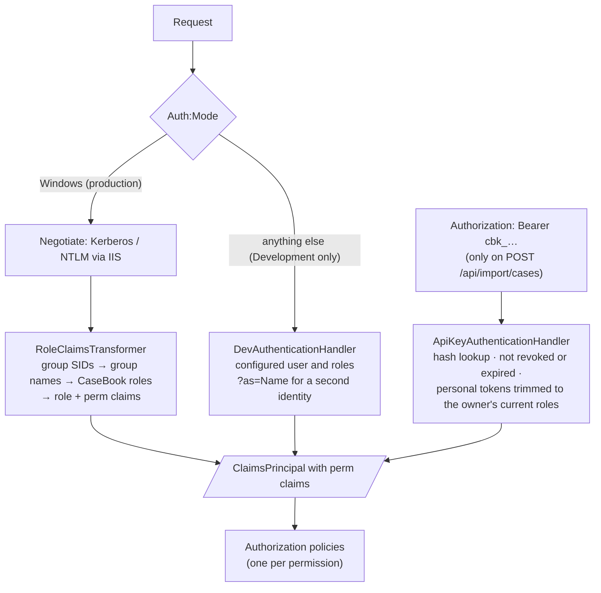

# Authentication, authorization and security

Who can sign in, what they can see and do, where each decision is enforced, and what is protected how. Tamper
evidence has its own page: [integrity.md](integrity.md).

> **UI visibility is not enforcement.** Pages hide what you can't do (`AuthorizeView`, disabled buttons).
> Enforcement happens at three places: the page or endpoint policy, the service-layer permission check, and the
> need-to-know query filter. A change that only hides a button protects nothing.

## Authentication



### Windows (production)

- IIS performs Windows Integrated Authentication; the installer enables Windows auth and disables anonymous for
  the whole site except `/api`.
- `Web/Security/RoleClaimsTransformer.cs` runs on each request. It takes the user's group claims (SIDs),
  resolves them to `DOMAIN\Group` and `Group` names (cached for the process lifetime), asks the role directory
  which CaseBook roles those groups map to, and adds role claims and `perm` claims.
- A user in no mapped group signs in successfully but has no permissions. Every page refuses them, and they land
  on `/access-denied`, which shows who they're signed in as and names the permission the page needed.
- A failed Negotiate handshake is SIEM event 5101.

### Development

`Web/Security/DevAuthenticationHandler.cs` signs every request in without a password:

- The identity comes from `DevAuth` settings (default `Dev Analyst`, id `S-1-5-21-DEV-1001`).
- Roles come from `DevAuth:Roles`; `appsettings.json` grants all five.
- `?as=<name>` on any URL switches to a second identity (`dev:<name>`), remembered in an HttpOnly cookie,
  for testing presence, assignment and need-to-know. **It keeps the same roles.** To test a lower-privilege
  user, change `DevAuth:Roles` (for example `DevAuth__Roles__0=Manager` as an environment variable).

**Fail-safe** (`Web/Security/AuthModeGuard.cs`): when `Auth:Mode` isn't `Windows`, startup throws unless the
environment is `Development`. A demo or QA server (any environment except `Production`) can opt in with
`Auth:AllowDevSignInOutsideDevelopment=true`; `Production` refuses dev sign-in even with the opt-in.

### API tokens

Used only by `POST /api/import/cases` (bearer header).

| | Personal token | System token |
|---|---|---|
| Created by | Any signed-in user (account menu → API tokens) | `Administer` (Administration → API tokens) |
| Acts as | The owner; roles are a subset of theirs, trimmed to the roles they still hold at each call | A machine identity `apitoken:<slug>` with the roles granted to it |
| Maximum lifetime | 90 days | 365 days |

- Format `cbk_` + 32 random bytes (base64url). Only the SHA-256 is stored; the token is shown once.
- Expiry is mandatory. Revocation (by the creator or an administrator) is immediate and permanent.
- A rejected token is SIEM event 5101 (`ApiTokenRejected`), logged with its 12-character prefix and the source
  address, never the token.
- Create and revoke are written to the audit chain and SIEM (5404).

### Sessions

- There's no application session cookie. Negotiate authenticates the connection; the Blazor circuit carries
  the principal.
- **Permissions refresh while signed in.** Every 2 minutes each circuit re-derives roles and permissions from
  the current role directory, so editing a role or removing an AD mapping takes effect without the user
  reconnecting. AD group *membership* changes need a new Windows logon.
- **Idle lock** (`Security:IdleTimeoutMinutes`, default 15): after inactivity, a 60-second warning, then the
  circuit is torn down and the user lands on `/session-expired`. With Windows auth, *Resume* signs them straight
  back in; it's a screen lock, not a credential check. *Lock now* in the account menu does the same.
- The data-protection keyring (antiforgery, circuit state) must persist (`DataProtection:KeyPath`), or every
  app-pool recycle disconnects everyone.

## Authorization

### Permissions

Eight permissions, defined in `Domain/Enums/Permission.cs`. Code checks them; administrators can't invent new
ones ([decision 0003](../decisions/0003-permissions-as-code-atoms.md)).

| Permission | Grants |
|---|---|
| `ViewCases` | Use the app and see cases within need-to-know |
| `ViewAllCases` | See every case, including restricted ones; dashboard and team workload |
| `EditCases` | Create cases and change their content |
| `ChangeClassification` | Promote, escalate or de-escalate; re-date a classification change |
| `ApproveReports` | Approve a report as final |
| `ViewRestricted` | See every restricted case; lift a restriction |
| `ManageLegal` | Legal referral, legal hold and its release |
| `Administer` | Administration, access log, integrity sealing, exports of configuration and compliance bundles, archive |

### System roles

From `Application/Security/RoleDefinitions.cs`. These five are seeded, locked, and re-synced to code on every
start.

| Role | View | View all | Edit | Classify | Approve reports | View restricted | Legal | Administer |
|---|:-:|:-:|:-:|:-:|:-:|:-:|:-:|:-:|
| **Analyst** | ✓ | | ✓ | ✓ | | | | |
| **IncidentCommander** | ✓ | | ✓ | ✓ | ✓ | ✓ | | |
| **Manager** | ✓ | ✓ | | | | | | |
| **LegalPrivacy** | ✓ | ✓ | | | | ✓ | ✓ | |
| **SysAdmin** | every permission, including any added later ||||||||

Consequences worth knowing:

- Analysts can reclassify, including escalating to Breach (subject to the stage gate).
- Incident commanders see **every** restricted case, not only the ones they lead (`ViewRestricted`).
- Managers and Legal/Privacy can't edit case content. They **can** add task comments (which need only
  `ViewCases`).
- Custom roles combine the same permissions; the last role holding `Administer` can't lose it or be deleted.

### Where each check happens

| Layer | Mechanism | Where |
|---|---|---|
| Every endpoint | Fallback policy: authenticated user | `Web/Program.cs` |
| Pages | `@attribute [Authorize(Policy = "<Permission>")]` | each `Components/Pages/*.razor` |
| HTTP endpoints | `.RequireAuthorization("<Permission>")` | `Web/Program.cs` |
| Case actions | `CaseService.Require()` looks up the calling method in `CaseActionPermissions`; **a method with no entry fails closed**; a unit test checks every mutating method is listed; a refusal emits SIEM 5202 | `Application/Cases/CaseService.cs`, `CaseActionPermissions.cs` |
| Admin actions | `AdminActionPermissions.Require<TService>()`, all `Administer`, fails closed | `Application/Security/AdminActionPermissions.cs` |
| Other services | Direct checks: evidence upload and transfer (`EditCases`), report generate (`EditCases`) and approve (`ApproveReports`), lessons, import decisions, API tokens | each service |
| Data visibility | `ForUser()` on every case query (below) | `Application/Cases/CaseQueryExtensions.cs` |
| UI | `AuthorizeView` and `CanEdit` flags hide controls | components (cosmetic) |

`ForbiddenException` produces the message "You don't have permission to …", shown as a toast.

### Need-to-know

```csharp
// Application/Cases/CaseQueryExtensions.cs (simplified)
if (user.Has(ViewAllCases) || user.Has(ViewRestricted)) return query;   // cleared roles see everything
return query.Where(c => !c.IsRestricted
                     || c.IncidentCommander == user.UserId
                     || c.Assignments.Any(a => a.UserId == user.UserId));
```

- Applied to lists, search, the workspace, every write (a case is loaded through it before changing), downloads,
  exports, dashboards, indicators, campaigns (a restricted case can't bridge two campaigns), pins and recents.
- Audit-trail reads (`IntegrityService.RecentAsync`, `QueryAsync`, `AuditFacetsAsync`: `/integrity`, a case's
  Audit tab, the audit CSV) show `ViewAllCases` and `Administer` the whole trail. Everyone else sees only entries
  for cases they can see; case-less entries (configuration, roles) and entries under a case's former number are
  left out.
- **No existence leak:** a hidden case and a missing case give the same "not found".
- Restricting is open to anyone with `EditCases` (they're kept on the case). Lifting needs the IC, or
  `ViewAllCases` or `ViewRestricted`.
- People who can't see a case can't be @mentioned on it, handed it, or emailed about it. Breach-escalation
  chat messages for restricted cases are redacted.

### Known gaps between the UI and enforcement

Listed in [reference/known-issues.md](../reference/known-issues.md#security). In short:

- The pending-import queue isn't filtered by need-to-know.
- The compliance bundle, access-log query and "list all API tokens" have no service-level check (their pages
  and endpoints require `Administer`).
- Report hash verification doesn't apply need-to-know.
- A configuration bundle's "signature valid" requirement is enforced in the page, not in the import method.

## HTTP protections

- **Security headers** on every response (`Web/Security/SecurityHeadersMiddleware.cs`):
  `Content-Security-Policy: default-src 'self'; img-src 'self' data:; style-src 'self' 'unsafe-inline';
  script-src 'self'; object-src 'none'; connect-src 'self'; frame-ancestors 'none'; base-uri 'self';
  form-action 'self'`, plus `X-Content-Type-Options: nosniff`, `X-Frame-Options: DENY`,
  `Referrer-Policy: no-referrer`, `Cross-Origin-Opener-Policy: same-origin`, a restrictive
  `Permissions-Policy`, and no `Server` header. **No inline scripts are allowed**, so JavaScript lives in
  `wwwroot/js` files.
- **HSTS and HTTPS redirection** outside Development.
- **Antiforgery** on form posts.
- **Rate limiting**: a per-user token bucket (40 burst, 40 per minute by default) on downloads, exports, the
  import API and the calendar feed. Over budget returns 429 with `Retry-After` and SIEM 5306 (a spike suggests
  bulk scraping).
- **Static files** are served before authentication, so everything in `wwwroot` is public. Nothing sensitive
  belongs there.
- **Status pages**: a page GET that's refused redirects to `/access-denied` (SIEM 5201); an unknown page
  redirects to `/not-found`.

## Protecting data

| Data | Protection |
|---|---|
| Case records | Need-to-know; row hashes and the audit chain; SQL Server TDE recommended at rest (not configured by CaseBook); optional ledger tables |
| Evidence files | Outside the web root, random names, per-case folders, path-traversal checks, SHA-256 recorded and re-verifiable; downloads logged to custody, the access log and SIEM |
| Inline images | Served only if the bytes really are PNG, JPEG, GIF or WebP; SVG and mislabeled files refused |
| Reports | SHA-256 recorded; downloads logged; TLP marking on every page; indicators defanged |
| Exports | CSV cells starting with `= + - @`, tab or CR are neutralized against formula injection; exports are scoped by need-to-know and logged |
| Markdown | Rendered to sanitized HTML by `Content/MarkdownService.cs` (no raw HTML) |
| Secrets | Never in the database. Server-side config or CyberArk. Administration shows only whether a secret is present |
| Logs | Email logs recipient counts, not addresses; API tokens by prefix; access-log labels sanitized against log injection |
| PII at rest | Relies on SQL Server TDE. Column-level Always Encrypted isn't implemented |

## Auditing who did what

Three different records, for three different questions:

| Question | Record | Where to look |
|---|---|---|
| Who **changed** something? | The hash-chained audit trail: every insert, update and delete, with before and after values | Integrity & audit; a case's Audit tab; `GET /export/case-audit.csv` |
| Who **read** a case or **downloaded** something? | The access log (outside the chain, coalesced into view sessions) | Access log (administrators); "Viewed by" in a case's Audit tab |
| Who **handled an evidence file**? | Chain of custody | The file's *Custody* panel |

Plus the SIEM stream, for real-time detection over all of the above
([OPERATIONS.md §5](../OPERATIONS.md#5-siem-security-event-stream-f-18)).

## Security assumptions

- The app pool runs as a dedicated, least-privilege account (a gMSA where possible), with Modify only on the
  data root.
- The web root is read-only to the app.
- SQL Server is reached with Windows authentication. The app account is `db_owner` only if it applies its own
  migrations (otherwise datareader, datawriter and execute).
- The seal-signing key is provisioned out of band and its public key archived separately
  ([OPERATIONS.md §2](../OPERATIONS.md#2-integrity-signing-key-management-f-05b)).
- One app instance (see [overview.md](overview.md#runtime-topology-production)).
- Database administrators are trusted not to edit data, and the chain, seals and optional ledger make it
  detectable if they do.
