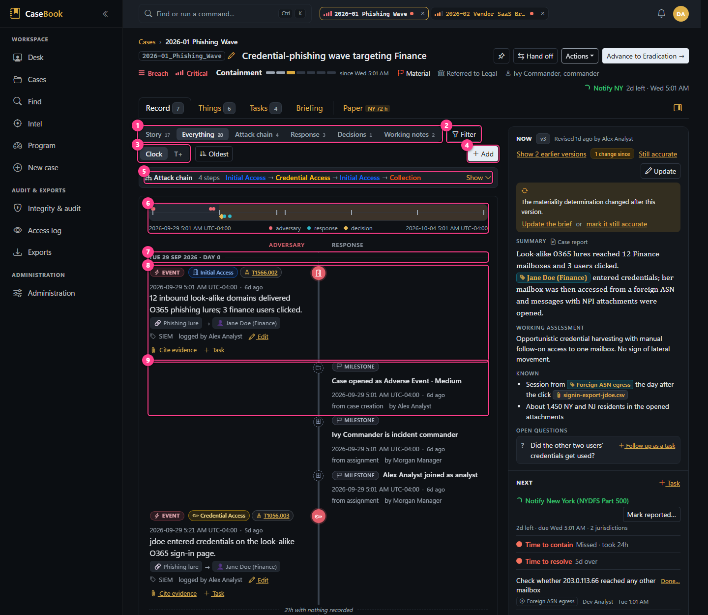
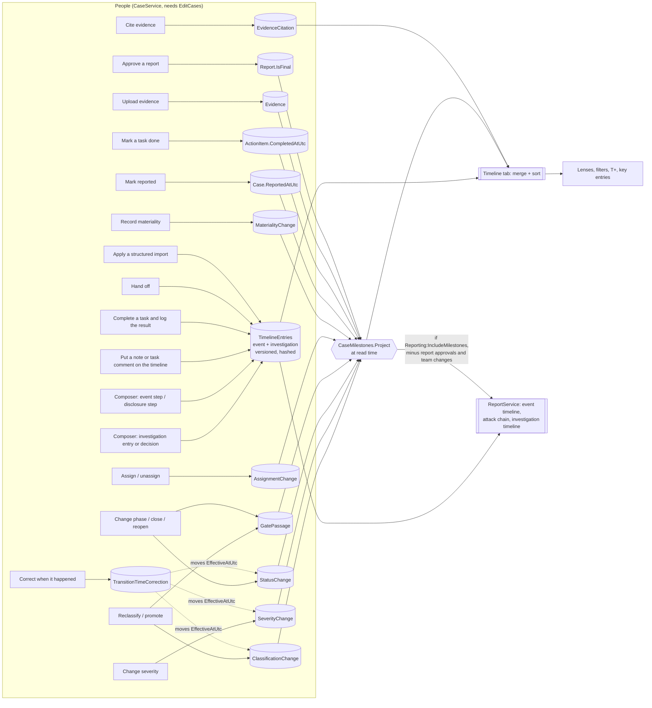

# The incident timeline

Each case has one chronology, shown on the Timeline tab and printed in the case report. It's the central
record of the investigation. This page explains how it's built, stored, edited, ordered and reported.

## Two sources, one view

The timeline is assembled every time it's shown, from two sources:

1. **Stored entries.** Rows in `TimelineEntries`, written by people. They come in two kinds:
   - **Event steps** (`Kind = Event`): what the adversary did (the attack chain), or for a third-party case,
     what the vendor disclosed and when.
   - **Investigation entries** (`Kind = Investigation`): what the team did. Typed as Detection, Analysis,
     Containment, Eradication, Recovery, Communication, Evidence, Escalation, Note or Other, plus
     **Decision** (what was decided and why) and **Handoff** (one person handing the case to another).
2. **Derived milestones.** Response milestones read from records the case already holds (a phase change, a
   gate passage, a completed task, …). **Nothing is copied or stored for them**, so a milestone can't drift
   from its source, and correcting the source corrects the timeline
   ([decision 0011](../decisions/0011-timeline-derived-milestones.md)).

## What creates stored entries

| How | Kind / type | What's set | Code |
|---|---|---|---|
| Timeline composer, *Investigation entry* | Investigation, chosen type | Markdown text, source, optional pasted screenshot; Decision needs a rationale | `CaseService.AddTimelineEntryAsync` |
| Timeline composer, *Event step* | Event, Other (or a disclosure type on third-party cases) | Tactics, technique, actor → target entities, source, optional screenshot | `CaseService.AddEventStepAsync` → `Case.AddEventStep` |
| *Add to timeline* on a note or task comment | Investigation, chosen type (not Decision) | `PromotedFrom = note:<id>` or `taskcomment:<id>`; text can be edited on the way | `CaseService.PromoteToTimelineAsync` |
| Completing a task with "add to the timeline" | Investigation, chosen type (not Decision) | `ActionItemId`, source `Task: <title>`, time = completion time | `CaseService.CompleteActionItemAsync` |
| *Hand off…* | Investigation, Handoff | Source `Handoff`, time = now | `CaseService.HandOffAsync` |
| Applying a structured import | As imported (Handoff becomes Communication; a Decision without a rationale becomes Communication) | `PromotedFrom = import`, shown as "imported" | `CaseImportService.ApplyAsync` |

## What is derived

From `Application/Cases/CaseMilestones.cs`:

| Milestone | From | Time used | Actor |
|---|---|---|---|
| Activity began (*N* before detection) | the case's initial-activity time, when set | that time | none |
| Case opened as *classification · severity*; when filed more than an hour after detection: "Detected (*SIEM id*); case opened as …", marked recorded later | the case and its opening history rows | creation, or detection when filed later | creator |
| Classification *X → Y* (including promotion from Complex Event) | `ClassificationChange`, except the opening one | **effective** time | who changed it |
| Severity *X → Y* | `SeverityChange` | effective time | |
| Phase *X → Y* (including reopen) | `StatusChange` | effective time | |
| *Name* is incident commander / joined as … / is no longer on the case | `AssignmentChange` (an IC handover is one line) | when recorded | |
| Materiality *X → Y* (decided by, on, rationale) | `MaterialityChange` | when recorded | |
| *Gate* gate **overridden** (with justification; flagged). A passed gate isn't a row: it shows as a note ("Incident escalation gate passed") on the transition it guarded | `GatePassage` | the guarded transition's effective time (recorded time shown when different) | |
| Reported to regulators | `Case.ReportedAtUtc` | that time | none recorded |
| Task done: *title* (unless a stored entry already logs that task's result) | `ActionItem` with status Done | completion time | |
| Evidence added: *file* (unless it's a screenshot shown on an entry, or a file an entry cites) | `Evidence` | upload time | uploader |
| Case / lessons-learned report *vN* approved as final | `Report` | approval time | approver |
| *Entity* assessed *verdict* (was *previous*), with the reason | `EntityVerdictChange` (an existing entity re-assessed; adding one with a verdict isn't recorded) | when recorded | who changed it |
| Working assessment recorded / Assessment revised (brief v*N*), with the new assessment | `CaseBrief` versions whose working assessment differs from the version before; a closing brief's conclusion is left to the Closed milestone | when the version was saved | who saved it |

Not on the timeline (they're in their own tabs and in the Audit tab): notes themselves, task comments, case
links, entity and IOC changes other than verdicts, ATT&CK tags, legal referral and hold, restriction, archive, brief versions that don't change the working assessment.

## What an entry contains

| Field | Notes |
|---|---|
| When it occurred (`OccurredAtUtc`) | Supplied by the person, in their display time zone, stored as UTC. |
| When it was recorded (`CreatedAtUtc`, `CreatedBy`) | Server time and the signed-in user. Never changes. Edited entries use the **first** version's time. |
| Type, text, source | Source is free-text provenance: the tool, "Handoff", "Task: …", or an import's origin. |
| Event steps | One or more ATT&CK tactics, an optional technique, an actor and target from the case's entities. |
| Decisions | Rationale (required), options considered, decided by (a free-text name, which may differ from who logged it). |
| Links | A pasted screenshot (`EvidenceId`), cited evidence (`EvidenceCitations`), the task it logs (`ActionItemId`), tasks raised about it (`ActionItem.AboutRef`), and where it was promoted from. On screen, a decision shows its tasks with when, by whom and the result, and a task's result entry says "Carries out the decision of …". |
| Version | Investigation entries: version number and the entry it supersedes. |

Times are covered by the rules in [decision 0010](../decisions/0010-after-the-fact-recording.md):

- An entry recorded more than **one hour** after it occurred shows **"recorded …"** (imported entries show
  **"imported …"**). The report can print the same note (`Reporting:MarkLateEntries`).
- Transitions use an effective time ("when it happened") and keep the recorded time. A milestone dated earlier
  than it was entered shows "recorded …" as well.

## Editing, correcting and deleting

| What | How it changes | Code |
|---|---|---|
| Investigation entry | **New version.** The old version stays (viewable under "Show N earlier versions"); citations move to the new version; an optional reason goes on the audit entry. | `Case.EditInvestigationEntry` |
| Event step | **Corrected in place.** The previous values are in the audit trail. | `Case.EditEventStep` |
| Milestone | Read-only: change the source record. For classification, severity and phase changes, *Correct time* re-dates the change with a required reason, adds a `TransitionTimeCorrection`, and moves the contained/resolved/closed time with it. The recorded time never moves. | `Case.CorrectTransitionTime` |
| Delete | **Not possible.** No code removes a timeline entry. | |

Correction limits: not in the future, not before detection, and staying between the neighbouring changes of the
same kind. The opening state can't be re-dated. Re-dating a classification change needs `ChangeClassification`.

## Ordering

- Stored entries sort by occurred time, then recorded time.
- Milestones sort by their time, then by milestone kind.
- In the merged view, a row's position is `(time, tie-break)`, where an entry's tie-break is its recorded time
  and a milestone's is its own time.
- **Newest first** by default on open cases; a **closed** case opens **oldest first** (read as a story). The sort button flips it.
- On a closed case, team changes are folded ("2 team changes hidden · Show").
- Day headers read "Wed 30 Sep 2026 · Day 5", counted from detection ("before detection" for earlier days).
- **Clock / T+** switches times to time since detection (`T+2d 4h`, `T−3h` before detection). Needs a detected
  time.

## Lenses and filters

| Control | Effect |
|---|---|
| **Story** | The key entries, oldest first: event steps, decisions, handoffs and milestones, except task-done and evidence-added. A closed case's Record opens here. |
| **Everything** | Entries and milestones together. |
| **Attack chain** (**Vendor incident** on third-party cases) | Event steps only; with the attack chain strip (on a third-party case, "Attack chain at the vendor", from its attack steps). |
| **Response** | Investigation entries only. |
| **Decisions** | Decision entries only; the composer defaults to Decision. |
| **Working notes** | The case's working notes (off the record). |
| **Filter** | Tactic (event lens) or type, source text, and entity (as actor or target, or tagged with `[[…]]` in the text). Any active filter hides milestones. |
| **Changed since** | Opened from "N changes since you last viewed" or the brief: only entries and milestones recorded after that time. |

Only current versions appear. Edits by others appear live with a highlight and a "N new entries" pill.

**Two lanes** (Story and Everything, where the panel is at least 620 px wide, a container query): event steps on
the left of the time spine, investigation entries and milestones on the right. The spine carries the phase in force
at each row (from the status changes' effective times). Eight hours or more between consecutive rows shows as
"N h with nothing recorded". Above the lanes, a **minimap** of the whole case: phase bands, the adversary's steps
above the line, the response below, decisions as diamonds and milestones as ticks; a mark brings its row into view
(switching to Everything if a lens or filter hid it). A decision's tasks (those *about* it) are listed under it as
"Carried out by".

## The attack chain

The attack chain *is* the event steps, in order; there's no separate table. Each step's actor → target also
becomes an edge on the relationship graph, its tactics feed ATT&CK coverage, and campaign rollups merge member
cases' event steps into one timeline. On a third-party case only the attack steps at the vendor make the chain;
its disclosure milestones don't (`EventSteps`).

## Evidence on the timeline

- A **screenshot pasted** into the composer is uploaded as evidence (hashed, with custody) and shown on that
  entry (`EvidenceId`). Thumbnails come from `/evidence/{id}/inline`, which serves only real raster images and
  logs nothing.
- **Cite evidence** links any number of evidence files to a current entry. The report prints them with the
  entry.
- Evidence that isn't a pasted screenshot also appears as an "Evidence added" milestone.

## In the case report

`ReportService` builds three sections from the same data:

| Section | Contents |
|---|---|
| Event timeline | All event steps by occurred time: type, defanged text, source. No "By" column. |
| Attack chain | Event steps numbered, drawn across ATT&CK tactic lanes. Empty for third-party cases. |
| Investigation timeline | Current investigation entries (Markdown flattened; decisions printed with "Why", "Options considered", "Decided by" and "Actions taken" (the tasks started from the decision, with when, by whom and the result); cited evidence appended; "(Recorded …)" for late entries if `Reporting:MarkLateEntries`), plus milestones if `Reporting:IncludeMilestones`, **except** report approvals and team changes. Columns: time, type, description (with source), **By** (who logged it, or the milestone's actor). |

So the screen and the report agree, except that the report leaves out staffing changes and report approvals.

## How it's queried and persisted

- The workspace loads the whole case with its children (`CaseService.GetDetailAsync`). The timeline tab merges
  in memory; there's no paging. This is fine at the expected size (tens to a few hundred entries per case).
- Indexes: `TimelineEntries(CaseId)`, `(CaseId, Kind, IsCurrent)`, `OccurredAtUtc`, and the actor and target
  ids.
- Every stored entry is row-hashed and audit-chained. Milestones aren't stored, so they add nothing to the
  audit chain beyond their source records.

## Business rules

- A **Decision always has a rationale**: in the composer, on edit and on import. Decisions can't be created by
  promoting a note or completing a task.
- **No deletion**, and investigation entries keep their history.
- **Milestones are derived, never stored.** To show something new, add it to `CaseMilestones.Project` (and
  decide whether the report should include it). Keep the de-duplication rules: a task whose result is logged as
  an entry, and a screenshot attached to an entry, don't also appear as milestones.
- **Recorded times never change.** Only effective times move, through a recorded correction.

## Known gaps

- The composer doesn't reject a **future** occurred time on the server (only promotion, task completion and
  import do).
- Removing an entity used as an event step's actor or target fails at the database (see
  [known issues](../reference/known-issues.md)).

## Changing the timeline

See [development/recipes.md](../development/recipes.md#change-the-timeline) for which files to touch for a new
entry type, a new milestone, or a change to ordering or the report.
