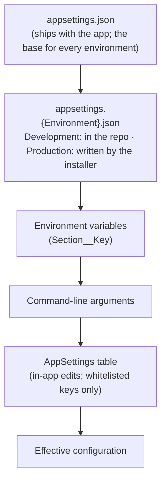

# Configuration reference

Every setting CaseBook reads, where it comes from, what it defaults to, and who can change it. For how to set
up a production host see [INSTALL.md](../INSTALL.md); for the reasoning behind the split between in-app and
server-side settings see [decision 0007](../decisions/0007-settings-split.md).

Source paths are relative to `src/` unless they start with `deploy/`.

## 1. Where settings come from

Later sources win. The database provider (`Infrastructure/Configuration/DbSettingsConfiguration.cs`) is added
**last** in `Web/Program.cs`, so an in-app value beats files, environment variables and the command line, but
only for keys in the in-app whitelist (`Application/Admin/SettingsCatalog.cs`).

Things to know:

- **Production inherits `appsettings.json`.** The production file the installer writes is an overlay, not a
  complete file. Every section it omits (rate limits, SLA targets, notification scans, SIEM, chat, access log)
  takes its value from `appsettings.json`.
- **Environment variables** use the standard mapping: `Siem__Webhook__Url` sets `Siem:Webhook:Url`, and
  `Email__LegalDistribution__0` sets the first element of a list. There is no prefix.
- **The environment** comes from `ASPNETCORE_ENVIRONMENT`. Only `launchSettings.json` sets it (to
  `Development`). Nothing in `deploy/` sets it, so an IIS install runs as **Production**, which loads
  `appsettings.Production.json` and enforces Windows authentication.
- **Lists merge by index** across sources. A later source can replace items 0..n but can't make a list
  shorter. If you put recipients in a file, you can't clear them from the in-app editor.
- **Administration → Settings → Configuration source map** shows the true effective value of each key and
  which source it came from. Use it when a value isn't what you expect.

### 1.1 In-app (operational) settings

Administration → Settings edits the keys in `SettingsCatalog`. A save:

1. requires the `Administer` permission;
2. rejects any key not in the catalog;
3. normalizes the value (booleans must parse; numbers must be within the catalog's range; a blank number is
   stored as *null*; a choice must match one of the options);
4. writes an `AppSetting` row, which is audited and hash-chained like any other change;
5. reloads configuration and emits SIEM event 5403.

Two other key spaces share the table: `Taxonomy:*` (display labels, Administration → Taxonomy) and
`EmailTemplate:*` (Administration → Email templates).

When loading, the database provider applies the same whitelist. A row whose key isn't in the catalog (and
isn't `Taxonomy:*` or `EmailTemplate:*`) could only have got there outside the app. It is ignored, and **at
startup** it is logged as Critical and sent as SIEM event 5002. The check runs once per start, so a row
inserted while the app is running is ignored silently until the next restart.

> **Known quirks** (see [known issues](../reference/known-issues.md)):
> - The settings form shows the **catalog default** when no database override exists, not the value from your
>   files. For example, the production template's 24-hour auto-seal interval displays as 6. The source map
>   shows the real value.
> - **Clearing a number field doesn't mean "off".** A blank number is stored as null and skipped on load, so
>   the file value comes back. To disable an SLA target, enter `0`.

### 1.2 Live reload

| Takes effect | Settings |
|---|---|
| Immediately | Anything read per request: SLA targets, deadline settings, labels, access-log scope, time zone, base URL, branding colors, external links, email, chat, SIEM transports, reporting options, legal-hold option |
| Within about 5–10 minutes | Background-job options (jobs re-read them every 5 minutes; the integrity monitor every 10; the executive report hourly) |
| New sessions only | `Security:IdleTimeoutMinutes` |
| **Restart required** | `Auth:Mode`, `Auth:AllowDevSignInOutsideDevelopment`, `Database:*`, `ConnectionStrings:*`, `DataProtection:KeyPath`, `RateLimiting:*`, `Siem:QueueCapacity`, every `Secrets:CyberArk:*` key, all storage paths, `Integrity:SigningKeyPath`/`ExportPath`, `DevAuth:*`, `RoleMapping:*` (first run only, see §3.16) |

## 2. Startup checks

The app refuses to start in exactly these cases:

| Condition | Message |
|---|---|
| Environment is Production and `Auth:Mode` isn't `Windows` (missing means `Dev`) | `Auth:Mode is '…' in Production. Production requires Auth:Mode=Windows…` |
| Environment is neither Development nor Production, `Auth:Mode` isn't `Windows`, and `Auth:AllowDevSignInOutsideDevelopment` isn't `true` | `Auth:Mode is '…' in the '<environment>' environment. Set Auth:Mode=Windows, or…` |
| `DataProtection:KeyPath` is set but not an absolute path | `DataProtection:KeyPath must be an absolute path…` |
| `Database:Provider` is `SqlServer` and there's no `ConnectionStrings:Default` | `A SqlServer connection string is required.` |

Everything else is checked lazily or not at all:

- A `Database:Provider` other than `SqlServer` (including a typo) means **SQLite**.
- A file store whose folder can't be created fails when it's first used, typically on the first request
  that touches evidence or reports.
- **If the seal-signing key file is missing, the app generates a new RSA-3072 key there.** That's
  convenient in development. In production, provision the key out of band ([OPERATIONS.md §2](../OPERATIONS.md#2-integrity-signing-key-management-f-05b)),
  because a generated key on the server can't vouch for anything.
- Not validated at all: whether storage paths are outside the web root, `AllowedHosts`, email settings, the
  format of `App:BaseUrl`. SIEM URLs are validated each time an event is sent.

## 3. Key reference

Columns:

- **Edit**: **App** (Administration → Settings) or **Server** (files or environment).
- **Sens**: 🔒 secret · ⚠ sensitive (infrastructure detail, personal data) · blank for benign.
- A default shown as `json: …` is a value set in `appsettings.json` rather than in code.

### 3.1 Hosting and authentication

| Key | Purpose | Default | Edit | Sens |
|---|---|---|---|---|
| `Auth:Mode` | `Windows` = Negotiate (Kerberos/NTLM) with AD group → role mapping. Any other value = the passwordless development handler, which starts only in the Development environment. **Must be `Windows` in Production.** | `Dev` (json: `Dev`; prod template: `Windows`) | Server | ⚠ |
| `Auth:AllowDevSignInOutsideDevelopment` | `true` lets a non-Production environment other than Development (a demo or QA server) use the development handler. Ignored in Production. | `false` | Server | ⚠ |
| `DevAuth:UserId`, `DisplayName`, `Upn`, `Email` | Identity of the development user | `S-1-5-21-DEV-1001`, `Dev Analyst`, … | Server | |
| `DevAuth:Roles` | Roles granted to the development user | none in code; json: all five | Server | |
| `AllowedHosts` | Host header allow-list | `*`; prod template: the site hostname | Server | ⚠ |
| `Logging:LogLevel:*` | Standard ASP.NET Core log levels | json: `Information`; prod template: `Warning` | Server | |
| `Security:IdleTimeoutMinutes` | Lock an idle session after N minutes; `0` disables. The warning appears 60 seconds before (or at half the timeout if that's shorter). | `15` | App | |
| `RateLimiting:Downloads:TokenLimit` / `TokensPerPeriod` / `PeriodSeconds` | Per-user token bucket on downloads, exports, the import API and the agenda feed. Over budget gets **429** with `Retry-After` and SIEM event 5306. | `40` / `40` / `60` | Server | |

### 3.2 Database

| Key | Purpose | Default | Edit | Sens |
|---|---|---|---|---|
| `Database:Provider` | `SqlServer`, or SQLite for any other value | `Sqlite` | Server | ⚠ |
| `ConnectionStrings:Default` | Connection string. Production uses integrated security (no password). | `Data Source=App_Data/incidentmanager.db`; prod template: `Server=…;Database=…;Trusted_Connection=True;Encrypt=True;TrustServerCertificate=True;Application Name=CaseBook;` | Server | ⚠ (🔒 if it ever holds credentials) |

The template ships `TrustServerCertificate=True`. Set it to `False` once SQL Server presents a CA-signed
certificate.

### 3.3 Storage paths

All production paths sit under the installer's **data root** (`-DataRoot`). Relative paths resolve against the
process's working directory, which under IIS is the site folder.

| Key | Holds | Code default | Edit | Sens |
|---|---|---|---|---|
| `EvidenceStore:RootPath` | Evidence files (per-case folders, random names) | `App_Data/evidence-store` | Server | ⚠ |
| `ReportOutput:RootPath` | Generated reports | `App_Data/report-output` | Server | ⚠ |
| `ReportBranding:RootPath` | The report and email logo | `App_Data/branding` (not in `appsettings.json`) | Server | ⚠ |
| `ReportTemplates:RootPath` | Uploaded Word templates (`{id}.docx`) | unset: a `report-templates` folder beside the branding folder | Server | ⚠ |
| `Integrity:SigningKeyPath` | PEM RSA private key that signs seals. **Generated if missing.** | `App_Data/keys/seal-signing.pem` | Server | 🔒 (the file) |
| `Integrity:ExportPath` | Out-of-band copies of seals | `seals` (relative to the working directory, **not** `App_Data`) | Server | ⚠ |
| `DataProtection:KeyPath` | Keyring for antiforgery and circuit protection, encrypted with machine DPAPI. Must be absolute. Blank uses the framework default, which under an app pool without a profile is lost on every recycle. | blank | Server | ⚠ |
| `BackupStatus:FilePath` | JSON file written by your backup jobs ([OPERATIONS.md §1.3.1](../OPERATIONS.md#131-backup-health-status-file-h-04)). Relative paths resolve against the content root. | blank (not configured) | Server | ⚠ |
| `BackupStatus:BackupMaxAgeHours` / `RestoreMaxAgeDays` | When Diagnostics calls a backup or restore stale | `24` / `35` | Server | |

> **A store with no path falls back under `App_Data` in the web root.** On a production server the web root
> is read-only, so that store fails with *"Access to the path … is denied"* the first time it's used.
> `Upgrade-CaseBook.ps1` adds any data-folder setting the release template has and your config lacks. If
> `Integrity:SigningKeyPath` is missing, it stops instead of guessing.

### 3.4 Integrity

| Key | Purpose | Default | Edit |
|---|---|---|---|
| `Integrity:AutoSeal:Enabled` | Sign a seal on a schedule. Chain verification runs every 10 minutes either way. | code `false`; json, template and catalog `true` | App |
| `Integrity:AutoSeal:IntervalHours` | Hours between seals (`≤0` means 6) | `6`; prod template `24` | App |
| `Integrity:EvidenceVerify:Enabled` | Periodically re-hash every stored evidence file (and once at startup); alarm 5003 on drift | `false` | App |
| `Integrity:EvidenceVerify:IntervalHours` | Hours between passes (`≤0` means 24) | `24` | App |

### 3.5 Reporting

| Key | Purpose | Default | Edit |
|---|---|---|---|
| `Reporting:OrganizationName` | Report header line 1; app name in the sidebar and emails; STIX identity | unset: `[Company Name]` in reports, `CaseBook` elsewhere | App |
| `Reporting:TeamName` | Report header line 2 | unset: `[Team Name]` | App |
| `Reporting:RequireSeparateApprover` | Maker-checker: the approver of a final can't be the person who generated it | `false` | App |
| `Reporting:LessonsLegend` | Confidentiality legend on every page of the lessons-learned report | blank | App |
| `Reporting:SectionLayout` | Section order and visibility (`Summary,!Outcome,…`; `!` hides). Edited with the layout designer. | all sections (notes and brief off) | App |
| `Reporting:DefangIndicators` | Defang IOCs in reports (`hxxp`, `[.]`) | `true` | App |
| `Reporting:IncludeMilestones` | Include derived milestones in the report timeline | `true` | App |
| `Reporting:MarkLateEntries` | Note "recorded …" on entries made more than an hour after they happened | `true` | App |
| `Reporting:DefaultTlp` | Default TLP marking: CLEAR, GREEN, AMBER, AMBER+STRICT, RED (invalid means AMBER) | `AMBER` | App |

### 3.6 Organization, branding and links

| Key | Purpose | Default | Edit |
|---|---|---|---|
| `Organization:TimeZone` | Where days, months and quarters begin for trends, the program report and digests. A fixed list of 14 IANA zones. | `America/New_York` | App |
| `Organization:DefaultJurisdictions` | Pre-fills a case's affected jurisdictions (`NY, NJ`) | blank | App |
| `Branding:AccentColor` / `Branding:InkColor` | Brand colors (hex) for the UI and emails | gold `#ffcf31` / charcoal `#232a33` | App |
| `ExternalLinks:DetectionSourceLabel` | Name of the detection system shown in the UI | json: `SIEM` | App |
| `ExternalLinks:DetectionCaseUrlTemplate` | Deep link to the detection platform; `{0}` = the case's detection id | blank | App |
| `ExternalLinks:VirusTotalUrlTemplate` | IOC lookup link; `{0}` = indicator | json: VirusTotal search URL | App |
| `App:BaseUrl` | Absolute site URL used in email links, the email logo and calendar links. Blank still sends, without links. **The installer doesn't set it.** | blank | App |

### 3.7 Governance and retention

| Key | Purpose | Default | Edit |
|---|---|---|---|
| `Governance:LegalHoldRelease:RequireSecondApprover` | Two-person control for releasing a legal hold | `false` | App |
| `Retention:CaseYears` | Described as "years before a closed case can be archived". **Nothing reads it** ([known issues](../reference/known-issues.md)). | `7` | App |

### 3.8 Response SLAs

Targets are hours from detection. **There's no code default.** A target exists only if configuration holds a
whole number from 1 to 8760; anything else means "no SLA" for that severity. Informational cases never have one.

| Key pattern | Default (json) | Notes |
|---|---|---|
| `Sla:Containment:{Critical,High,Medium,Low}` | 4 / 12 / 24 / 72 | Detected → contained |
| `Sla:Resolution:{…}` | 24 / 72 / 168 / 336 | Detected → resolved |
| `Sla:Detection:{…}` | none | Occurred → detected; only when the occurred time is recorded |
| `Sla:Breach:Containment:{…}`, `Sla:Breach:Resolution:{…}` | none | Override for Breach-classified cases; blank uses the general target |
| `Sla:AtRiskThresholdPercent` | 80 | When a running clock shows "at risk" (1–100) |

All are editable in-app (App). Remember that a blank field restores the json value; enter `0` to switch a
target off.

### 3.9 Regulatory notification deadlines

| Key | Purpose | Default | Edit |
|---|---|---|---|
| `Compliance:NotificationDeadlines:Enabled` | Master switch for the deadline clock, its dashboard block and the case panel | `false` | App |
| `…:StartBasis` | When the clock starts: `Determination` (the materiality determination) or `Detection` | `Determination` | App |
| `…:DefaultWindowHours` | Window for jurisdictions with no rule | `72` | App |
| `…:AtRiskThresholdPercent` | When a deadline shows "at risk" | `80` | App |

Per-jurisdiction windows are reference data (Administration → Regulatory deadlines), not settings.

### 3.10 Labels

`Severity:Label:{Critical,High,Medium,Low,Informational}`: display names for the five severities (App).
Classification, phase and other labels are under Administration → Taxonomy (`Taxonomy:*` rows).

### 3.11 Access log

| Key | Purpose | Default | Edit |
|---|---|---|---|
| `Access:LogScope` | Which case opens are logged: `Off`, `RestrictedOnly` or `All`. Artifact downloads and exports are logged whenever logging is on. | `All` | App |
| `Access:CoalesceWindowMinutes` | Repeated access by the same person within this window is folded into one row with a count (`≤0` means 30) | `30` | App |

### 3.12 Email

The SMTP client has **no username/password support and no timeout setting**: use an anonymous or
IP-allow-listed relay.

| Key | Purpose | Default | Edit | Sens |
|---|---|---|---|---|
| `Email:Enabled` | Off: messages are logged (recipient count only) instead of sent | `false` | App | |
| `Email:SmtpHost` | Relay host | blank; installer `-SmtpHost` | Server | ⚠ |
| `Email:SmtpPort` | Relay port | `25` | Server | |
| `Email:EnableSsl` | STARTTLS | `true` | Server | |
| `Email:From` | Sender address. A blank installer mail domain produces `casebook@`, which fails once email is on. | `incident-manager@localhost`; template `casebook@<domain>` | App | |
| `Email:LegalDistribution` | Who is emailed when a case escalates to Breach | empty | App | ⚠ |
| `Email:IntegrityAlertDistribution` | Who receives audit-chain and evidence-drift alarms | empty | App | ⚠ |
| `Email:AssignmentNotifications` | Email people when they're assigned | `false` | App | |

Message wording is edited under Administration → Email templates (`EmailTemplate:*`). The branded shell is
fixed.

### 3.13 Notifications and background scans

Each scan re-reads its options every 5 minutes and runs when it's enabled and its interval has passed. All
scans read case data only. All deliver only when `Email:Enabled` is on (or to chat, where routed).

| Key | Purpose | Default | Edit |
|---|---|---|---|
| `Notifications:OverdueScan:Enabled` / `IntervalHours` | Remind task owners once when a task passes its due date | `false` / `24` | App |
| `Notifications:OverdueScan:Escalation:Enabled` | Escalate overdue tasks further | `false` | App |
| `…:Escalation:IncidentCommanderAfterHours` / `ManagersAfterHours` | When to tell the incident commander, then managers (`0` skips the step) | `48` / `120` | App |
| `Notifications:DueSoonScan:Enabled` / `LeadHours` / `IntervalHours` | Remind once as a task enters its lead window. Keep the interval at or below the lead time. | `false` / `24` / `6` | App |
| `Notifications:DeadlineScan:Enabled` / `IntervalHours` | Remind the incident commander and assignees as a regulatory deadline approaches or passes. Also needs the deadline clock on. | `false` / `1` | App |
| `Notifications:StaleScan:Enabled` / `IntervalHours` | Nudge about open cases with no activity | `false` / `12` | App |
| `Notifications:StaleScan:Days:{Critical,High,Medium,Low}` | Quiet days before a nudge (`0` = never) | `2` / `5` / `10` / `21` | App |
| `Notifications:StaleScan:Days:Informational` | As above | `0` | Server |
| `Notifications:DigestScan:Enabled` / `IntervalHours` | Master switch for the per-user work digest (users opt in from the account menu) | `false` / `1` | App |
| `Notifications:ExecutiveReport:Enabled` | Quarterly program-report email to managers, sent in the first 7 days of a quarter | `false` | App |
| `Notifications:Mandatory:{Assignment,Overdue,DueSoon}` | Users can't opt out of that type | `false` | App |
| `Notifications:Chat:{BreachEscalations,Assignments,Mentions,OverdueReminders,DueSoonReminders,DeadlineReminders,StaleReminders}` | Also post that type to the team chat channel | `false` | App |

Administration → Settings → Notifications has a **Delivery readiness** panel. It shows whether email is on,
whether a sender is set and which triggers are enabled, and a *Send a test email* card.

### 3.14 Calendar feed

| Key | Purpose | Default | Edit | Sens |
|---|---|---|---|---|
| `Agenda:FeedKey` | HMAC key that signs each user's ICS feed URL (`/agenda/feed.ics?token=…`). Blank disables the feed (404). Rotating it invalidates every issued URL. Tokens also expire after 365 days. | blank | Server | 🔒 |

### 3.15 SIEM, chat and secrets

The full SIEM reference, including the event catalog, is in [OPERATIONS.md §5](../OPERATIONS.md#5-siem-security-event-stream-f-18); CyberArk is in
[§6](../OPERATIONS.md#6-secret-management-f-19). The keys:

| Key | Default | Sens |
|---|---|---|
| `Siem:QueueCapacity` (restart) | `2048` (minimum 16) | |
| `Siem:Webhook:Enabled`, `Url` (https; http only to loopback), `Token`, `AuthHeader`, `AuthScheme`, `TimeoutSeconds`, `MaxAttempts` | off, blank, blank, `Authorization`, `Bearer`, `5`, `3` | `Token` 🔒, `Url` ⚠ |
| `Siem:Syslog:Enabled`, `Host`, `Port`, `Protocol` (`Udp`/`Tcp`), `Facility`, `AppName`, `TimeoutSeconds` | off, blank, `514`, `Udp`, `16`, `CaseBook`, `5` | `Host` ⚠ |
| `Siem:EventLog:Enabled`, `Source`, `LogName` | off, `CaseBook`, `Application` | |
| `Chat:Webhook:Enabled`, `WebhookUrl` (https), `Format` (`Slack`/`Teams`), `TimeoutSeconds`, `MaxAttempts` | off, blank, `Slack`, `5`, `3` | `WebhookUrl` 🔒 |
| `Secrets:CyberArk:Enabled`, `BaseUrl`, `AppId`, `ClientCertificateThumbprint`, `CacheTtlSeconds`, `TimeoutSeconds`, `FailClosed` (all restart) | off, blank, blank (template `CaseBook`), blank, `300`, `5`, `true` | `BaseUrl`, `AppId` ⚠ |

**Only two values can be `@cyberark:` references:** `Siem:Webhook:Token` and `Chat:Webhook:WebhookUrl`.
Connection strings, `Agenda:FeedKey` and SMTP settings must be literals or come from environment variables.

### 3.16 Role mapping (first run only)

`RoleMapping:Groups:{Analyst,IncidentCommander,Manager,LegalPrivacy,SysAdmin}`: the AD groups (names or SIDs)
for each system role. They're copied into the database **only when the role-mapping table is empty**, on first
start. After that, mappings are managed in Administration → Roles & access, and these keys are ignored.
`appsettings.json` carries sample group names (`SOC-Analysts`, …), and the template replaces them with the
installer's values. Sensitivity: ⚠ (names AD groups).

### 3.17 Design-time only

`IM_MIGRATIONS_PROVIDER=SqlServer` (environment variable) points the `dotnet ef` tooling at the SQL Server
migrations assembly. The running app never reads it. See [development/recipes.md](../development/recipes.md#add-or-change-a-database-column).

## 4. The production template and the installer

`deploy/appsettings.Production.template.json` is rendered by `Install-CaseBook.ps1`, which replaces these
tokens and refuses to write the file if any remain:

| Token | Becomes | Lands in |
|---|---|---|
| `__PUBLIC_HOSTNAME__` | `-Hostname` | `AllowedHosts` |
| `__SQL_INSTANCE__`, `__DB_NAME__` | `-SqlInstance`, `-DbName` | `ConnectionStrings:Default` |
| `__DATA_ROOT__` | `-DataRoot` | every storage path, the key paths, `DataProtection:KeyPath`, `BackupStatus:FilePath` |
| `__SMTP_HOST__`, `__MAIL_DOMAIN__` | `-SmtpHost`, `-MailDomain` | `Email:SmtpHost`, `Email:From` |
| `__AD_GROUP_ANALYSTS__` … `__AD_GROUP_APPADMINS__` | the five AD groups | `RoleMapping:Groups:*` |

The template also fixes `Auth:Mode=Windows`, `Database:Provider=SqlServer`, auto-seal on every 24 hours,
logging at `Warning`, and CyberArk off.

The installer does **not** set `App:BaseUrl`, `Agenda:FeedKey`, any SIEM or chat endpoint, or
`ASPNETCORE_ENVIRONMENT`. Set them by editing `appsettings.Production.json` (server-side keys) or in
Administration (in-app keys).

**Upgrades never rewrite this file** (it is excluded from the binary copy and backed up first). The only
change an upgrade makes is adding missing data-folder settings. Any other new setting in a later release takes
its `appsettings.json` default until you add it.

## 5. Hard-coded values

These are constants in code today. Changing them needs a release. The ones most likely to need tuning come
first.

| Value | Where |
|---|---|
| Evidence upload limit **50 MB** | `Web/Components/Pages/CaseTabs/CaseEvidenceTab.razor` (`MaxEvidenceBytes`) |
| Timeline screenshot **15 MB**; report logo 2 MB; Word template 5 MB; config bundle 64 MB | `CaseTimelineTab.razor`, `Admin.razor`, `Application/Admin/ReportTemplateService.cs`, `AdminConfigBundle.razor` |
| Case-import file **4 MB in the UI, 5 MB through the API**; IOC import 2,000 indicators | `CaseImport.razor`, `Web/Program.cs`, `Application/Import/IocImportConverter.cs` |
| Audit-chain verification every **10 minutes** (tamper-detection latency) | `Web/BackgroundJobs/IntegritySealHostedService.cs` |
| Job option re-read every 5 minutes | each `*HostedService.cs` |
| Signed-in users' permissions re-derived every **2 minutes** | `Web/Security/PermissionRevalidatingAuthStateProvider.cs` |
| User directory refresh 30 minutes | `Infrastructure/Security/UserDirectory.cs` |
| API token maximum lifetime 90 days (personal) / 365 days (system) | `Application/ApiTokens/ApiTokenService.cs` |
| "Recorded later" threshold 1 hour | `Application/Cases/CaseService.cs` (`BackdateReasonThreshold`) |
| Audit and access-log CSV exports capped at **100,000 rows** (silently) | `Web/Program.cs` |
| Indicator list 300 rows | `Application/Intel/IndicatorService.cs` |
| Access review "dormant" after 90 days | `Application/Admin/AccessReviewService.cs` |
| Webhook and chat retry back-off 250 ms × attempt | `Web/Siem/WebhookTransport.cs`, `Web/Notifications/ChatWebhookNotifier.cs` |
| Seal key RSA-3072, PKCS#1 v1.5 with SHA-256 | `Infrastructure/Security/RsaSealSigner.cs` |
| Blazor circuit options, HSTS and Kestrel limits | framework defaults (`Web/Program.cs`) |
| Outbound HTTP proxy | none configured; the `siem` and `chat` clients use the system proxy |
