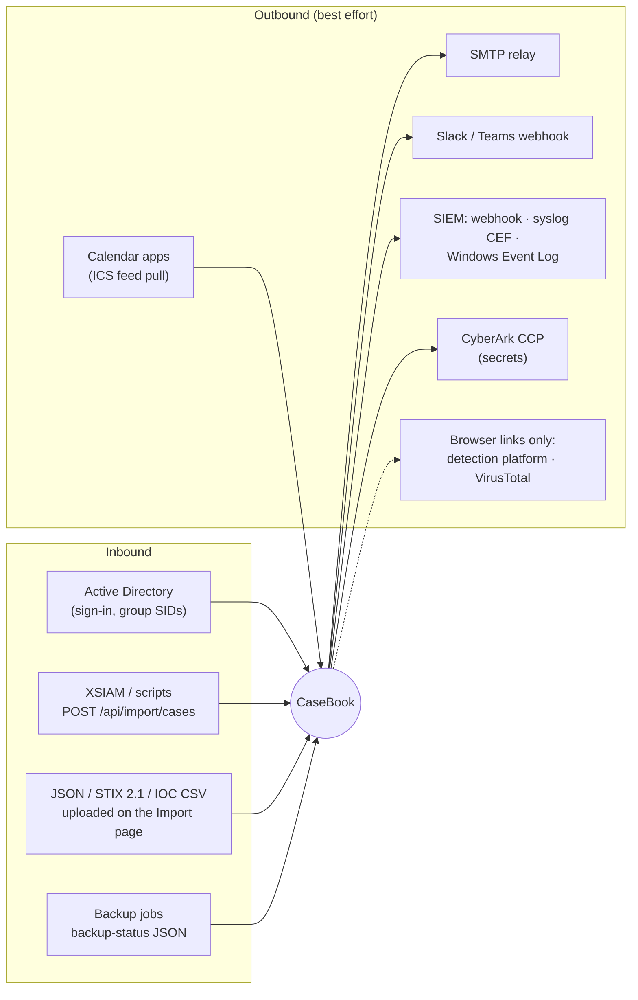

# Integrations

Every connection CaseBook makes to something outside itself, and every way data comes in. All outbound calls go
to endpoints an operator configured; **nothing calls an AI service** ([decision 0005](../decisions/0005-no-outbound-ai.md)).

| Integration | Direction | Default | Config | Code |
|---|---|---|---|---|
| Active Directory | in | on (Windows mode) | `Auth:Mode`, role mappings in-app | `Web/Security/RoleClaimsTransformer.cs`, `WindowsNames.cs` |
| Case-import API | in | available | API tokens in-app | `Web/Program.cs`, `Application/Import/` |
| File imports (JSON, STIX, CSV) | in | available | — | `Application/Import/` |
| Email (SMTP) | out | off | `Email:*` | `Infrastructure/Notifications/` |
| Team chat | out | off | `Chat:Webhook:*`, `Notifications:Chat:*` | `Web/Notifications/ChatWebhookNotifier.cs` |
| SIEM | out | off | `Siem:*` | `Infrastructure/Siem/`, `Web/Siem/` |
| CyberArk CCP | out | off | `Secrets:CyberArk:*` | `Infrastructure/Secrets/` |
| Calendar feed | pulled | off | `Agenda:FeedKey` | `Application/Work/AgendaFeedService.cs`, `Infrastructure/Agenda/` |
| Backup status | read from file | off | `BackupStatus:*` | `Web/Ops/BackupHealthReader.cs` |
| Detection platform, VirusTotal | links in the UI only | — | `ExternalLinks:*` | Overview and Entities tabs |
| MITRE ATT&CK | embedded data | — | — | `Application/Mitre/` |
| STIX export | file download | — | — | `Application/Export/StixExportService.cs` |

## Active Directory

- **What:** Windows Integrated Authentication through IIS; AD group SIDs resolved to group names and mapped to
  CaseBook roles; display names looked up for the user directory.
- **Auth:** Kerberos/NTLM; the app pool's identity reads group names.
- **Failure:** a SID that can't be resolved is cached as unknown for the process lifetime; if the role directory
  can't load at startup it's empty, and **nobody gets permissions** until it loads.
- **Local testing:** not possible on the development handler; use a domain-joined test server.

## Case-import API (and XSIAM elevation)

- **What:** lets a producer (an XSIAM playbook, a script) hand a case or additions to an existing case to a human
  reviewer.
- **Auth:** bearer API token with `EditCases` ([API.md](../API.md)). IIS must allow anonymous access to `/api` so
  the token scheme applies (the installer does this).
- **Data:** a `casebook-case-import` JSON document: target (new case or an existing case id), origin, summary,
  timeline entries, entities, tasks. Up to 5 MB.
- **Result:** a pending import, nothing written to a case. A reviewer confirms or rejects it in *Import →
  Pending imports*.
- **Failure:** 400 with an `error` message for invalid documents; 401/403/413/429 as documented; server errors
  redirect to `/Error` (an HTML 302).
- **Retry:** none on the server; the caller decides.
- **XSIAM:** `integrations/xsiam/CaseBookElevate.py` is a template automation (Python 3, `requests`) that builds
  a new-case document from an XSIAM incident (name, severity, times, details, incident id, indicators with DBot
  verdicts) and posts it. It hasn't been run against a live tenant; adapt the mappings and test it first. See
  [integrations/xsiam/README.md](../../integrations/xsiam/README.md).
- **Local testing:** create a system token in Administration → API tokens on a development instance, then
  `curl -X POST http://localhost:5103/api/import/cases -H "Authorization: Bearer <token>" -H "Content-Type:
  application/json" --data @integrations/xsiam/sample-elevation.json`.

## File imports

On the Import page: a case-import JSON document, a **STIX 2.1 bundle**, or an **indicator CSV**. STIX and CSV
are converted into an entities-only document (up to 2,000 indicators). Everything goes through the same editable
preview and the normal audited writes. The *Generate a prompt for your AI* step builds a prompt embedding the
schema, for use in the organization's own approved AI tool.

## Email (SMTP)

- **What:** breach escalation to Legal, assignment, mentions, handoff, reminders (overdue, due soon, deadlines,
  stale cases), digests, the quarterly executive report, integrity alarms
  ([who gets what](../architecture/backend.md#who-gets-notified-about-what)).
- **Auth:** none. `SmtpClient` with host, port and STARTTLS (`Email:EnableSsl`). The relay must accept the server
  anonymously or by IP.
- **Data:** branded HTML plus a text part; subject and body from editable templates; links and logo only when
  `App:BaseUrl` is set. Restricted-case details only go to people who can see the case.
- **Failure:** logged and dropped; **no retry**. With email off, sends are logged (recipient counts only).
- **Testing:** Administration → Notifications → *Send a test email*. Locally, run an SMTP sink such as smtp4dev
  on localhost:25 with `Email:EnableSsl=false`.

## Team chat (Slack or Teams)

- **What:** a shared channel broadcast for selected events (breach escalations, assignments, mentions, reminder
  summaries), chosen per type under Notifications.
- **Auth:** the incoming-webhook URL is the credential (`Chat:Webhook:WebhookUrl`, literal or a CyberArk
  reference). Must be https (http only to loopback).
- **Data:** Slack mrkdwn or a Teams MessageCard; restricted cases are redacted ("Breach escalation (restricted
  case)").
- **Failure and retry:** up to `MaxAttempts` (3) with a 250 ms × attempt back-off; then dropped and logged.
- **Limits:** a broadcast channel, not per-user messaging.
- **Testing:** point the URL at `http://localhost:<port>/` with any request-capture tool.

## SIEM security-event stream

- **What:** a structured stream of security-relevant actions for detection rules. Full reference, payload and
  event-id catalog: [OPERATIONS.md §5](../OPERATIONS.md#5-siem-security-event-stream-f-18).
- **Transports:** webhook (JSON over https, optional bearer or API-key header; token may be a CyberArk
  reference), syslog (RFC 5424 with a CEF payload, UDP or TCP), Windows Event Log (event id = catalog id).
- **Delivery:** events go into a bounded in-memory queue (`Siem:QueueCapacity`, 2048) and a background dispatcher
  sends each to every enabled transport. Never blocks a user action. Webhook retries up to 3 times; syslog and
  Event Log don't retry. Overflow and anything queued at shutdown is lost; the audit chain remains the record.
- **Testing:** Administration → Diagnostics → *Send test event* (id 5901) reports per-transport success.
  Locally, a webhook to `http://localhost:<port>` or syslog to a local UDP listener.

## CyberArk Central Credential Provider

- **What:** fetches secrets at runtime instead of keeping them in configuration. **Only `Siem:Webhook:Token` and
  `Chat:Webhook:WebhookUrl` are resolved this way today.**
- **Auth:** the CCP Application ID, plus whatever the CyberArk administrator requires: a client certificate
  (`ClientCertificateThumbprint`, in `LocalMachine\My`), allowed machines (source IP), and/or the OS user (the
  app pool identity).
- **Data:** `GET {BaseUrl}/api/Accounts?AppID=…&Safe=…&Object=…` for a reference written as
  `@cyberark:Safe=<safe>;Object=<object>`.
- **Failure:** cached for `CacheTtlSeconds`; on error, `FailClosed=true` resolves to nothing (the dependent
  feature degrades, for example the webhook sends without auth), `false` serves the last good value. Health in
  Diagnostics → Secret resolution.
- **Config needs a recycle.** Full guide: [OPERATIONS.md §6](../OPERATIONS.md#6-secret-management-f-19).

## Calendar feed

- **What:** each user's open, dated tasks as an ICS file (`/agenda/agenda.ics`, signed in) or a subscription URL
  for calendar apps (`/agenda/feed.ics?token=…`).
- **Auth:** the subscription token is an HMAC (`Agenda:FeedKey`) over the user id and issue time. Users can reset
  their link; it stops working after 365 days or if the user loses all roles. Blank `FeedKey` disables the feed.
- **IIS:** the feed must be reachable anonymously for calendar apps, which needs a carve-out
  ([troubleshooting](troubleshooting.md#health-probe-returns-401)).

## Backup status file

Your backup and restore-verification jobs write a small JSON file; CaseBook reads it to show backup freshness in
Diagnostics. Format and job snippets: [OPERATIONS.md §1.3.1](../OPERATIONS.md#131-backup-health-status-file-h-04).

## Links out

`ExternalLinks:DetectionCaseUrlTemplate` turns a case's detection id into a link to the SIEM or detection
platform (`{0}` = the id); `ExternalLinks:VirusTotalUrlTemplate` adds a lookup link to network and hash
indicators. These are plain links in the browser; CaseBook makes no request to either service.

## MITRE ATT&CK

The Enterprise matrix (v19.1) is embedded as JSON and loaded once. No network access. To update it, see
[src/IncidentManager.Application/Mitre/README.md](../../src/IncidentManager.Application/Mitre/README.md).

## Exports for other systems

| Export | For |
|---|---|
| `/export/iocs.csv` | A blocklist feed of malicious indicators |
| `/cases/{id}/graph.stix.json` | A case's entities and relationships as STIX 2.1, for a TIP or a partner |
| `/campaigns/{id}/rollup.json` | A campaign rollup |
| `/export/config-bundle.json` | Moving configuration between CaseBook instances |

See [workflows/reporting.md](../workflows/reporting.md#cross-case-reporting) for the rest.
