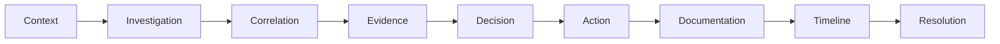
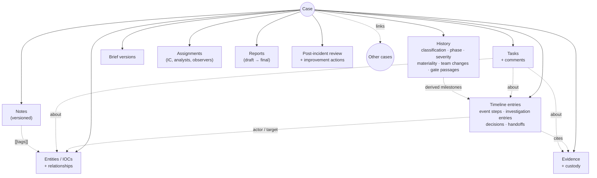

# What CaseBook is

CaseBook is an on-premises web application in which a security operations team works and records its
escalated security matters, from the moment something is judged worth a case until the case is closed and
reported. It keeps one tamper-evident record per matter: what happened, what the team did and decided, what
evidence supports it, who did each thing, and when. Reports, metrics and regulatory deadlines come from that
same record.

It runs as a single ASP.NET Core (Blazor Server) application on Windows Server with IIS and SQL Server, with
users signing in through Active Directory. See [architecture/overview.md](../architecture/overview.md).

## The problem it solves

When a SOC escalates something (a phishing wave that got credentials, a vendor's breach notice, a malware
outbreak), the work spreads across a SIEM, email threads, chat, spreadsheets and a Word report written at the
end. Afterwards nobody can say with confidence:

- what was known at each point, and when it was learned;
- who decided to contain, escalate or notify, and why;
- whether the evidence behind a finding is the same file that was collected;
- whether a regulatory notification deadline (for example NYDFS Part 500's 72 hours) was met.

CaseBook is the workspace where that work is recorded as it happens (or as soon after as people can), in a
form that holds up in front of an examiner or in litigation.

## What it deliberately is not

| Not this | Why |
|---|---|
| **A SIEM or alert triage queue** | Cases start at the point something is already judged noteworthy: a complex event, an adverse event, an incident or a breach. Alerts are triaged in the SIEM. CaseBook stores a reference to the SIEM case (`DetectionCaseId`) and links back to it, but doesn't ingest telemetry or query it. |
| **A SOAR platform** | Containment and eradication actions are recorded as tasks and timeline entries. CaseBook never executes them. No background job or API changes a case ([decision 0004](../decisions/0004-human-gated-automation.md)). |
| **An AI analyst** | CaseBook never calls an AI model. It can generate a prompt for your own approved tool and import the result after a person reviews it ([decision 0005](../decisions/0005-no-outbound-ai.md)). |
| **A chat tool** | Teams talk in their own chat. The record keeps conclusions: decisions with their reasons, the brief, notes, handoffs ([decision 0014](../decisions/0014-no-discussion-thread.md)). |
| **Legal's tool** | Legal and Privacy make determinations (materiality, notification). CaseBook records them, with who decided and when, but Legal isn't expected to work in the app. |
| **Multi-tenant SaaS** | One instance per organization, on its own servers. |

## Who uses it

| Person | What they do in CaseBook | Default role |
|---|---|---|
| SOC analyst | Works cases: timeline, entities and IOCs, evidence, notes, tasks; can reclassify | **Analyst** |
| Incident commander | Leads a case; sees restricted cases; approves reports | **IncidentCommander** |
| SOC manager, CISO, leadership | Dashboard, team workload, program report, every case read-only | **Manager** |
| Legal / Privacy | Read access to every case including restricted ones; legal referral and legal hold | **LegalPrivacy** |
| Application administrator | Settings, roles, templates, gates, integrity operations, access log | **SysAdmin** |

The roles are bundles of eight permissions. Organizations can define their own roles from the same
permissions and map any role to AD groups. The exact permission matrix is in
[architecture/security.md](../architecture/security.md#system-roles).

## The incident-response model in CaseBook

The product follows an investigation from context to resolution. This is how each stage shows up in the
application today, and how strong it is.

| Stage | In CaseBook | Notes |
|---|---|---|
| **Context** | The new-case form (classification, severity, origin, detected and occurred times, SIEM reference, data context); the impact assessment (affected individuals, data elements, jurisdictions); the **case brief** ("Where it stands": summary, working assessment, known, open questions, next steps); the context rail (clocks, team, key entities). | Strong. The brief is the explicit, versioned "what we believe now". |
| **Investigation** | **Investigation** timeline entries (typed, Markdown, can tag entities); notes (versioned, @mentions); Investigate tasks; open questions in the brief that become tasks. | Recording only. CaseBook doesn't query telemetry. |
| **Correlation** | Entities and IOCs (defanged input is normalized, duplicates merged); the relationship graph; "also in" other cases; suggested related open cases; duplicate and campaign check at creation; case links; campaigns; the Indicators page; ATT&CK coverage. | Matches **exact values only** (case-insensitive): no CIDR, parent-domain or fuzzy matching. Suggestions never link automatically. |
| **Evidence** | Uploads hashed with SHA-256 and kept outside the web root; chain of custody (uploaded, viewed, downloaded, transferred); timeline entries cite evidence; pasted screenshots; optional periodic re-hash of stored files. | Strong. Evidence can't be removed. |
| **Decision** | **Decision** timeline entries with a required rationale, options considered and who decided; reasons on every classification, severity and phase change; the materiality determination; stage-gate attestations and override justifications. | Strong. A reclassification records its reason on the change itself, not as a separate Decision entry. |
| **Action** | Tasks (phase-linked kinds, owners, due dates, playbooks, comments, reminders); handoffs; legal referral and hold; restriction; "Mark reported". | Actions are recorded, not executed. |
| **Documentation** | Word case report (draft, then approved final, hashed and re-verifiable, in your own template); lessons-learned review and its separate report; improvement-action register; compliance evidence bundle; audit trail. | Strong. |
| **Timeline** | One chronology per case: stored event and investigation entries plus milestones derived from the case record; lenses; T+ time; after-the-fact dating with the entry time kept; corrections with a reason. The report prints the same timeline. | The central artifact. See [architecture/timeline.md](../architecture/timeline.md). |
| **Resolution** | Phases Containment → Eradication → Recovery → Post-Incident → Closed; contained, resolved and closed times feed SLAs; the close gate; reopen; supersede as a duplicate; archive (blocked under legal hold). | Adequate. There's no root-cause field (the outcome lives in the review and the report), and phases aren't forced into an order. |

## Core concepts

| Concept | Meaning |
|---|---|
| **Case** | One escalated matter. Numbered `YYYY-NN_Name` (for example `2026-14_Phishing_Wave`); a Complex Event is numbered `CE-YYYY-MM-DD_Name` until it's promoted. |
| **Classification** | Where the case sits on the incident response plan's ladder: **Complex Event** (not yet classified) → **Adverse Event** → **Incident** → **Breach**. Moving up runs a stage gate; moving down doesn't. |
| **Phase** | NIST SP 800-61 lifecycle: New → Triage → Containment → Eradication → Recovery → Post-Incident → Closed. Any phase can follow any other; only closing is gated. |
| **Severity** | Informational, Low, Medium, High, Critical. Drives SLA targets and stale-case thresholds. |
| **Origin** | Internal detection, or third-party (a vendor tells you about their breach). Third-party cases use a "Disclosure" timeline instead of an attack chain. |
| **Timeline** | Event steps (what the adversary or vendor did), investigation entries (what the team did), decisions, handoffs, and derived milestones. |
| **Entity / IOC** | An account, host, IP, domain, URL, file hash, file name, email address, process or registry key, with a disposition (Unknown, Benign, Suspicious, Malicious, Compromised). |
| **Evidence** | A file attached to a case, hashed, with its own custody log. |
| **Task** | Follow-up work with an owner, due date and kind. Can be "about" an entity, evidence file or timeline entry. |
| **Brief** | The versioned "Where it stands" summary at the top of a case. Its summary is what the report prints. |
| **Stage gate** | An administrator-defined checklist that a promotion, escalation or closure must satisfy, or override with a written justification. |
| **Restricted case** | Need-to-know: visible only to its team and to roles with clearance. Nobody else can tell it exists. |
| **Exercise case** | A tabletop case, fixed at creation. Fully usable, but excluded from dashboards, reminders, feeds and correlation. |
| **Audit chain** | Every change, hash-chained, with periodic signed seals. See [architecture/integrity.md](../architecture/integrity.md). |
| **Campaign** | A connected group of cases linked "part of campaign". Not a separate record. |

A full glossary is in [reference/glossary.md](../reference/glossary.md).

## How the concepts relate

## Major workflows at a glance

| Workflow | Where to read more |
|---|---|
| Open a case, or import one from JSON, STIX, CSV or the API | [workflows/case-lifecycle.md](../workflows/case-lifecycle.md#1-opening-a-case) |
| Classify, escalate, change phase, close, reopen | [workflows/case-lifecycle.md](../workflows/case-lifecycle.md) |
| Record the investigation: timeline, entities, evidence, notes, tasks, brief, handoff | [workflows/investigation.md](../workflows/investigation.md) |
| Materiality, notification deadlines, legal referral and hold, restriction | [workflows/governance.md](../workflows/governance.md) |
| Reports, lessons learned, improvement actions | [workflows/reporting.md](../workflows/reporting.md) |
| Administration and configuration | [workflows/administration.md](../workflows/administration.md) |

For a guided look at the screens, see [product/screens.md](screens.md).
