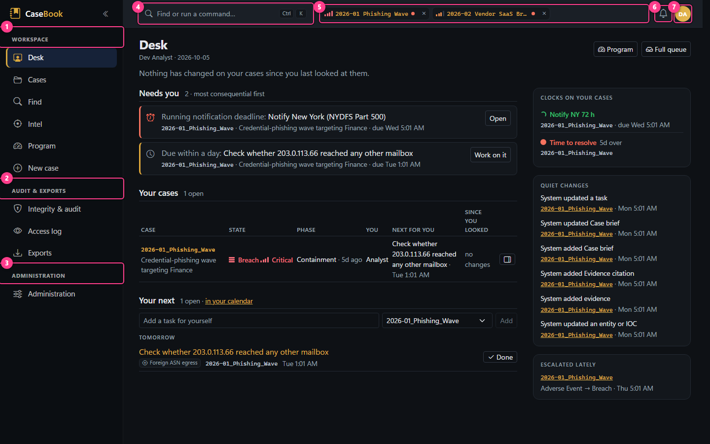
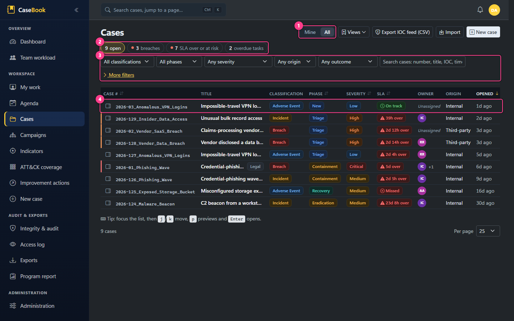
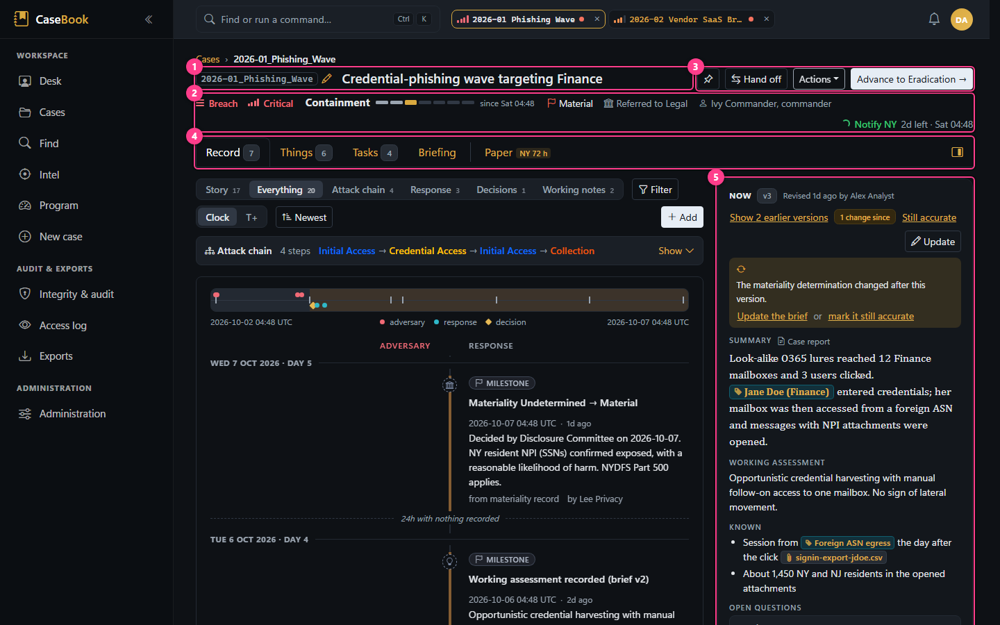
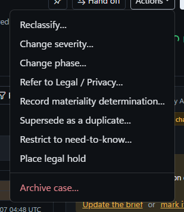
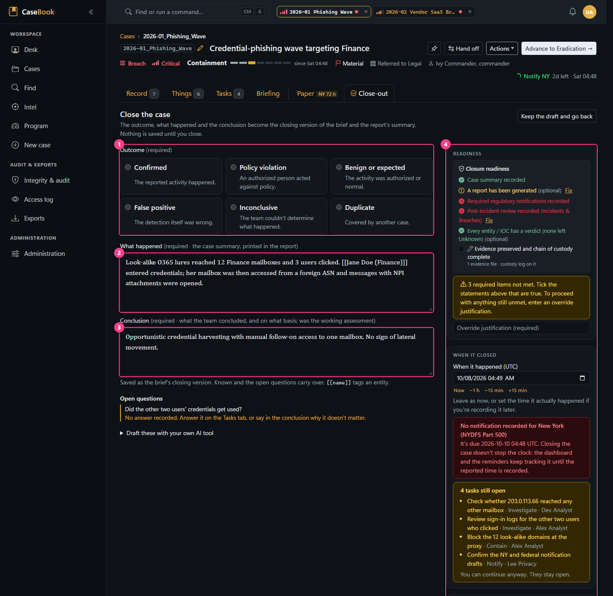

# A tour of the screens

What each main screen is for, with numbered callouts. All images come from the seeded demo data and are
regenerated by `tools/screenshots/capture.mjs` ([how](../MAINTAINING-DOCS.md#screenshots)). Times show the
browser's local zone because the profile menu was set to *Local*; stored times are always UTC.

> **Signing in.** There's no login page. In production the browser signs in with Windows Integrated
> Authentication (Kerberos/NTLM), and AD group membership decides your roles. Someone who signs in but is in no
> mapped group lands on `/access-denied`, which shows who they're signed in as and what to ask for. In
> development, every request is signed in as a configurable dev user (see
> [development/getting-started.md](../development/getting-started.md#the-development-user)).

## Navigation shell

1. **Workspace**: Desk, Cases, **Find** (typed results across every case you can see; see
   [Find](../workflows/find.md)), **Intel** (Indicators, Campaigns, ATT&CK coverage under one bar), **Program**, and New case (with
   `EditCases`). Opening `/` goes to Program for roles with `ViewAllCases`, and to the Desk for everyone else.
   **Program** gathers the cross-case views under one bar: Overview (the leadership dashboard), Team, Due work
   (open tasks across the team by when they're due), Improvement actions, the Legal register and the Program
   report. The first three need `ViewAllCases`. Your calendar feed is in *Notification settings*.
2. **Audit & exports**: Integrity & audit (everyone), Access log (administrators), Exports.
3. **Administration**: settings hub, administrators only.
4. **Command bar** (`Ctrl+K` or `/`): Find's typed results as you type (entities, cases, record entries,
   tasks, evidence), jump to a page, or run an action on the open case. `?` lists your keyboard shortcuts. By
   default `g` then `m`/`c`/`f`/`d`/`n`/`i` goes to your Desk, Cases, Find, Program, a new case or Integrity;
   every shortcut can be changed in *Keyboard shortcuts*.
5. **Open-case tabs**: the cases you're on, beside the command bar, kept on your account so they're back
   when you sign in. Opening a case adds its tab; pinned cases come first and stay; up to 8 others are kept,
   and opening another lets go of the one you looked at least recently. A tab shows the case's number, severity
   and a dot when a clock is at risk or breached, and goes back to the view you left. **Open beside** (the split
   icon on a tab) shows that case's Briefing next to the page you're on, docked as a column on wide screens and
   over the page on narrower ones; *Open* or *Swap* puts it in front.
6. **Recent activity**: changes others made to cases you can see. Unread is tracked per browser.
7. **Account menu**: notification preferences, *Keyboard shortcuts* (`/account/keyboard`: change any key, or switch every single-key shortcut off), personal API tokens, *My access*, *Lock now*, theme, row
   density, UTC or local times, and 24- or 12-hour clock. These preferences are saved to your account.

The sidebar collapses to icons (the `«` button), and below 641 px it becomes a top bar with a menu button.

**On a phone** (below 768 px) Desk, Cases and Find sit along the bottom. A case opens on **Now** (the brief), with
**Now · Record · Next · Things** along the bottom and **More** for Tasks, Briefing and Paper. Next lists the
obligations and open tasks; *Done…* on a task records its result (and can put it on the record) without leaving
it. What needs room says so instead of offering a cramped form: phase changes, gates, closing and reports are done
at a desk, and so are administration and the import queue.

## Dashboard

The header picks the **period** the timing and target figures cover (30 days, this quarter to date, or 12 months,
the default) and whether exercise cases count. **Needs action** lists what someone should act on: regulatory notices at
risk of or past their window first, then whatever fell due earliest (cases past or near a response target, briefs
that predate a decision, handoff, phase, classification or materiality change, overdue tasks, and improvement
actions past their target date). **Notification clocks** shows every running notice clock with how much of its
window is used. The tiles show the open-case mix, then the period's median time to
detect, contain, resolve and report (detected → reported), each with its mean beneath, its change on the period
before and a trend line of the monthly medians over the last 12 months: medians lead because one long case pulls a
mean far off. **Within target** shows detection, containment, resolution and regulatory notices (made inside each
jurisdiction's window) for the period, with containment broken down by severity. **Where open cases are** shows
each phase's open cases by severity, how long the longest-waiting one has been in it, and how many are past a
response target. **Vendor cases** counts open vendor cases, the vendors with a case opened in the period, those with
attack steps in our environment, and the median days from a vendor's first attack step to it telling us, then lists
the open vendor cases (one with steps in our environment first). Then **Case activity**: 12 months of new cases above the line (with the cases carried over
from earlier months hatched beneath them) and closed cases below it. *Color by Classification* splits both by
breach, incident and adverse event; a closed case counts under the classification it closed with. Hovering over or
tapping a month says what it held and links to the cases opened in it. Every tile links to the matching filtered
case list. Exercise cases are excluded. **Export metrics (CSV)** downloads the figures.

## Case list

1. **Mine / All** scope (also `/cases/mine`).
2. **Count chips**: one-click filters for open, breaches, SLA over or at risk, and overdue tasks.
3. **Filters**: classification, phase, minimum severity, origin, outcome and search (case number, title, IOC,
   and the record: timeline entries and decisions, the brief, notes, tasks and their results, the review; a row
   says where it matched). *More filters* adds closed, exercises, notify state, legal referral, legal hold, assignee and opened
   window. All filters live in the URL, so a view can be bookmarked or saved under **Views**.
4. **A case row.** The left edge is marked for High or Critical cases. In the list, `j`/`k` move, `p` opens a
   read-only preview beside the list, and `Enter` opens the case.

## New case

A single page, not a wizard.

1. **Template**: pre-fills classification and severity, adds playbook tasks after creation, and puts prompts
   (not values) into the summary.
2. **Classification**: *Complex Event* (not yet classified, numbered `CE-…`), Adverse Event, Incident or
   Breach.
3. **Restricted**: need-to-know from the start. If you wouldn't keep access yourself, you're added to the
   team. **Exercise** (just above) is permanent.
4. **Detected / Initial activity**: entered in your display time zone and stored as UTC.
5. **Indicators**: one per line, defanged input accepted. **Check now** looks for open cases you can see
   that already carry them, and lists closed ones as **Seen before**, with each one's outcome, closing line and the
   verdict the indicator reached there. You can mark matches as related, duplicate or same campaign. A match pauses the
   first *Create* but never blocks it.

## The case workspace

1. **Case number and title.** The pencil renames the number (a custom number is kept through promotion).
   Links of the form `/cases/2026-01` also work.
2. **State line**: the classification as rungs on the ladder, severity as bars, a phase bar with how long the
   case has been in its phase (hover a segment for when it was reached; click to change phase), the flags that
   matter (Material, Referred to Legal, Restricted, Legal hold, Exercise) and the incident commander. It ends with
   the **most urgent clock**: a running notification deadline, else the running SLA clock, with its deadline.
3. **Pin**, **Hand off**, the **Actions** menu (below), and the one **primary act** the state calls for:
   *Promote onto the ladder…* for an unclassified event, *Advance to* the next phase, *Close the case…* from
   Post-Incident, or *Reopen case…* on a closed case.
4. **Views**: **Record** (the timeline, with its lenses), **Things** (IOCs & entities, Evidence, ATT&CK,
   Connections, and Impact from Incident up or once impact is recorded), **Tasks**, **Briefing** and **Paper**
   (Report, Lessons learned, Audit trail). A view with several parts lists them under the bar, and reopens on the
   part last used. Number keys `1`–`5` switch views. The part is in the URL (`?tab=Entities`; a view's name opens
   its last part). An open case opens on its Record, a closed one on its Briefing. Paper stays dimmed until the
   report or lessons matter (a breach, a running notification clock, Recovery and later, or Post-Incident). A dot
   marks a view where someone else just added something.
5. **Now and Next**, beside every tab from 1200 px wide (the button at the end of the tab bar hides it). **Now**
   is the brief, "where it stands": the versioned summary (in a serif, as written into the record), working
   assessment, known, and each open question with whoever is answering it. It tells you when the record has
   moved on since it was written, and *Still accurate* or *Update* answers that. **Next** lists running
   obligations first (a notification deadline with *Mark reported…*, then the SLA clocks), the open tasks each
   with why it exists (answers a question, carries out a decision, about an entity or file, feeds a notification,
   phase work), and the next gate's readiness as a meter that opens its checklist. The team and key entities
   follow. The pane steps aside on the Briefing, which carries the same things in its own form. Below 1200 px
   the brief is opened from the Briefing.

The **Briefing** is one page for a commander or a manager, assembled from the record and writing nothing. Five
questions: **What is happening** (the summary, the attack chain's tactics in order, when the activity began and how
soon it was detected), **What we know** (the working assessment or conclusion, Known, the entity verdicts as a
tally, the impact), **What we are doing** (open tasks with owner and due, a Notify task due after the notification
deadline marked, and what was done this week), **What remains** (each open question and who is answering it, the
running notification deadline, what the next gate still needs) and **Why** (the latest decisions with why and what
was considered, the last classification change with its reason, the materiality call). Beside them: obligations
(each jurisdiction's clock and the SLA clocks), governance (materiality, legal referral, legal hold, access) and the
team. *Open the brief* shows the brief's card (where it's revised or confirmed); *Copy briefing as text* puts the
same briefing on the clipboard as plain text. Below: the notification deadline table with *Mark reported*,
readiness for the next stage gate with each check's *Fix*, the case record and access (restriction). Scope and impact (affected individuals, data
elements, jurisdictions) is **Things › Impact**; ATT&CK techniques are **Things › ATT&CK**; related cases are
**Things › Connections**. Change history is in the audit trail (**Paper › Audit trail**).

A **closed** case's Briefing leads with the record instead: an outcome strip (the outcome, when the activity
began, detected → contained and recovery → closed with how long each took, and the improvement actions still
open), then the five questions from the closing brief, then "How it unfolded": the key moments oldest first (the first eight and the last
four, with the rest a click away on the timeline). An unrecorded scope reads "Not recorded" rather than "Not
assessed yet".

On a phone a case opens on **Now** (the brief), with Now · Record · Next · Things along the bottom and *More*
for Tasks, Briefing and Paper. **Next** lists the running obligations and the open tasks, each with *Done…* to
record its result:

### The Actions menu

Each item opens a dialog. Items you lack permission for aren't shown. Reclassify needs `ChangeClassification`;
legal referral and legal hold need `ManageLegal`; archive needs `Administer`; everything else needs `EditCases`.
*Record materiality determination* appears only on Incidents and Breaches.

### Changing phase

A change of phase, rung or severity opens as a sheet under the header, so the case stays in view.

1. **Target phase.** Any phase can be chosen. Choosing *Closed* opens the Close-out view (below) instead.
2. **When it happened**, defaulting to now, with quick nudges. More than an hour back requires a reason. The
   time it was entered is kept as well.
3. **Open tasks** for the phases being left behind. A warning only.

### Closing a case

Closing is a view of its own (a *Close-out* tab appears beside the views while you work on it; the draft is kept
while you look at the rest of the case).

1. **Outcome**, each with what it means.
2. **What happened**: the case summary, printed in the report.
3. **Conclusion**: what the team concluded and on what basis. Together with what happened, it becomes the brief's
   closing version. Open questions are listed underneath, and *Draft these with your own AI tool* gives a
   copy-paste prompt.
4. **Readiness** (the close gate: machine checks met, advisory or unmet, attestations to tick, and an override
   justification for anything required that's unmet, recorded on the gate passage), **when it closed**, a
   running notification clock that closing won't stop, and the tasks still open.

### Handing off

A structured handoff: where it stands, what's been done, what's open, and what to watch for. It's recorded on
the timeline as a *Handoff* entry, can be emailed to the recipient, and can move your open tasks to them. It
doesn't change the incident commander; that's a separate assignment.

## Timeline tab

1. **Lenses**: Story (the turning points, oldest first), Everything, Attack chain (Disclosure on third-party
   cases), Response, Decisions, Working notes.
2. **Filter**: tactic or type, source, entity, and whether milestones show.
3. **Clock / T+**: show times as clock times or as time since detection. Next to it, newest or oldest first.
4. **Add** opens the composer (below).
5. **Attack chain**: event steps as a one-line tactic strip; *Show* expands it.
6. **Minimap**: the whole case on one line, the phases as bands, the adversary's steps above and the response
   below; click a mark to bring its entry into view.
7. **Day header**: date and day number counted from detection.
8. **An adversary step**, in the left lane: tactics, technique, actor → target, source, who logged it. Story and
   Everything read in **two lanes**, the adversary left of the time spine and the response right of it, with the
   phase as a band on the spine and quiet stretches marked.
9. **A derived milestone**, in the right lane, labelled with where it comes from ("from case creation").
   Milestones aren't stored timeline rows; they're read from the case record. A milestone for a classification,
   severity or phase change has **Correct time** (re-date it, with a reason).

**Investigation entries** show their type, text, who logged it, and *recorded …* when written more than an hour
after it happened, with Edit (saves a new version), Cite evidence and Task. **Decisions** show what was decided,
why, the options considered, who decided, and the tasks carrying them out.

### Adding to the timeline

1. **Five modes**: **Finding** (what the team found or did), **Decision** (with its why), **Adversary step**
   (*Disclosure step* on a third-party case), **Question** (added to the brief's open questions, optionally with a
   task to answer it) and **Working note** (off the record; `@` mentions a teammate).
2. **When it occurred**, in your display zone, with nudges.
3. **Actor and target** from the case's entities. *New IOC…* in the list creates one without leaving the
   composer. Each step becomes an edge on the relationship graph.
4. **ATT&CK** technique or tactic search, or the matrix picker.
5. **Then**: follow-ups saved in the same act (below).

Paste a screenshot anywhere in the composer to attach it as hashed evidence.

**Then**, under a finding, decision or adversary step, adds follow-ups saved in the same act: tasks about the
entry (a decision's tasks read as carrying it out), a question for the brief, a line for the brief's Known, and a
link to another case. The footer says what the save writes before you save it.

## IOCs & entities tab

1. **Possibly related open cases** that share an indicator. A suggestion only: nothing links until you choose.
2. **Add entity / IOC**: type, value (defanged is fine), label, disposition, source, TLP.
3. **Paste indicators**: many at once; types are detected and duplicates merged.
4. **Relationship graph**: entities by type and disposition, relationships, and event steps overlaid as
   tactic-colored edges. *Across cases* redraws it around shared indicators. Drag to arrange (positions are
   shared). *STIX* downloads the graph as a STIX 2.1 bundle.
5. **Entity list**: *also in* links to other cases you can see; Live or Defanged display; VirusTotal lookup;
   details panel; edit; remove.

Below the list, relationships are added and edited (type, description and direction).

## Evidence tab

1. **Upload**: pick, paste or drag a file (up to 50 MB). It's hashed (SHA-256) on the way in and stored
   outside the web root.
2. **An evidence row**: description, size, SHA-256, who uploaded it and when, and what cites it ("Cited by 1
   timeline entry and the brief"). **Custody** shows the chain of custody (uploaded, viewed, downloaded,
   transferred) and records a transfer; **Download** is itself a custody event; **Task** raises a task about
   the file. Evidence can't be deleted.

## Working notes

Working notes are the Timeline's **Working notes** lens (there is no Notes tab; `?tab=Notes` and `n` open the
lens). Write one with the composer's *Working note* mode. Each note shows the people mentioned (`@`, emailed a
link), *Edit* (saves a new version; earlier versions stay readable), **Put on the record** (adds it to the
investigation timeline as an entry; the note itself is unchanged) and *Task*. Notes are off the record: not on
the timeline and not in the case report unless a report layout includes analyst notes.

## Entity and evidence panels

Any entity chip, tag or row opens the **entity panel** over the current tab (`?entity=<id>`): the value with a
copy of its defanged form, type, source and TLP; the **verdict on this case** as five shapes to choose from (a
change asks why, required for Malicious or Compromised, and shows on the timeline); where the case refers to it;
tasks about it; relationships; and **Seen before**, the open and closed cases where the same value appears, each
with the verdict reached there and, for closed ones, how they ended.

An evidence file name, a cited-file chip or a brief citation opens the **evidence panel** (`?evidence=<id>`): a
preview on request (images, or the first lines of a text file; looking records a "Viewed" custody event), the full
SHA-256, the chain of custody, what cites it, tasks about it, and *Download* (a custody event), *Task about it* and
*Record a transfer…*.

## Tasks tab

1. **Apply playbook**: add the steps of a case template as tasks.
2. **Add a task**: title, owner (a person, or a free-text external name), kind, due date and time.
3. **Grouped by kind** (Investigate, Contain, Eradicate, Recover, Notify, General), with progress.
4. **"About" chip**: the entity, evidence file or timeline entry the task was raised from. Click to jump there.
5. **Mark done** (with a result that can go on the timeline), **edit**, **comment**.

## Report and lessons learned

The Report tab previews the case report, generates a Word draft (built-in layout or an administrator's
template, with a TLP marking), and lists stored reports with their hashes. **Approve & finalize** needs
`ApproveReports`. The Lessons learned tab holds the post-incident review, improvement actions and the separate
lessons-learned report.

## Cross-case views

| Screen | What it's for | Image |
|---|---|---|
| Campaigns | Cases linked "same campaign", rolled up: shared indicators, combined ATT&CK, merged event timeline |  |
| Indicators | Every indicator across cases you can see, most-shared first |  |
| ATT&CK coverage | Techniques and tactics seen across cases, shaded by count |  |
| Improvement actions | The cross-case register of post-incident follow-up |  |
| Program report | Quarter-on-quarter figures for leadership |  |

## Integrity and administration

| Screen | What it's for | Image |
|---|---|---|
| Integrity & audit | Verify the audit chain, see seals, filter the audit trail, export a compliance bundle |  |
| Access log | Who read which case or downloaded which artifact (administrators) |  |
| Administration | Settings by section, with a left rail of every admin area |  |
| Roles & access | System and custom roles, and AD group mappings |  |
| Data elements | Personal-data categories and their notification jurisdictions |  |
| Regulatory deadlines | Notification window per jurisdiction |  |
| Report templates | Word template library with live preview |  |
| Configuration bundle | Signed export and previewed import of editable configuration |  |
| My access | What your roles allow |  |
