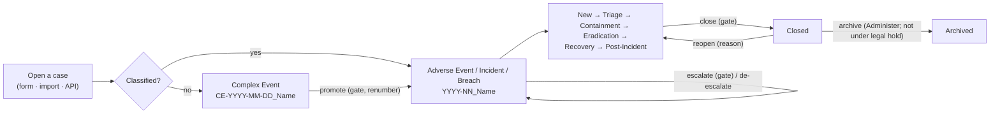
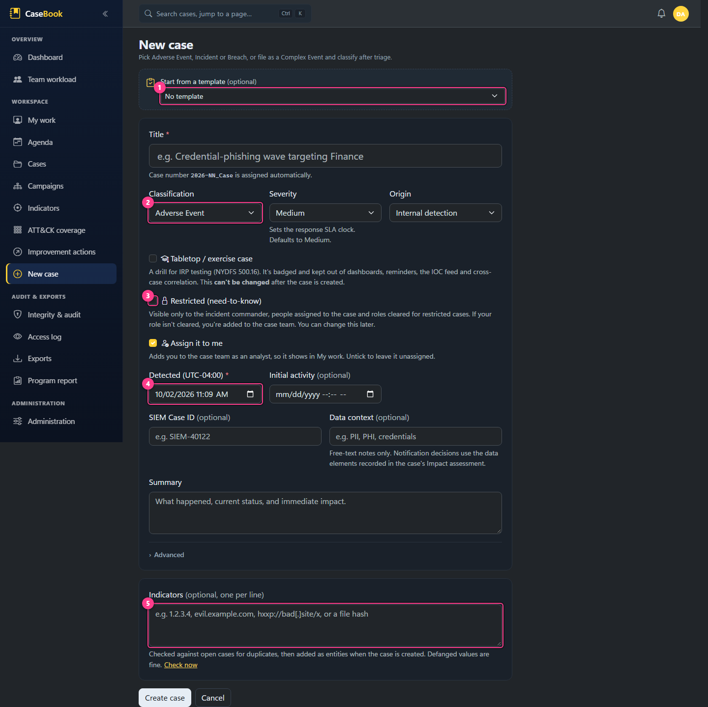
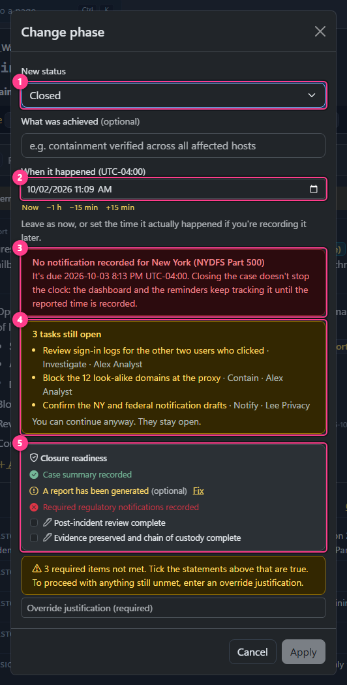

# Case lifecycle workflows

Opening, classifying, moving through phases, closing, reopening and archiving a case. Each workflow lists its
trigger, what the user sees, what happens in the code, what changes, who may do it, what's validated, the
errors, and what follows. Shared mechanics (permission check, need-to-know load, audit chain, notifications)
are described once in [backend.md](../architecture/backend.md#the-write-path).

## 1. Opening a case

| | |
|---|---|
| **Trigger** | *New case* (sidebar, case list, `g n`) → `/cases/new` |
| **The user sees** | A single form: optional template, title, classification (Complex Event, Adverse Event, Incident, Breach), severity (pre-filled from your last case), origin (internal, or third-party with vendor name, contact and reference), exercise, restricted, "assign it to me" (on by default), detected and initial-activity times, SIEM case id, data context, summary, an optional custom case number with a live availability check, and indicators (one per line).  |
| **Behind the scenes** | `CaseService.CreateAsync` → `CreateCaseValidator` → `Case.Open` (phase New; opening classification, phase and severity rows; brief v1 from the summary) → save. Then, as separate resumable steps: add each indicator as an entity (source "Filed at case creation"), link any matches you chose, apply the template's playbook tasks. Then the browser opens the case. |
| **Numbering** | Classified: `YYYY-NN_Slug`, where NN is the next number for that year (max + 1 among auto-numbered classified cases). Complex Event: `CE-YYYY-MM-DD_Slug`, with `-2`, `-3` on a same-day clash. Custom: anything up to 200 characters, unique. The slug comes from the title (first six words, 42 characters). On a number collision the save retries up to 20 times. |
| **Duplicate check** | When you leave the indicators box, press *Check now*, or press *Create* with unchecked indicators, `FindOpenCaseMatchesForIocsAsync` looks for the same values (refanged, case-insensitive, any type) on **open, non-archived, non-exercise cases you can see**. Matches are listed with "Don't link / Related to / Duplicate of / Part of campaign". The first *Create* pauses to show them; the second creates. |
| **Restricted** | If you mark it restricted and wouldn't otherwise keep access, you're added as an Analyst. |
| **Data changed** | `Cases`, `ClassificationChanges` (if classified), `StatusChanges`, `SeverityChanges`, `CaseBriefs` (if a summary was given), `CaseAssignments` + `AssignmentChanges`; then `CaseEntities`, `CaseLinks`, `ActionItems` |
| **Permission** | `EditCases` |
| **Validation and errors** | "A short descriptive name is required (used in the case number)." · title required (300) · summary 8000 · "Vendor name is required for a third-party event." · "The detected time can't be in the future." · "Activity can't begin after it was detected." · "Initial activity can't be more than 10 years before detection. Check the year." · "Case number '…' is already in use." |
| **Partial failure** | If the case saved but setup (indicators, links, tasks) didn't finish, an amber message offers **Finish setup** (resumes without duplicating) or **Open case as-is**. |
| **Afterwards** | No notification is sent on creation. The timeline shows "Case opened as …". |

**Exercise cases** are fixed at creation: they work normally but are excluded from dashboards, team workload,
reminders, digests, the calendar feed, the IOC feed and cross-case suggestions.

## 2. Importing a case

### From the Import page

| | |
|---|---|
| **Trigger** | *Import* on the case list → `/cases/import`; or `?into=<caseId>` to add to an existing case |
| **The user sees** | Paste or upload a `casebook-case-import` JSON document, a STIX 2.1 bundle, or an indicator CSV (up to 4 MB; STIX and CSV become entities only, up to 2,000). Or use **Generate a prompt for your AI**, which produces a copy-paste prompt embedding the schema for your own approved AI tool. Then an **editable preview**: include or exclude each row, fix times and types, choose a new case or an existing one, and set the origin (provenance).  |
| **Preview rules** | Untrusted input: lengths are clamped with warnings; unknown values fall back with a warning; indicators are refanged, typed and de-duplicated; rows without text are dropped; **future-dated rows are excluded** ("This time is in the future, so the entry is excluded. Correct the time to include it."); a missing time becomes now (with a warning); a Decision without a rationale becomes a Communication; Handoff isn't importable (becomes Communication); no classification means Complex Event. |
| **Behind the scenes** | `CaseImportService.ApplyAsync` creates the case through `CaseService.CreateAsync` (same validation, permissions and audit), then adds timeline entries (marked imported), entities and tasks through the normal `CaseService` methods. The document's top-level summary becomes a note; the new case's summary becomes brief v1. Each row's source, or else the document's origin, becomes the provenance. Resumable. |
| **Permission** | `EditCases` |
| **Errors** | "This isn't a CaseBook case-import document (expected "format": "casebook-case-import")." · a newer schema version than the server supports · "A decision on the timeline needs its why. Add it, or change the entry's type." |

> **Discrepancy:** an *unrecognized* classification value warns "Using Adverse Event instead." but the case is
> actually opened as a **Complex Event**.

### From the API (pending imports)

A machine producer (an XSIAM playbook, a script) posts the same document to `POST /api/import/cases` with an
API token ([API.md](../API.md)). Nothing is written to a case: a **pending import** is stored, and the response
points at `/cases/import?pending=<id>`. The *Pending imports* table on the Import page lists them (to anyone
with `EditCases`, regardless of the target case's restriction). A reviewer opens one, edits the preview and
chooses **Confirm & apply** or **Reject** (with an optional note). If the document targets a case the reviewer
can't see, a new case is prepared instead, with a warning.

## 3. Promoting and reclassifying

| | |
|---|---|
| **Trigger** | Actions → *Promote onto the ladder…* (Complex Event) or *Reclassify…*; also the command palette |
| **The user sees** | Target classification, **reason (required)**, *when it happened* (defaults to now; shows the recorded time beside it when different), and the **gate section** for an upward move: machine checks, attestations to tick, and an override justification box when something required is unmet. Apply stays disabled until the input is valid. |
| **Behind the scenes** | `CaseService.ReclassifyAsync`: for an **upward** move (or promotion), evaluate the stage gate for the **target** (`PromoteToAdverseEvent`, `EscalateToIncident`, `EscalateToBreach`; promoting a Complex Event straight to Breach runs only the Breach gate) → `Case.Reclassify` → record a gate passage → on promotion, renumber `CE-…` to `YYYY-NN_…` (original year, unless the number is custom) → save. After commit, on reaching **Breach**: email `Email:LegalDistribution`, chat broadcast if enabled (redacted for restricted cases), SIEM 5503. |
| **Data changed** | `ClassificationChanges` (with effective time), `GatePassages`, `Cases.Classification` (and `CaseNumber` on promotion) |
| **Permission** | `ChangeClassification` (Analyst, IncidentCommander and SysAdmin by default) |
| **Validation and errors** | "A reason is required to change classification." · the effective time can't be in the future, before detection, or before the previous classification change · "Stage gate '…' is not satisfied: N required items outstanding. Complete them or override with a recorded justification." · "Gate '…' requires a reason of at least N characters." · "…an override justification of at least N characters." |
| **Afterwards** | Timeline milestone "Classification X → Y" at the effective time, and a gate milestone (flagged if overridden). The brief shows "The case was reclassified as … after this version." Materiality becomes recordable at Incident and Breach. Notification-deadline clocks may start. |

De-escalation (down the ladder) isn't gated. There's no way back to Complex Event.

## 4. Changing severity

Actions → *Change severity…*: new severity, a reason (required if backdated by more than an hour), *when it
happened*. `CaseService.ChangeSeverityAsync` → `Case.ChangeSeverity`. Needs `EditCases`. Not gated; no
notification. Severity drives the SLA targets and stale-case thresholds. Timeline milestone "Severity X → Y".

## 5. Changing phase

| | |
|---|---|
| **Trigger** | *Advance to <next phase>* in the header, the phase bar, or Actions → *Change phase…* |
| **The user sees** | Target phase (all seven listed), "What was achieved" (optional when moving forward; required when the close gate demands commentary or when backdated; when closing, the closing fields below replace it), *when it happened*, a warning listing **open tasks** for the phases being left ("You can continue anyway. They stay open."), and when closing with a running notification clock, a warning that closing doesn't stop it. When closing, the **close gate**.  |
| **Behind the scenes** | `CaseService.ChangePhaseAsync` → if the target is Closed, validate the closing record and evaluate the `CloseCase` gate, then write the closing brief → `Case.ChangePhase` → one save. |
| **Rules** | **Any phase can follow any other**, forwards or backwards. Entering Containment, Recovery and Closed for the first time sets `ContainedAtUtc`, `ResolvedAtUtc` and `ClosedAtUtc` at the effective time; later visits don't move them. Leaving Closed clears `ClosedAtUtc`. Eradication and Post-Incident set no timestamp. |
| **Permission** | `EditCases` |
| **Errors** | The gate messages above; "Give a reason when recording a change more than an hour after it happened."; effective-time limits |
| **Afterwards** | Milestone "Phase X → Y"; SLA clocks stop at contained and resolved; dashboards update; the Report tab becomes prominent from Recovery and Lessons learned from Post-Incident. |

### Closing: outcome and closing brief

A case closes with a conclusion of record. When the target is **Closed**, the dialog asks for:

| Field | Notes |
|---|---|
| **Outcome** (required) | What the case concluded, from the active [case outcomes](administration.md#case-outcomes): Confirmed, Policy violation, Benign or expected, False positive, Inconclusive or Duplicate out of the box. Each shows its description. Stored on the case (`OutcomeKey`) and on the close's `StatusChange`. |
| **What happened** (required) | Pre-filled from the brief's summary. Becomes the case summary, which the report prints as Summary. |
| **Conclusion** (required) | Pre-filled from the brief's working assessment: what the team concluded, and on what basis. It also stands in for the transition reason. |
| Open questions | The brief's open questions, each with its answer from the task that followed it up, or "No answer recorded" (advisory). |

Saving writes a new brief version (the **closing brief**: what happened, the conclusion, and Known and the open
questions carried over) and the phase change in one save, at the same instant, so the brief doesn't read as out of
date. When nothing changed, no new version is written. The closing fields count as the summary for the gate's
"Case summary recorded" check. A superseded case's close dialog opens with the outcome *Duplicate* and the
supersede reason as the conclusion.

Errors: "Record the outcome and what the team concluded to close the case." · "Choose an outcome to close the
case." · "That outcome isn't available any more. Choose another." · "Say what happened to close the case." · "Say
what the team concluded to close the case."

Afterwards the header shows the outcome beside the phase, the Closed milestone reads "Phase X → Closed ·
*outcome*", the brief is marked **Closing brief** with its assessment labelled **Conclusion**, the report's
Outcome section leads with the outcome and the conclusion, and the case list can filter by outcome.

### The close gate

Seeded for every installation: *Closure readiness*, with "Case summary recorded" (required), "A report has been
generated" (advisory), "Required regulatory notifications recorded" (required), and two attestations to tick:
"Post-incident review complete" and "Evidence preserved and chain of custody complete". Administrators change it under
Administration → Stage gates. The full list of machine checks is in [governance.md](governance.md#stage-gates).

## 6. Correcting when a transition happened

From a classification, severity or phase milestone on the timeline, **Correct time** asks for the new time and a
reason (up to 2000 characters). `CaseService.CorrectTransitionTimeAsync` → `Case.CorrectTransitionTime`. The
change's effective time moves; a `TransitionTimeCorrection` row records old time, new time and reason; if the
change set the contained, resolved or closed time, that moves too. The recorded time never changes.

Limits: not in the future, not before detection, between the neighbouring changes of the same kind, and not the
opening state ("That change isn't on this case, or it's the opening state, which can't be re-dated.").
Needs `EditCases`, plus `ChangeClassification` for a classification change.

## 7. Reopening

Shown on a closed case: **Reopen case…** with a required reason. `Case.Reopen` returns the case to the phase it
was in before the latest close (Recovery if unknown), as an ordinary phase change. The case's outcome is cleared
(the earlier close's history row keeps it), and closing again asks for one. Closing again re-runs the gate.
Errors: "Only a closed case can be reopened." · "A reason is required to reopen a case." Reopen can't be
backdated. Needs `EditCases`.

## 8. Superseding a duplicate

Actions → *Supersede as a duplicate…* (not on closed cases): pick the primary case and optionally copy indicators
it's missing. In one save: a "Duplicate of" link, the copied entities (source "Copied from …"), and a note on each
case pointing at the other. It **doesn't close** the duplicate; the close dialog then opens pre-filled "Duplicate
of …". Needs `EditCases`.

## 9. Archiving and restoring

Actions → *Archive case…* / *Restore from archive* (needs `Administer`). Archived cases leave the default case
list, duplicate-check suggestions and notification headlines. **Refused under legal hold** ("This case is under
legal hold and can't be archived. Release the hold first."). Archiving doesn't depend on phase, and an archived
case can still be edited.

`Retention:CaseYears` is shown as a setting but no code uses it; nothing flags cases for archiving
([known issues](../reference/known-issues.md)).

## Who can do what

| Action | Permission |
|---|---|
| Open, edit, phase, severity, assign, hand off, timeline, entities, evidence, notes, tasks, brief, links, supersede, restrict, materiality, mark reported | `EditCases` |
| Promote, escalate, de-escalate; re-date a classification change | `ChangeClassification` |
| Refer to Legal; place or release a legal hold | `ManageLegal` |
| Archive, restore | `Administer` |
| Comment on a task | `ViewCases` |
| Lift a restriction | `EditCases` and (incident commander, `ViewAllCases` or `ViewRestricted`) |

There's no read-only lock on closed or archived cases.
