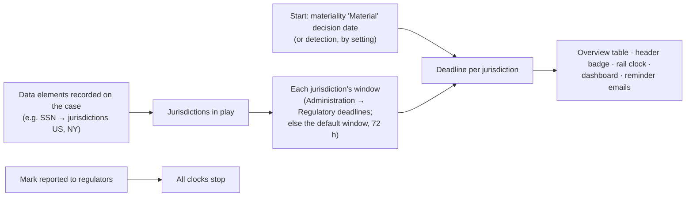

# Governance workflows

Stage gates, materiality, regulatory notification deadlines, legal referral and hold, and need-to-know
restriction. These are the parts of a case that regulators and counsel care about most.

## Stage gates

A stage gate is an administrator-defined checklist that a transition must satisfy, or get through with a written
override. Gates **block or warn; they never move a case by themselves.**

| Trigger | When it runs |
|---|---|
| `PromoteToAdverseEvent` | Complex Event → Adverse Event |
| `EscalateToIncident` | → Incident (from Complex Event or Adverse Event) |
| `EscalateToBreach` | → Breach (from anything lower) |
| `CloseCase` | any phase → Closed |

The gate is chosen by the **target**, so promoting a Complex Event straight to Breach runs only the Breach gate.
De-escalation and every other phase change are never gated.

### Requirements

Each requirement is either a **machine check** (a key into `Application/StageGates/GateCheckRegistry.cs`, with
an optional number) or an **attestation** (a statement the person ticks in the dialog), and is either
**blocking** or **advisory**. A gate can also require a minimum length for the transition's reason
(`CommentaryMinLength`).

| Machine check | Passes when |
|---|---|
| `SummaryPresent` | The case has a summary |
| `AffectedIndividualsCountSet` | The affected-individuals count is recorded |
| `DataElementsSet` | At least one data element is recorded |
| `AffectedStatesSet` | Affected jurisdictions are recorded |
| `DetectionCaseIdSet` | The SIEM case id is recorded |
| `AtLeastOneEntity` | At least N entities (default 1) |
| `AtLeastOneMaliciousEntity` | At least N entities with disposition **Malicious** (Compromised doesn't count) |
| `AtLeastOneEvidence` | At least N evidence files |
| `AtLeastOneReport` | At least N **case** reports (lessons-learned reports don't count) |
| `IncidentCommanderAssigned` | An incident commander is assigned |
| `MinAffectedIndividuals` | Affected individuals ≥ the threshold |
| `MaterialityDetermined` | Passes below Incident; otherwise needs Material or Not material |
| `LessonsCaptured` | Passes below Incident; otherwise the review has "what happened" and at least one improvement action, or "no actions identified" |
| `NoOpenTasks` | No open tasks |
| `NotificationsRecorded` | Passes unless the deadline clock is on, a deadline applies (a data element with notification jurisdictions and a start time) and no reported time is recorded |

Rules:

- Checks look at the **saved** case, not unsaved edits in the dialog.
- Attestations count **only** when ticked in the dialog at the moment of the transition, never from stored data.
- An unknown check key never passes.
- One active gate per trigger.
- The dialog offers a "Fix" jump next to each unmet check (to the right tab, the assign dialog, the materiality
  dialog).

### Passing and overriding

On Apply, `CaseService.ApplyGateAsync`:

1. If required items are unmet and there's no override justification: "Stage gate '…' is not satisfied: N
   required items outstanding. Complete them or override with a recorded justification."
2. Enforces the minimum length on the reason, and on the override justification when overriding.
3. Records a **`GatePassage`** in the same save as the transition: who, when, overridden or not, the
   justification, the reason, and every requirement's outcome (`[MET]`, `[UNMET(OVERRIDDEN)]`,
   `[UNMET(advisory)]`).

The timeline shows "<Gate> gate passed" or "**overridden**" (flagged, with the justification). If no active gate
exists for a trigger, nothing is recorded.

### Default gates

Seeded on first start in every environment:

| Gate | Requirements |
|---|---|
| Promotion readiness | Summary present |
| Incident readiness | Summary present; at least one entity; IC assigned (advisory) |
| Breach readiness | Summary present; affected individuals count; data elements; affected jurisdictions; at least one malicious entity (advisory); attestation "Impact assessment reviewed with leadership / Legal" |
| Closure readiness | Summary present; a report generated (advisory); required regulatory notifications recorded; attestations "Post-incident review complete" and "Evidence preserved and chain of custody complete" |

Configure them in Administration → Stage gates.

## Materiality

| | |
|---|---|
| **Trigger** | Actions → *Record materiality determination…* (shown on Incidents and Breaches only) |
| **Fields** | Status (Under review, Material, Not material); for a final status: **decision maker**, **decision date** and **rationale** (all required) |
| **Behind the scenes** | `CaseService.RecordMaterialityAsync` → `Case.RecordMateriality`. A status change also writes a `MaterialityChange`. |
| **Permission** | `EditCases` |
| **Errors** | "A final determination must record who made the decision." and similar for date and rationale; the date can't be in the future; only on an Incident or Breach |
| **Effect** | Milestone "Materiality X → Y — Decided by … on …". With the deadline clock's start basis set to Determination, a *Material* decision starts the notification clocks. The decision maker (often a committee) is kept separate from the person who recorded it. CaseBook records the determination; it doesn't make it. |

## Regulatory notification deadlines

The feature is **off** by default (`Compliance:NotificationDeadlines:Enabled`).



- **Which deadlines apply**: the union of notification jurisdictions on the data elements recorded in the case's
  impact assessment. Each jurisdiction's window comes from its notification rule (NY and US, 72 hours, are
  seeded) or the default window.
- **When the clock starts**: the materiality decision date (`Determination`, the default) or detection
  (`Detection`, for Breach cases).
- **Mark reported**: Overview → *Mark reported to regulators*, with the time it was done (can be backdated; not
  future, not before detection). `CaseService.MarkReportedAsync`. One reported time **stops every
  jurisdiction's clock**; there's no per-jurisdiction reporting. *Clear reported milestone* undoes it.
  Milestone "Reported to regulators".
- **Reminders**: when `Notifications:DeadlineScan` is on, the incident commander and assignees are emailed once
  as a deadline becomes at-risk and once when it passes.
- **Closing doesn't stop the clock.** Closed cases with an unrecorded notification keep appearing as "awaiting
  report" until it's recorded. The `NotificationsRecorded` check on the close gate makes recording it a
  requirement for closing.

## Legal referral

Actions → *Refer to Legal / Privacy…*: contact and a note on regulatory relevance. `CaseService.ReferToLegalAsync`
(needs `ManageLegal`). Records that the case was referred, when and by whom; deadlines remain Legal's
responsibility. The case list's "Referred" filter is the SOC's roll-up. A referral can't be withdrawn.

## Legal hold

```mermaid
stateDiagram-v2
    state "No hold" as NH
    state "Held" as H
    state "Held, release requested" as HP
    [*] --> NH
    NH --> H: Place legal hold
    H --> NH: Release (reason required; not allowed in two-person mode)
    H --> HP: Request release (reason)
    HP --> H: Withdraw request
    HP --> NH: Approve release (a different ManageLegal user)
```

- **Place**: Actions → *Place legal hold* (reason optional). SIEM 5501.
- **Release**: a reason is required ("Say why the legal hold is being released."). With
  `Governance:LegalHoldRelease:RequireSecondApprover` on, a direct release is refused; the user requests release,
  and **someone else** with `ManageLegal` approves it ("Two-person control: someone other than the requester must
  approve the release."). SIEM 5502.
- **Effect**: a case under legal hold **can't be archived**. Nothing else is blocked.
- All need `ManageLegal` (Legal/Privacy and SysAdmin by default).

## Restriction (need-to-know)

| | |
|---|---|
| **Restrict** | Actions → *Restrict to need-to-know…* (reason optional). Anyone with `EditCases`. If you'd lose access, you're added as an Analyst. |
| **Lift** | Actions → *Lift restriction…* (reason required). Only the incident commander, or someone with `ViewAllCases` or `ViewRestricted`. |
| **Effect** | The case disappears for everyone except its team and cleared roles: lists, search, My work, dashboards, indicators, ATT&CK coverage, campaigns, exports, mentions and handoff pickers. A hidden case and a missing one look the same. Opening a restricted case is a higher-severity SIEM event (5305). The reason goes on the audit entry. SIEM 5504 / 5505. |

See [architecture/security.md](../architecture/security.md#need-to-know) for the exact rule and its known gaps.
