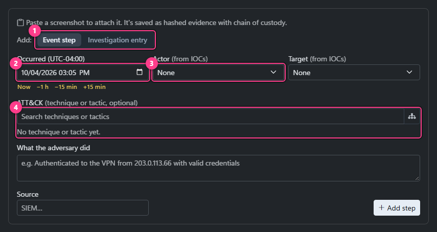
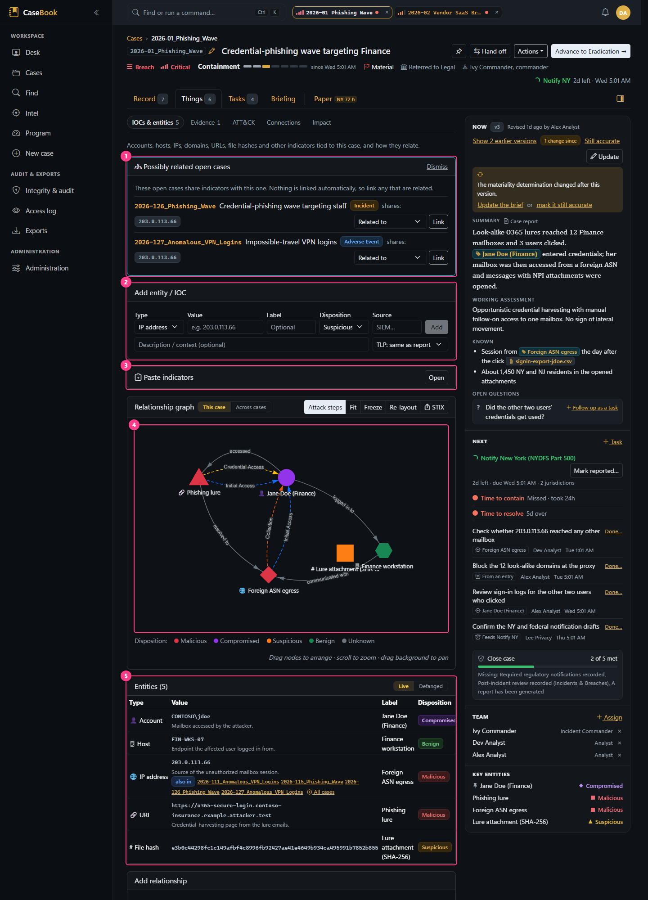
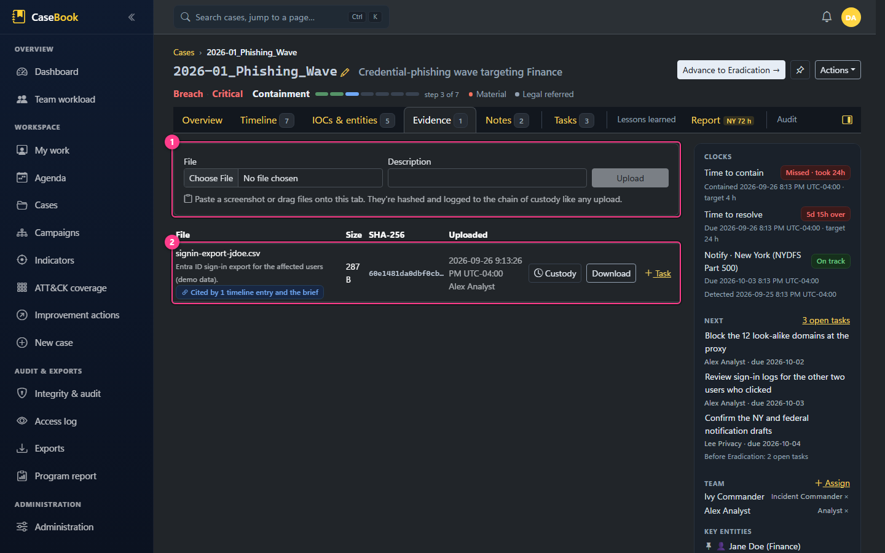
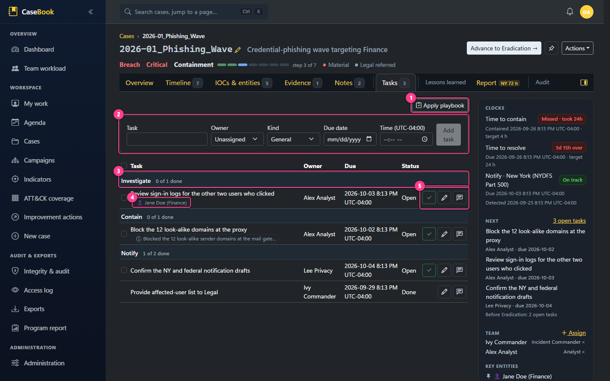
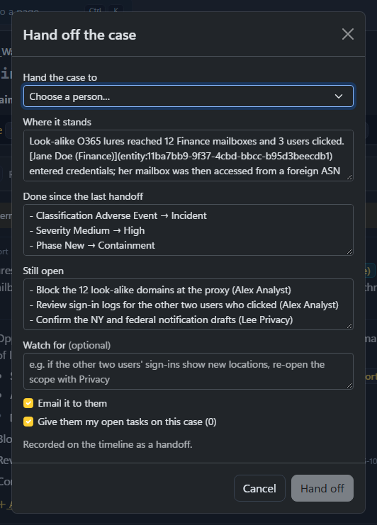

# Investigation workflows

Recording the work: the brief, the timeline, entities and IOCs, evidence, notes, tasks, the team and handoffs,
case links and campaigns. All of these need `EditCases` unless noted, and all go through the shared
[write path](../architecture/backend.md#the-write-path). Nothing on this page can be deleted except entities,
relationships, case links, ATT&CK tags and assignments.

## The brief ("Where it stands")

| | |
|---|---|
| **Where** | Top of the Overview tab |
| **What it holds** | **Summary** (what the case report prints), **Working assessment**, **Known**, **Open questions**, **Next steps** (not typed: the live list of open tasks, snapshotted into each saved version) |
| **Saving** | *Revise* → `CaseService.ReviseBriefAsync` → `Case.ReviseBrief` creates a new version and marks the old one superseded. Saving with no written part changed makes no version ("No changes; the brief is unchanged."; the next-steps snapshot doesn't count). When things have been recorded since, **Still accurate** (beside "N changes since", and in the update nudge) records who confirmed the current version and when, without a new one (`ConfirmBriefAsync`; the header then reads "confirmed … by …"), and "changes since" counts from the confirmation. "Show N earlier versions" shows history. At least one part must be filled ("Write at least one part of the brief."); each part up to 8000 characters. The parts are plain text boxes: entity tags and evidence citations show as `[[name]]` and are saved back as links; typing `[[label or value]]` of one of the case's entities tags it (the close dialog's *What happened* and *Conclusion* work the same way). |
| **Concurrency** | If someone saved a newer version while you edited: "Someone else saved a newer version of the brief while you were editing. Your text is still here; review theirs, then save again to replace it." |
| **Open question → task** | Each line of a list in *Open questions* can be followed up as a task ("Raised from an open question in the brief (vN)"). Refused if an open task already follows that question. Once the task is done, its answer shows under the question (or "Marked done without an answer." for tasks completed before answers were required). |
| **Freshness** | After a decision, handoff, phase, classification or materiality change, the brief says it may be out of date ("1 change since", "Update the brief"). |
| **Rules** | `Cases.Summary` always equals the current brief's summary; editing the summary in *Edit details* also creates a version. The other parts are not in the case report unless a report layout turns the brief section on. |

## The timeline

How the timeline works internally is in [architecture/timeline.md](../architecture/timeline.md). The workflows:

### Adding an investigation entry or decision

| | |
|---|---|
| **Trigger** | Timeline tab → **Add** (or `l`), mode *Finding* or *Decision* |
| **Fields** | Type (Detection, Analysis, Containment, Eradication, Recovery, Communication, Evidence, Escalation, Note, Other, **Decision**), when it occurred (with nudges), Markdown text (with `[[` entity tags), source, an optional pasted screenshot. A Decision adds **why** (required), options considered and decided by (suggests the case team, then everyone; free text such as "IC with Legal" still works). |
| **Behind the scenes** | `CaseService.AddTimelineEntryAsync`. A pasted screenshot is uploaded as evidence first ("Pasted into the timeline", up to 15 MB) and linked. |
| **Errors** | "A decision on the timeline needs its why." |
| **Afterwards** | Shows "recorded …" if more than an hour after it occurred. Prints in the report's investigation timeline. A decision prompts a brief update. |
| **Follow-ups** | *Then* adds, in the same save: tasks about the entry (title, owner, kind, due), a question for the brief (optionally with a task to answer it), a line for the brief's Known, and a link to another case. `EntryFollowUps` on `AddTimelineEntryAsync` / `AddEventStepAsync`: everything is validated first and lands in one `SaveChanges`; the brief changes make one new version; the link follows `LinkCaseAsync`'s rules (visible, not self, one per pair, an existing link is left as it is). |

### Adding a question

Composer → *Question*: one line for the brief's open questions, and "Follow it up as a task" (on by default).
`CaseService.AddOpenQuestionAsync` writes a new brief version with the question on its own list line and, if
asked, the task that follows it up, in one save. Errors: "Write the question." · "That question is already open in
the brief."

### Adding an event step (the attack chain)

Same composer, *Adversary step*: when, one or more ATT&CK tactics and an optional technique, **actor → target**
(entities on this case; *New IOC…* creates one in a dialog without leaving), what the adversary did, source,
optional screenshot. `CaseService.AddEventStepAsync` → `Case.AddEventStep`. Errors: "The actor is not an entity
on this case." (and the same for the target), technique ids must look like `T1566` or `T1566.001`.

On **third-party** cases the lens is *Disclosure* and steps are typed by disclosure stage (Notified, Scope
confirmed, Data confirmed, Remediation, Regulatory notification) without tactics. An "attack mode" toggle still
allows attack steps.

### Editing

- **Investigation entry** → *Edit* saves a **new version** (optional reason on the audit entry); citations move
  with it.
- **Event step** → corrected **in place** (the audit trail keeps the old values).
- **Milestones** can't be edited; for transitions use *Correct time*
  ([case-lifecycle.md](case-lifecycle.md#6-correcting-when-a-transition-happened)).

### Citing evidence

*Cite evidence* on a current entry → pick files → `CaseService.CiteEvidenceAsync` → `Case.SetCitations` (only
real additions and removals are audited). Superseded entries can't be cited. Cited files print with the entry in
the report.

### Putting a note or task comment on the record

*Put on the record* on a working note, or *Add to timeline* on a task comment: pick a type (not Decision: "Record a
decision as a Decision entry on the timeline, with why it was made."), a time (not in the future), and edit the
text if needed. Creates an investigation entry that remembers where it came from; the original is unchanged, and
the note is marked "On the record".

## Entities and IOCs

| Action | How | Rules |
|---|---|---|
| Add one | *Add entity / IOC*: type, value, label, disposition, source, TLP, description → `AddEntityAsync` → `Case.AddEntity` | Network types are refanged (`hxxp`, `[.]`); hashes, file names and accounts are kept exactly. **Adding an existing (type, value) never overwrites it**: an Unknown disposition takes the new one, blank details are filled, and anything already recorded is kept ("…is already on this case as Malicious. Its verdict wasn't changed; use Edit to change it."). |
| Paste many | *Paste indicators*: one per line, comma, semicolon or tab | Types are detected; duplicates merged. Indicators already on the case keep their verdict, and the confirmation says how many. |
| Edit | *Edit* (optional reason) | Can't collide with another entity of the same type and value. |
| Disposition | Unknown, Benign, Suspicious, Malicious, **Compromised** (a legitimate asset taken over). Changing it on an existing entity is recorded with its reason and shown as a **verdict** milestone on the timeline, in the report and in the entity panel's verdict history; marking one Malicious or Compromised needs a reason ("Say why it's compromised: the reason is kept with the verdict.") | An Unknown entity referenced three or more times is suggested for review. |
| Pin | From the entity panel | Pinned entities show first under Key entities in the Now/Next pane, followed by Malicious, Compromised and Suspicious ones. |
| TLP | Per indicator | Controls sharing in exports. |
| Relationships | *Add relationship*: source, type (14 kinds), target, description | Directed; no self-links; no duplicates; editable in place (type, description, swap direction). |
| Graph | Drag to arrange; *Re-layout*; *Fit*; *Freeze* | Positions are shared by everyone and not audited. Event steps are drawn as tactic-colored edges. |
| Remove | *Remove* | Also removes its relationships and graph position. **Fails if an event step uses it as actor or target** ([known issue](../reference/known-issues.md)). Tasks "about" it keep a dangling reference. |
| Cross-case | *also in* on a row (hover for the other case's title, phase, outcome and verdict there); the entity panel's **Seen before** (closed cases: outcome, closed date, the verdict there and the closing line) and open cases; *Possibly related open cases*; the Indicators page | Value matches ignoring case on cases you can see (excluding exercises). An **account and an email address** with the same value are one identity; other types match only their own type. Suggestions never link by themselves. |
| Tag in text | `[[` in any Markdown editor | Stored as a link to the entity id; renders as a chip that opens the entity panel; counts as a reference for the timeline's entity filter. |

## Evidence

| | |
|---|---|
| **Trigger** | Evidence tab: choose a file and a description, then *Upload*; or paste a screenshot or drag files onto the tab (uploaded immediately) |
| **Behind the scenes** | `EvidenceService.UploadAsync` checks `EditCases` and need-to-know **before** storing; the evidence store writes the bytes under a random name outside the web root while computing SHA-256; an `Evidence` row and an "Uploaded" custody event are saved. |
| **Limits** | 50 MB per file through the page (15 MB for timeline screenshots) |
| **Custody** | *Custody* shows uploaded, viewed (preview; once per person per 10 minutes), downloaded (explicit download only), transferred. **Record transfer** (recipient, method, purpose) attests a hand-off outside CaseBook; it's also written to the audit chain. Thumbnails don't count. |
| **Integrity** | The file's hash is part of the record. The optional re-hash job alarms if stored bytes change. |
| **Removal** | Not possible. Evidence is immutable once attached. |

## Notes

| | |
|---|---|
| **Trigger** | Composer → *Working note* (or `n`); the notes are listed in the Timeline's *Working notes* lens |
| **Fields** | Markdown body; `@` to mention someone who can see the case; `[[` to tag an entity |
| **Behind the scenes** | `CaseService.AddNoteAsync`; mentions are de-duplicated, the author dropped, and anyone who can't see the case dropped. After saving, each person mentioned is emailed a link to the note. |
| **Editing** | Saves a new version; only people **newly** mentioned are emailed. |
| **Report** | Notes are working reasoning and are **not** in the case report unless a report layout includes the Analyst Notes section. |
| **Search** | The case-list search matches current note text, as well as the number, title, summary, entities, current timeline entries and decisions (with their why), the current brief, task titles, task comments and results, phase-change reasons and the post-incident review. When the match isn't the number, title or summary, the row says where: "decision, 1 Oct 2026: …MFA fatigue on a payment account…". |
| **Removal** | Not possible. |

## Tasks

| Action | How | Rules |
|---|---|---|
| Add | Title, owner (a person or a typed external name), kind, due date and time (in your zone) → `AddActionItemAsync` | "Say what needs doing." Title up to 400 characters. |
| Raise from something | *Task* on a timeline entry, entity, evidence file or note; *Follow up as a task* on a brief question; quick add on My work | The task remembers what it's about. For a timeline entry or a note it points at the first version, so the link survives edits. *Task* on a Decision starts with the decision's text as the title, to trim into the action. |
| Apply a playbook | *Apply playbook*: choose a template, steps and a default owner → `ApplyTemplateAsync` | Owner = the step's hint, else the incident commander, else the default owner. Due = now + the step's offset, so a playbook applied mid-case isn't instantly overdue. |
| Complete | ✓ → result text, **done by** (you, another person, or a typed name), completion time (can be backdated; not in the future or before detection), optionally "add to the timeline as …" → `CompleteActionItemAsync` | The result is saved as a "Result: …" comment, and optionally an investigation entry, in one save. It shows under the task's title, on the task chip of the timeline entry it's about, and in the report's Response Tasks. **A task raised from a brief question needs an answer** ("This task follows up a question in the brief. Say what was found to mark it done."), and the answer shows under the question in the brief. The timeline type defaults to the task's kind: Contain → Containment, Eradicate → Eradication, Recover → Recovery, Investigate (or a question's task) → Analysis, Notify → Communication, General → Other. **Finishing Contain, Eradicate or Recover work while the case is in an earlier phase** offers "Move the case to <phase>…": it opens the usual phase dialog with the result as what was achieved and the completion time as when, and the analyst reviews and applies it (nothing moves on its own). |
| Change status | Edit, or bulk "mark done" | Any status to any status (Open, In progress, Blocked, Done, Cancelled). Cancelling in Edit asks "Why cancel it?" (optional); the answer is kept as a "Cancelled: …" comment and shown under the task. Leaving Done clears the completion time and "done by". A question's task can be set to Done this way only if it was answered before (it was reopened since). |
| Comment | 💬 → append-only comment | Needs only **`ViewCases`**, so view-only roles can comment. Can be put on the timeline. |
| Reminders | Background jobs, when enabled | Overdue and due-soon emails to the owner (else the IC), escalating to the IC then managers. Off by default. |
| Phase link | Kinds Investigate, Contain, Eradicate and Recover map to Triage, Containment, Eradication and Recovery | Open tasks of a phase being left are listed as a warning when changing phase; the `NoOpenTasks` gate check can require none. |

Tasks are never deleted; cancel them instead.

## Team, incident commander and handoff

| Action | How | Effect |
|---|---|---|
| Assign | Now/Next pane → Team → *Assign*: person and role (Incident commander, Analyst, Observer); or Actions → *Assign to me* | `Case.Assign`. Re-assigning changes the role. A new incident commander demotes the previous one to Analyst. The assignee is emailed (not when assigning yourself) if assignment emails are on. On a restricted case, assigning someone gives them access. |
| Unassign | × beside a team member | Recorded as "no longer on the case". |
| Hand off | *Hand off* in the case header: recipient (only people who can see the case), where it stands (required), done since the last handoff, still open, watch for; options to email it and to give them your open tasks | `CaseService.HandOffAsync` adds a **Handoff** timeline entry and can move your open tasks. It doesn't change the incident commander; that's a separate assignment. "Choose someone other than yourself." |

Team changes appear on the timeline ("X is incident commander, taking over from Y"). They can't be backdated.

## ATT&CK

- **Case techniques**: Overview → ATT&CK matrix picker. Added and removed one by one (a partial failure leaves
  what was already saved).
- **Event steps** carry tactics and a technique.
- The Overview card and the report's ATT&CK appendix show **both**: the tags, plus each technique recorded on an
  attack-chain step (one per technique and tactic, named from the catalog). A technique only on the chain has a
  dashed chip with a link mark and no ×; remove it by editing its step. The report's table has a Source column
  ("Tagged", "Attack chain (2 steps)" or both; template field `technique.source`). A third-party case's event steps are
  disclosure milestones and add nothing.
- `/attack-coverage` combines both across cases you can see.

## Case links and campaigns

| Action | How | Rules |
|---|---|---|
| Link | Overview → *Related cases* → *Link a case*; from the new-case duplicate check; from *Possibly related open cases*; from Supersede | Types: Related to, Duplicate of (directional), Part of campaign. **One link per pair of cases.** No self-links ("A case can't be linked to itself."). You must be able to see both. |
| Remove | × on the link | |
| Campaign | Any connected group of "Part of campaign" links | Not a record. `/campaigns/{id}` rolls up members, shared indicators (strongest verdict wins), combined ATT&CK, merged event timeline and overall posture. Only links where you can see both cases are followed, so a restricted case can't connect two groups for you. JSON export at `/campaigns/{id}/rollup.json`. |

Links to cases you can't see are hidden.

## My work, Agenda and Team workload

| Page | Shows | Who |
|---|---|---|
| **My work** (`/work`) | Your open cases, your overdue and upcoming tasks (owner matched against any of your identifiers), recent escalations, cases sharing an indicator you added; quick-add task | everyone |
| **Agenda** (`/agenda`) | Open tasks across cases you can see, bucketed Overdue / Today / This week / Later / Undated, filterable by owner; your personal calendar feed URL (needs `Agenda:FeedKey`) | everyone |
| **Team workload** (`/team`) | Open cases per person by severity, SLA and stale pressure, and the unassigned queue | `ViewAllCases` |

Exercise cases are excluded from all three.

## Saved views and pinned cases

- **Saved views**: the current case-list filters saved under a name, personal or shared; one can be your
  default landing view. Only the owner can delete one.
- **Pinned cases**: the pin button in the case header; pinned and recent cases appear in the command palette.
  Both are re-checked against need-to-know when shown.
