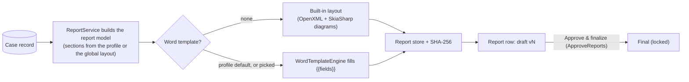

# Reporting workflows

The case report, the lessons-learned review and its report, improvement actions, and cross-case exports.
Reports are Word documents only ([decision 0013](../decisions/0013-word-only-reports.md)).

## The case report

| | |
|---|---|
| **Where** | Report tab |
| **The user sees** | Report profile (a named section layout; can be saved as the case's default), TLP marking, a **Preview** in the browser (a Word template is rendered with docx-preview), **Generate draft**, and the stored reports with version, hash, author, template and state. |
| **Generate** | Queued (`BackgroundJobs/ReportJobs`) and run in the background as the person who asked, so they can keep working; the Report part shows the stage it's on with a meter, and a toast says when it's ready, wherever they are. One job per person, case and kind at a time. Then `ReportService.GenerateAsync` (needs `EditCases` and need-to-know) → model → Word file → stored with its SHA-256 → `Report` row (draft, version = previous count + 1, file `{CaseNumber}_v{n}.docx`). Generating **never approves**. |
| **Approve** | *Approve & finalize* → `ReportService.ApproveAsync` (needs `ApproveReports`). With `Reporting:RequireSeparateApprover` on, the person who generated it can't approve it ("Two-person control is on. Someone other than the analyst who generated this report must approve it."). Once only ("This report is already approved and final."). Milestone "Case report vN approved as final". |
| **Verify** | The stored file can be re-hashed and compared with the recorded hash. |
| **Download** | `GET /reports/{id}`; logged to the access log and SIEM (5303). |

**What's in it.** Sections are chosen by the case's report profile, else `Reporting:SectionLayout`, else all of
them. Notable behavior:

- Analyst notes and the working brief are **off unless a layout turns them on** (they're working reasoning and
  discoverable); the post-incident review is **never** in the case report.
- The investigation timeline includes milestones (except report approvals and team changes), a **By** column,
  and "(Recorded …)" notes for late entries ([timeline.md](../architecture/timeline.md#in-the-case-report)).
- The attack chain is drawn across ATT&CK tactic lanes; the entity graph is drawn as an image. On a third-party
  case the attack chain is the attacker's steps, at the vendor and (after a pivot) in our environment, with a *Where*
  column (`step.where`); the diagram tints the steps in our network and marks the pivot. The Event Timeline adds a
  *Disclosure milestones* table (template collection `milestone`: `when`, `type`, `description`, `source`).
- An attack step's time prints **as it was stated**: "Between 2026-09-02 and 2026-09-05", "2026-09-08 · time not
  stated", "On or before …", "Time not stated" (template field `step.when` does the same), the diagram labels it the
  same way, and a note under the table says the times are as reported. Steps are in their stated order.
- Indicators are listed apart from everything examined and **defanged** (`Reporting:DefangIndicators`).
- A TLP 2.0 marking is printed on every page.
- People appear by display name and enums by their labels; no raw ids or code names.
- Cited evidence is listed with its entry.
- The header uses `Reporting:OrganizationName` and `TeamName`, and the logo from Administration.

**Word templates.** Administrators upload `.docx` templates with `{{field}}` placeholders (Administration →
Reports), preview each one filled with a real case, and choose defaults per report profile and for
lessons-learned reports. Uploads with macros, embedded objects or externally loaded content are refused, and
unknown fields are reported. Starter templates can be downloaded from the same page. A report records which
template filled it (name and hash, by value).

## Lessons learned

| | |
|---|---|
| **Where** | Lessons learned tab (prominent from Post-Incident) |
| **Review** | One per case: what happened, contributing factors, what worked well, opportunities to improve; or "no actions identified". Saved in place (`LessonsService.SaveReviewAsync`); the audit trail keeps every revision. Concurrent edits are refused ("Someone else saved this review while you were editing. Reload to see their changes."). |
| **Draft what happened** | Fills the editor from the case record: key times, the event sequence and every recorded decision. Template-based; no AI. The analyst edits it. |
| **Improvement actions** | Title, related area, details, owner, target date, status (Open, In progress, Completed, Not pursued). Closing needs an outcome note ("Add an outcome note describing what was done before closing the action." / "Record why this action is not being pursued, and who decided, before closing it."). Adding one clears "no actions identified". Editable after the case closes. |
| **Lessons-learned report** | Generated separately (its own versions), optionally with a confidentiality legend on every page (`Reporting:LessonsLegend`). Never counted by the `AtLeastOneReport` gate check. |
| **Gate** | The `LessonsCaptured` check can require a review before closing an Incident or Breach. |
| **Wording** | Neutral on purpose ("improvement actions", "opportunities to improve"), because these records are discoverable ([decision 0012](../decisions/0012-discovery-conscious-records.md)). |

**Program › Improvement actions** (`/program/improvement-actions`) is the cross-case register, with a CSV export
(exercises excluded unless asked for).

## Cross-case reporting

| Output | Where | Contents |
|---|---|---|
| Leadership dashboard | Program › Overview, `/program` | Needs action and running notification clocks, open mix, median timings and targets met for a chosen period (30 days, quarter to date, 12 months), phases, notification compliance, 12 months of case activity (new, carried over and closed, optionally by classification); every figure links to the filtered list |
| Metrics CSV | `/export/metrics.csv` | Dashboard figures with monthly and quarterly rollups |
| Program report | Program › Program report (`/program/report`), `/export/program-report.csv` | Quarter against the previous quarter: volumes, time to detect, contain and resolve, SLA attainment, regulatory reporting, post-incident follow-through, top techniques. Optional quarterly email to managers. |
| Legal register | Program › Legal register (`/program/legal`), `/export/legal-register.csv` | Referrals, holds, materiality, notification deadlines |
| IOC feed | `/export/iocs.csv` | Malicious indicators across visible cases (a blocklist feed) |
| Case audit | `/export/case-audit.csv?case=…` | One case's audit trail |
| Compliance bundle | Integrity page or `/export/compliance-bundle.zip` | Audit segment, seals, public key and verification instructions ([integrity.md](../architecture/integrity.md#the-compliance-evidence-bundle)) |
| STIX graph | Entities tab or `/cases/{id}/graph.stix.json` | The case's entities and relationships as STIX 2.1 |

All exports are need-to-know scoped, rate-limited, neutralized against spreadsheet formula injection, and
logged. The Exports page (`/exports`) links them in one place.
